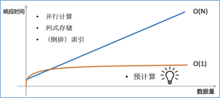

# Apache Kylin常见问题

以下收集了用户在学习使用Apache Kylin过程中经常遇到的一些问题，大部分原理类问题也适用于KAP。

### <!--原理方面-->

<!--**Q：Kylin的核心思想空间换时间是怎么工作的，如何做到大数据O(1)的查询复杂度？**-->

<!--**Q：Kylin需要很多的存储空间吗？如何预估Kylin空间膨胀率？**-->

<!--**Q：Kylin的Cube结果保存在哪里？查询时是访问内存还是哪里？**-->

<!--**Q：多表关联查询是预先对所有的表打cube，然后关联cube查询吗？**-->

<!--**Q：如果一张表被用在多个Cube中，查询时会查询哪个Cube呢？正确性会受到影响吗？**-->

<!--**Q：Kylin能用Spark引擎吗？为什么说Kylin的算法在Spark下效率和MR差不多？**-->

<!--**Q：Kylin做ETL吗？**-->

<!--**Q：Kylin可以实时构建Cube吗？**-->

<!--**Q：如果缺少建模的维度，用户查询时结果会怎样？**-->

<!--**Q：Kylin是否支持增量构建？ **-->

<!--**Q：Kylin支持明细数据查询吗？ **-->

<!--**Q：Kylin高级功能还开源吗？**-->

### 设计方面

**Q: Kylin最大能支持的维度有多少？**

A: 这个问题不是简单一个数字能回答的；首先，Kyin的多维立方体“物理”维度最多64个，但用户可以通过使用维表+定义"衍生"（Derived）维度的方式，将一个维度衍生出更多维，从而达到支持上百个维度查询的Cube。通常建议Cube的物理维度（除去衍生唯度）在15个以内，当有更多维度的时候，务必分析用户查询模式和数据分布特征，采取维度分组，定义mandantory、hierarchy和joint等高级手段，避免维度间的肆意组合（“维度的灾难”），从而使得Cube的构建时间和所占空间在可控范围。


**Q: 维度可以动态增加吗？减少呢？**

A: 当增减维度时，Cube需要重新计算；如果不想重新计算历史Cube，可以定义新Cube，然后将新老Cube做一个组合（Hybrid），一起响应用户查询。

**Q: Kylin构建Cube的过程要多久？有时很慢，如何优化？**

A: 通常Cube构建在几十分钟到几小时，取决于数据量、模型复杂度、维度基数、集群计算能力和配置等多方面。优化需要具体问题具体分析。

**Q: 构建Cube时，经常OOM，如何调整？可以关掉InMem模式吗？**

A：OOM需要看具体在哪一步发生，采取不同措施；如果是在“Build Dictionary”发生，需要审视Cube定义，看是否有对超高基数维度使用了字典编码（可改用其它编码方式）；如果是在"Build Cube"时候发生，需要检查Yarn的内存分配设置；要关闭InMem模式，可以在conf/kylin.properties里设置kylin.cube.algorithm=layer

**Q: 维度超过10个时，构建过程跑不起来，如何优化？**

A：参见第一个问题的回答

**Q：Derived维度和Normal维度是什么意思**

A：Derived维度相对于Normal来说，他并不参与维度的组合计算，他的FK参与维度组合计算，从而降低维度组合数，在查询时，对Dervied维度的查询会首先转换为对FK维度的查询，因此会牺牲少数性能。

**Q：Hierachy Dimension有顺序关系吗？**

A：有关系，要从大到小的顺序声明

**Q: 如果有多张事实表，该如何使用Kylin？**

A: 可以为每个事实表定义一个Cube，然后使用sub query来组合这几张表的查询。或者使用Hive view将多张事实表join成一张宽表，然后用这张宽表定义模型和Cube，查询按宽表进行。

**Q: Segment的数量影响查询的性能吗？大的Segment可以拆分成小的吗？**

A：Segment的数量会影响查询性能，因为Kylin需要顺序扫描每个Segment，所以通常建议定期进行Segment合并；大的Segment无需拆分成小的（也拆分不了）；在存储到HBase时会切分成多个region，所以不用担心查询性能。

**Q: 源数据模型变化了怎么办？**

A：具体问题具体分析；增加字段是没有问题的，删除或修改字段可能会导致metadata混乱。所以建议不要修改原始数据模型；如果无法避免，建议在源模型上创建Hive view，然后基于view来定义Cube；当源模型改变时（如列名更改），只需更新view即可，Cube不受影响。

**Q: 关系型数据库如何使用Kylin？**

A：使用工具(如sqoop)先将数据从RDBMS导入到Hive

**Q: Kylin会支持雪花模型吗？**

A: 未来版本将会支持

**Q：TopN支持多个维度吗？**

**Q：Streaming情况下，分区的日期字段如何选择？**

**Q：定义多个Aggregation Group，查询条件可以跨Aggregation Group吗**

A：Aggreation Group目的是降维，最好查询的条件只在一个Aggregation Group中，如果跨越了Aggregation Group，则需要从Base Cuboid进行Post Processing，会影响查询的性能。

**Q：使用Hive创建大平表性能会比星型模型更好吗？**

A：性能没有区别，但星型模型的维度可以使用derived dimension，存储上更紧凑。

### 查询方面

**Q：Kylin支持MDX吗？**

A：Kylin通过第三方Mondrian提供MDX支持，可以参考Kylin官方网站的相关文档。

**Q：怎么查看Kylin的执行计划？**

A：可以在查询的前面添加``explain plan for``以获得执行计划，例如```explain plan for select count(*) from airline```。但是执行计划的结果的展示并没有被优化，可以通过前端的``导出结果``功能查看。

**Q：Kylin支持模糊查询吗？**

A：Kylin支持like做为过滤条件。

**Q：支持的SQL标准是什么？有哪些函数？**

A：Kylin支持SQL92标准，使用Apache Calcite做为sql parser，因此kylin的sql标准可以参考https://calcite.apache.org/docs/reference.html

**Q：是否Calcite支持的SQL，Kylin都可以支持？**

A：还不能说100%支持，Calcite支持的SQL，Kylin会比较容易支持。

**Q：支持Distinct Count吗？**

A：支持，kylin提供两种统计去重（count distinct）指标的方式：基于HyperLogLog算法的模糊去重和基于Bitmap的精确去重。两种方式进行计算时需要的资源和性能不一样，用户可以根据需要选择使用。具体使用方式及说明参见http://kylin.apache.org/blog/2016/08/01/count-distinct-in-kylin 

**Q: 模型中Inner Join多张表，但查询事实表时，为什么有时查询结果比Hive的少？**

A：这是By Design，Kylin会首先从数据源读取原始数据，并按照模型的定义生成一张大平表。Kylin在从hive中抽取数据的时候，会按照model中定义的方式join所有表来取数据；如果有inner join，一些不能匹配的数据在拉取过程中会被直接过滤。如果查询是跟模型匹配的，带有所有表，那么查询结果就没有问题。如果查询只匹配部分表，有可能出现查询结果比在Hive中只查询部分表时少的情况。

在实际实践中，如果源数据质量不能保证的话，建议用left join；如果要用inner join，就要保证维度表与事实表的同步更新。

### 整合方面

**Q：Kylin可以和Pentaho整合吗？**

A： 可以，背后olap引擎是基于mondrian，saiku也是同理。

**Q：使用Kylin还需要BI系统吗？**

A：Kylin本身的核心在于强大的后端，针对数据分析提供亚秒级的响应。同时对外部各个BI平台也有很好的集成，也提供了丰富的API供进行二次开发。所以针对Apache Kylin需要配合其他的BI系统一起使用。

KAP已经内置了敏捷BI平台KyAnalyzer，不再需要另外开发或购买BI产品。

**Q：Kylin如何和Mondrain整合呢？**

A：需要对Mondrian进行二次开发，网上已经有很多分享，很简单。具体内容搜一下。


### 对比方面

**Q：Kylin与Spark、Impala有什么区别？**

A：从业内的使用经验来看，目前Hadoop平台上可用于查询分析的几种技术主要包括预计算（Kylin）、内存计算（以Spark为代表）、倒排索引（以ElasticSearche为代表）和列式存储（以Impala为代表）。

从技术原理来看，预计算技术将数据事先按维度组合聚合，保存结果为物化视图。经过聚合，物化视图的规模将只由维度的基数决定，而不再随数据量的增长而线性增长。以电商为例，如果业务扩张，交易量增长了10倍，但只要交易数据的维度不变（供应商/商品数量不变），聚合后的物化视图将依旧是原先的大小。查询的速度也将保持不变，即计算时间复杂度相对数据量是O(1)的。

而内存计算、倒排索引、列式存储等技术，虽然其技术原理各不相同，但都是在查询执行时（runtime）对明细数据进行在线的汇总统计，因此这些技术在数据记录数较少时（百万~千万），性能还处于可接受范围。但随着数据量快速增长（硬件资源不增加），其查询速度也将随着数据量的增长而线性增长，因此其计算时间复杂度相对数据量为O(N)的。

各种技术的计算时间复杂度对比如下图所示。从大数据背景来看，网络日志、系统日志、物联网等各种数据在飞速而持续的产生着，从而对于大数据查询分析来说，其面对的数据量将是一个爆发式的增长模式，因此，预计算这种能够屏蔽数据量爆发增长带来的计算压力，保持计算时间复杂度O(1)的技术将是最理想也是最合适的技术。而Apache Kylin，是目前Hadoop生态系统里唯一采用预计算这种技术的查询分析引擎，开源之后迅速成为Apache开源社区的顶级项目，并且在全球众多大型互联网、电信、金融企业里得到了广泛应用。



**Q：Kylin与Druid有什么区别？**

A：Druid最初的设计是为了实时分析，Kyiln更关注解决OLAP问题；最初Druid可以支持实时流Kafka，现在Kylin也支持直接从Kafka读取消息，具备实时构建Cube的能力，提供近实时的分析处理能力；Druid使用位图索引作为内部数据结构，Kylin也使用位图为Cube建立索引；Druid使用自己定义的查询语言，而Kylin支持ANSI SQL；Druid在支持表连接方面有限制；Kylin支持星型模型；Druid与先用的BI工具集成不够友好，Kylin可以很好地支持大部分BI工具，如Tableau，Excel；由于Kylin支持MOLAP Cube，在超大规模数据集上的复杂查询具备极高的性能。而Druid需要扫描全部索引，如果数据集太大，或者查询范围太大，则性能损失更大；Kylin依赖于Hadoop构建Cube和HBase存储索引，Druid采用了自己的计算和存储技术，对于已经部署了Hadoop和HBase的情况，Kyiln的部署只是很小的额外工作，而Druid需要重新部署完整的集群。

### 其它方面

**Q：Kylin可以跑TPCH吗？**

A: 我们提供了针对Kylin的测试数据生成工具SSB，此数据集的模型为根据TPCH简化而成的星形模型。理论上Kylin可以跑TPCH，但是需要对TPCH的模型进行调整，使其成为星形模型。更新信息请参考：[https://github.com/kyligence/ssb-kylin](https://github.com/kyligence/ssb-kylin)

