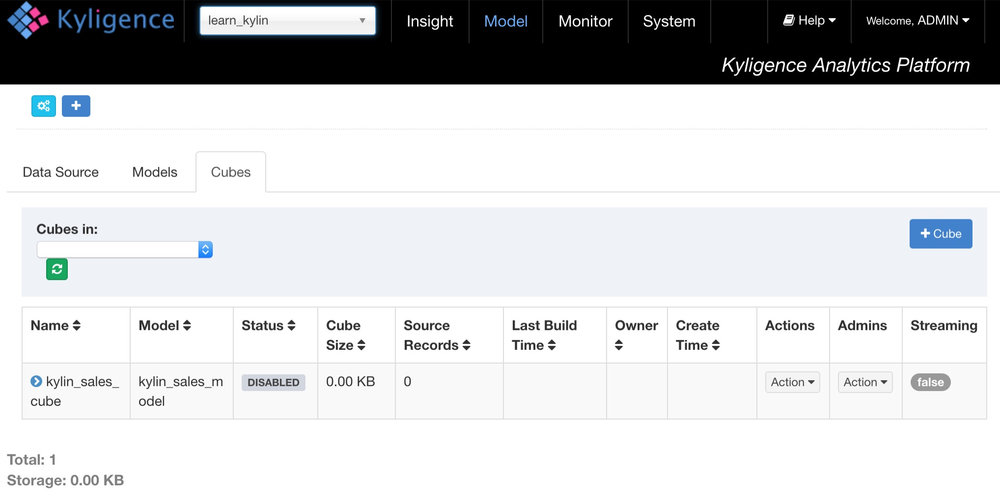
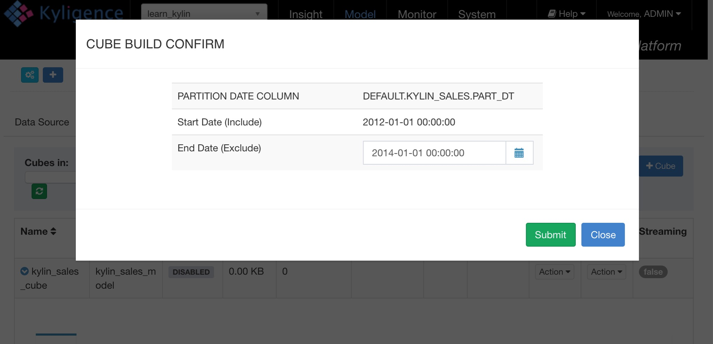

## 安装验证

KAP带有测试数据，只要几分钟就能创建和构建Sample Cube，验证安装的正确性。

### 导入数据样例和Cube

`bin/sample.sh`会创建5个Hive Table，并导入样例数据。数据导入成功后，会自动创建样例项目、模型和Cube定义。 

```shell
cd kap-{version}-{hbase}
bin/sample.sh
```

在成功的执行之后，提示将如下（项目名称为“learn_kylin”并需要用户在系统页面重新导入metadata）：

> Sample cube is created successfully in project 'learn_kylin'.
> Restart Kylin server or reload the metadata from web UI to see the change.

### 重新加载元数据

KAP界面上，在**系统**页面，点击`重新加载元数据`，加载刚才通过命令行更新的元数据。

### 构建Cube

KAP界面上，通过页面左上角的下拉菜单选择样例项目*learn_kylin*。



进入**模型**页面，选择样例Cube *kylin_sales_cube*，选择*操作*->*构建*，选择一个晚于*2014-01-01*的结束日期，这样会包含全部10000条原始数据，并提交。



进入**监控**页面，可以看到正在构建的Cube任务，可以点击*刷新*，获得最新进度，直到100%。

### 执行SQL

当Cube构建成功后，进入**查询**页面，可以在页面左侧看到之前导入的五张表，这时可以输入SQL语句，对样例数据进行查询分析。样例语句包括：

```sql
select part_dt, sum(price) as total_selled, count(distinct seller_id) as sellers from kylin_sales group by part_dt order by part_dt
```

查询的结果会呈现在页面中，可以对比Hive验证查询的结果和响应的速度。


至此KAP的主要功能验证完毕。
