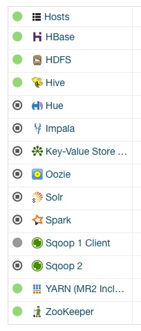

## 在CDH沙箱快速安装KAP

KAP发布了一些数据包，其中包含一些数据集样例和Cube。用户可以通过执行示例脚本轻松地导入数据集和Cube。欲悉更多关于安装和使用工具的详细信息，请参考其他相关指南。

### 准备环境

KAP需要在Hadoop节点上运行，为了获得更好的稳定性，我们建议您部署一个纯Hadoop客户机， 将一些指令，例如*hive, hbase, hadoop, hdfs*，提前安装配置好。为了使准备事宜更简便，我们建议您尝试将KAP和 *All-in-one* sandbox VM这类沙盒软件配合使用，比如*Hortonworks Sandbox（HDP）* 和*Cloudera QuickStart VM（CDH）*。最小内存配置需要10GB。

> 由于不同的沙盒软件配套于不同的HBase版本，请安装KAP相应的发行版。
>
> 在*HDP 2.2*上，请使用*HBase 0.98* 对应发行版；*HDP 2.3+*上，请使用*HBase 1.x* 对应发行版；
>
> 在*CDH 5.7+*上，请使用*CDH*对应发行版；

为了避免沙盒软件中的权限问题，你可以使用它的*root*帐户通过SSH。*Cloudera QuickStart VM 5.7+*的密码为 *cloudera*。

本指南将用*cloudera*作为案例。

在Virtual Box的设置中，我们也推荐您使用*bridged adapter*模型替代NAT模型。*Bridged Adapter*模型将给您的沙盒软件分配一个独立的IP地址，使您既可以通过本地访问KAP网页，也可以远程访问KAP网页。

请确保下列服务（HDFS/YARN/Hive/HBase/ZooKeeper）正常运作，并无任何警告信息（登录 Ambari Portal  [http://{hostname}:7180](http://{hostname}:7180) ，默认的用户名为“*cloudera*”，初始密码为“*cloudera*“）。



为了满足KAP的资源需求，以下参数应及时更新。

1. 对于*CDH 5.7+*，请更新*yarn.nodemanager.resource.memory-mb*到8192mb（或者在 cloudera manager上配置 8 GB ），更新*yarn.scheduler.maximum-allocation-mb*到4096mb （或者在 cloudera manager上配置 4 GB ），更新*mapreduce.reduce.memory.mb*到700mb, 更新*mapreduce.reduce.java.opts*到 512mb。
2. 如遇到如下信息 *org.apache.hadoop.hbase.security.AccessDeniedException: Insufficient permissions for user 'root (auth:SIMPLE)'*，则意味着未得到足够的HBase的书写权限。如果您希望关闭HBase的权限检查，请更新以下对应信息：将*hbase.coprocessor.region.classes* 和*hbase.coprocessor.master.classes*更新为*empty*，将*hbase.security.authentication*更新为 *simple*。

### 安装KAP

请访问 [KAP release notes](../release/README.md)获取KAP软件包。以下步骤针对KAP，KAP Plus步骤略有不同。

拷贝KAP二进制包至安装机器，并解压至安装目录，本文以*/usr/local*为例

```shell
cd /usr/local
tar -zxvf kap-{version}-{hbase}.tar.gz 
```

设置环境变量`KYLIN_HOME` 为KAP的主目录。

```shell
export KYLIN_HOME=/usr/local/kap-{version}-{hbase}
```

在HDFS中创建KAP的工作目录，并授予KAP启动用户读写权限。

```shell
hdfs dfs -mkdir /kylin
hdfs dfs -chown cloudera /kylin
hdfs dfs -mkdir /user/cloudera
hdfs dfs -chown cloudera /user/cloudera
```

由于沙箱环境资源有限，可以首先切换到最小化资源配置模版。

```shell
cd $KYLIN_HOME/conf

# Use sandbox(min) profile
ln -sfn profile_min profile
```

### 环境检查

KAP运行时需要依赖环境信息，通过环境变量读取，这些变量包括：HADOOP_CONF_DIR，HIVE_LIB，HIVE_CONF，和HCAT_HOME。样例配置如下

```shell
export HADOOP_CONF_DIR=/etc/hadoop/conf
export HIVE_LIB=/usr/lib/hive
export HIVE_CONF=/etc/hive/conf
export HCAT_HOME=/usr/lib/hive-hcatalog
```

可通过执行`bin/check-env.sh` 验证环境是否符合KAP运行需求。

### 启动KAP

执行`bin/kylin.sh start`，KAP将在后台开始启动，您可以用`tail`等命令观察`logs/kylin.log`文件，了解启动详细进度。

```shell
${KYLIN_HOME}/bin/kylin.sh start
```

要确认KAP进程正在运行，可以执行`ps -ef | grep kylin`查看进程。

> 如果遇到问题，请确认所有KAP都已经停止，再重试启动。请参阅"停止KAP"。

### 打开KAP GUI

在KAP启动完成后，可以打开Web浏览器，访问此KAP服务器的GUI界面`http://<host_name>:7070/kylin`。

请替换*host_name*为具体的机器名、IP地址或域名。默认KAP启动在*7070*端口，默认用户名ADMIN，默认密码KYLIN。

成功登录KAP后，可以通过构建Sample Cube验证安装的正确性。请继续阅读[安装验证](install/install_validate.cn.md)。

### 停止KAP

执行`bin/kylin.sh stop`命令，停止KAP进程。

要确认KAP进程已经停止，请执行`ps -ef | grep kylin`确认没有活跃进程。
