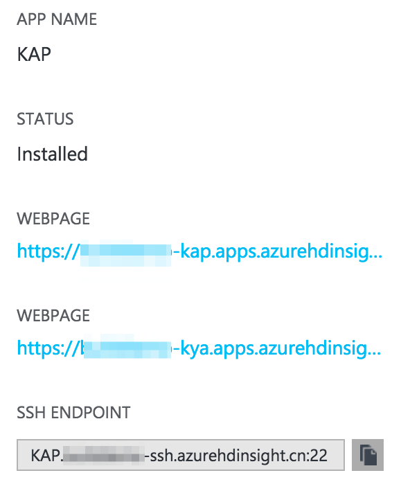

## 通过 Azure 中国镜像市场安装 KAP
我们非常高兴地告知您，KAP Enterprise 已在 [Azure 中国镜像市场](https://market.azure.cn/)上线。用户可以方便地使用镜像，快速创建一个基于 Azure HDInsight 的 Hadoop 集群，并在该集群上运行 KAP 实例。其中所有的安装、部署和配置工作都将为您自动完成。

> 提示：Azure 镜像使用方法仅对 Azure 中国镜像市场上发行的 KAP 有效。

对于通过镜像创建的 KAP 实例，我们为您提供至少一个月的试用许可证。在试用期内，您可以免费使用KAP，只需为使用的 Azure 资源（包括 HDInsight）付费；试用期结束后，请联系 Kyligence 公司以购买正式的产品许可证。

### 登录 Azure 镜像市场

使用浏览器访问 [https://market.azure.cn/](https://market.azure.cn/) 以进入 Azure 中国镜像市场， 搜索 **KAP** 或 **Apache Kylin**，您将检索到 KAP 的镜像，如图所示：


### 填写部署信息

请点击**立即部署**。如果您还未登录过 Azure，会要求您使用 Azure 账号登录。登录完成后，您将返回到镜像市场的安装页面：


请您谨慎地填写图中各项。相应的含义和注意事项如下：

| 填写项目                   | 描述                                       | 建议 / 默认值                                 |
| :--------------------- | :--------------------------------------- | ---------------------------------------- |
| Azure 订阅               | 用于创建 KAP 的 Azure 订阅，如果没有可用订阅，请联系 Azure 支持 |                                          |
| 选择资源组                  | 选择用于管理 KAP 和所有依赖资源的资源组                   | 建议新建一个资源组                                |
| 资源组名称                  | 新建资源组的名称                                 | 建议和 **clusterName** 一致                   |
| 区域                     | Azure 中国数据中心：可选东部和北部                     | 中国东部                                     |
| clusterName            | 新建 HDInsight 集群的名称                       | 使用字母和数字的组合，不可包含特殊符号，须唯一                  |
| storageAccount         | 新建 HDInsight 集群所使用的 storage account      | 可以是一个已有的 **storage account**，也可重新创建，建议和 **clusterName** 一致 |
| containerName          | 新建 HDInsight 集群所使用的 blob store 的名称       | 建议和 **clusterName** 一致                   |
| clusterLoginUserName   | HDInsight 集群的 web 管理员账号，也将是 KAP 的管理员账号   | admin                                    |
| clusterLoginPassword   | HDInsight 集群的 web 管理员密码，也将是 KAP 的管理员密码   | 长度不小于8，至少包含一个大写字母，一个数字以及一个特殊符号，且不可包含用户名  |
| sshUserName            | 使用 ssh 登录 HDInsight 集群的用户                | sshuser                                  |
| sshPassword            | 使用 ssh 登录 HDInsight 集群的密码                | 长度不小于8，至少包含一个大写字母，一个数字以及一个特殊符号，且不可包含用户名  |
| location               | 区域                                       | 跟上文中的**区域**保持一致，中国东部请选则 chinaeast，北部请选择 chinanorth |
| clusterType            | HDInsight 类型                             | hbase                                    |
| clusterWorkerNodeCount | HDInsight 集群的工作节点数                       | 根据需要设置，最小为2， 确保当前订阅下有足够可用的 core          |
| edgeNodeSize           | 运行 KAP 的节点的大小                            | Standard\_D3 或 Standard\_D4              |
| appType                | 选择要安装的 KAP 组件                            | KAP + KyAnalyzer                         |

在上述各项填写完毕之后，请您检查并确认 Azure 以及服务商的服务条款。确认无误后，请点击**立即部署**开始创建集群，如图所示：


### 部署过程

整个集群的部署大约需要30分钟，具体耗时取决于集群的规模等多种因素。在此过程中，首先会为您创建 HDInsight 集群，随后创建 Edge Node 并自动安装和配置 KAP。部署完成后，会显示**部署成功**的画面，如图所示：


在部署过程中，您可以通过 Azure 的门户预览查看此资源组内的资源创建情况。如果创建失败，将在门户中为您显示相关信息。如果您需要删除资源，请在 Azure 门户预览中删除对应的资源组即可；如果您需要重试，在删除资源组后，重复前面的操作即可。


### 查看集群信息

集群部署成功后，通过 Azure 门户预览，您将看到新创建的 HDInsight 集群及 KAP 的详细信息。HDInsight 信息通过在门户中依次点击 **More services** -> **INTELLIGENCE + ANALYTICS** -> **HDInsight clusters** 即可查看。点击集群名称可以进一步获得详细内容：


在上图中点击 **Cluster dashboard**，使用创建时指定的 **clusterLoginUserName** 账号及密码即可登录集群仪表盘（Ambari）对 Hadoop 集群进行统一的监控和配置管理。

在上图中点击 **Applications**，可以获取在集群上运行的应用程序（KAP）的情况，包括 KAP 组件的访问地址，如图所示：




该页面上的两个 web 页分别是 KAP 和 KyAnalyzer 的 web 界面，SSH 地址供管理员以远程 SSH 的方法直接登录 KAP 运行节点以进行管理操作。

您可以点击 web 页并输入在创建集群时指定的 **clusterLoginUserName** 账号及密码，即可访问 KAP 及 KyAnalyzer。


### 快速使用示例 Cube

KAP 在初次启动时，将自动创建一个示例 Cube 以及它所使用的 Hive 表，并自动触发构建任务。当您登录 并访问 KAP GUI 时，此 Cube 应当正在构建中或已构建完成，如图：


构建完成的 Cube 处于**READY**状态，表示可以为您处理查询。您可以在**分析**页面中手动输入 SQL 语句，如 **SELECT COUINT(*) FROM KYLIN_SALES** 以进行验证。随后您可以使用 KyAnalyzer 对该 Cube 进行更全面的分析。

在 KyAnalyzer 中，依次点击**管理控制台** -> **同步Cube信息**， 选择`learn_kylin`项目的中的`kylin_sales_cube`。随后点击**新建查询**， 刷新后可在**多维数据**下拉框中选择`kylin_sales_cube`加载模型，选择维度和度量即时生成汇总报告，如图所示：


至此，您已经拥有了一个在云上的、可动态伸缩的、支持超大数据集快速分析的计算平台。关于更多 KAP 和 KyAnalyzer 的使用方法，请您参阅 KAP 使用手册进行操作。

### 创建基于 Bob Store 的 Hive 表

在使用 KAP 之前，您需要将数据文件上传到 Hadoop，并使用 Hive 描述成数据表。HDInsight 作为 Azure 云上的 Hadoop 平台，默认使用 Azure Blob Store 作为分布式文件系统，从而提供一种高可用、可伸缩的低成本存储方案。您只需要将数据文件使用 Azure 工具上传到 Blob Store，即可使用 HQL 语句将其描述成表，HDInsight 以及 KAP 会直接从 Blob Store 读取文件。关于 Azure Blob Store 的使用，请参考 Azure 帮助文档。

下面是一个使用 Azure 命令行上传文件到 Blob Store 的范例：

```shell
export AZURE_STORAGE_ACCOUNT=<your storage account>
export AZURE_STORAGE_ACCESS_KEY=<your storage account access key>
 
# list all files in container
azure storage blob list <container>
# upload a file to container
azure storage blob upload <path of a local file> <container> <name in container>
```

请注意，不同 Hive 表的文件，应使用不同目录存放。Blob Store 虽不是普通的文件系统，但是可以在文件名中使用**/**模拟目录格式， 例如下面的命令，会将本地文件`airline\_2015\_01.csv`上传到容器 `mycontainer`上，使用目标`airline/2015/airline\_2015\_01.csv`作为路径：

```shell
azure storage blob upload airline_2015_01.csv mycontainer airline/2015/airline_2015_01.csv
```

接下来您便可以使用 HQL 来创建表。您可以在集群仪表盘上使用图形化界面操作，或通过 SSH 连接至集群某个节点上使用 Hive CLI 进行表操作，如下所示：

```sql
CREATE EXTERNAL TABLE airline_data (
Year int,  Quarter int, Month int, 
DayofMonth int, DayOfWeek int, FlightDate date, 
...
) 
PARTITIONED BY (Part_year STRING)
ROW FORMAT SERDE 'org.apache.hadoop.hive.serde2.OpenCSVSerde'
WITH SERDEPROPERTIES ("separatorChar" = ",") 
LOCATION 'wasb://<container>@<storage-account>.blob.core.windows.net/airline' 
TBLPROPERTIES('serialization.null.format'='','skip.header.line.count'='1');

ALTER TABLE airline_data ADD PARTITION (Part_year = '2015') location 'wasb://<container>@<storage-account>.blob.core.windows.net/airline/2015';
```

表创建完毕后，可以通过 SQL 语句进行简单验证：

```sql
hive> select * from airline_data limit 100;
```

至此，使用 Azure Blob Store 的 Hive 表创建成功。您可以使用 KAP 同步表定义、创建模型和 Cube、构建 Cube 和快速分析。

### Hadoop 任务追踪

在 Cube 构建时，用户可以通过 KAP 界面跟踪每个任务的进度和状态。当任务出错时，需要查询 Hadoop MapReduce 日志对故障进行排查。KAP 界面的任务追踪 URL 使用的是内网 DNS 地址，可能导致用户无法直接访问。在这种情况下，您可以在集群仪表盘中通过**YARN - Quick Links - Resource Manager UI**寻找 YARN 资源管理器的地址，然后按照运行状态**RUNNING**或**FINISHED**找到最近的任务。通常地址为 `https://<cluster_name>.azurehdinsight.cn/yarnui/hn/cluster`


### 集群伸缩

当您需要处理的数据量较大时，您可以增加集群节点以增加并发性、减少处理时间；当计算结束后，您可以减少集群节点以节省资源、降低成本。HDInsight 集群提供了动态伸缩的功能，为您提供最大化的便利。您可以通过 Azure 门户，在 HDInsight 页面选择 **Scale cluster** 对集群大小进行调整，如图所示：


### 管理员 SSH 操作

您可以使用 SSH 工具，连接至 KAP 的运行节点上进行操作。如果您需要查询 KAP 服务器的 DNS 地址，请在 Azure 中国门户预览中依次点击 **HDInsight** -> **应用程序** -> **KAP** -> **SSH ENDPOINT**。默认地址为`KAP.<cluster_name>-ssh.azurehdinsight.cn`；默认端口为22。

使用部署集群时填写的 SSH 用户名（默认sshuser）登录，此用户名具有 sudo 权限，进入 Linux 后可以执行`sudo su kylin`切换至`kylin`账户。请使用`kylin`账户对 KAP / KyAnalyzer 进行管理。

```shell
ssh sshuser@KAP.<clustername>-ssh.azurehdinsight.cn
sudo su kylin
```

KAP / KyAnalyzer 的安装路径和日志路径如下：

| 组件         | 安装路径                                 | 日志路径                                     |
| :--------- | :----------------------------------- | :--------------------------------------- |
| KAP        | /usr/local/kap/kap-2.3.0-GA-hbase1.x | /usr/local/kap/kap-2.3.0-GA-hbase1.x/logs/kylin.log |
| KyAnalyzer | /usr/local/kap/kyanalyzer-server     | /usr/local/kap/kyanalyzer-server/tomcat/logs/kyanalyzer.log |

运行下述命令以启动/停止 KAP：  

```shell
sudo su kylin
/usr/local/kap/kap-2.3.0-GA-hbase1.x/bin/kylin.sh (start|stop)
```

运行下述命令以启动/停止 KyAnalyzer：

```shell
sudo su kylin
/usr/local/kap/kyanalyzer-server/start-analyzer.sh
/usr/local/kap/kyanalyzer-server/stop-analyzer.sh
```

### 卸载 KAP

如果您需要停止使用 KAP 及 HDInsight 集群，请在 Azure 门户中删除相关的资源组即可。卸载前请备份必要的数据。


更多意见与建议，欢迎与我们联系：support@kyligence.io

