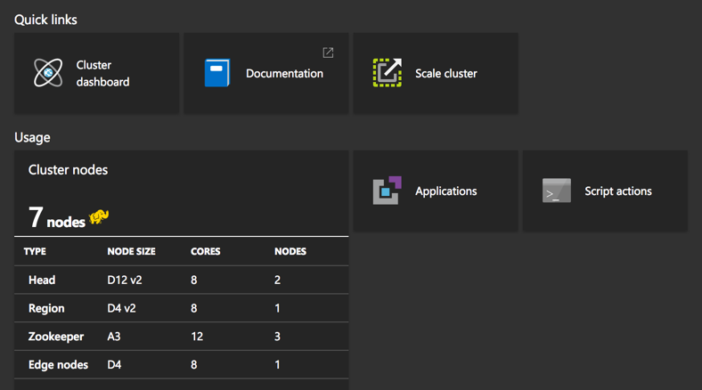
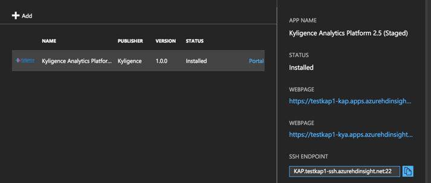
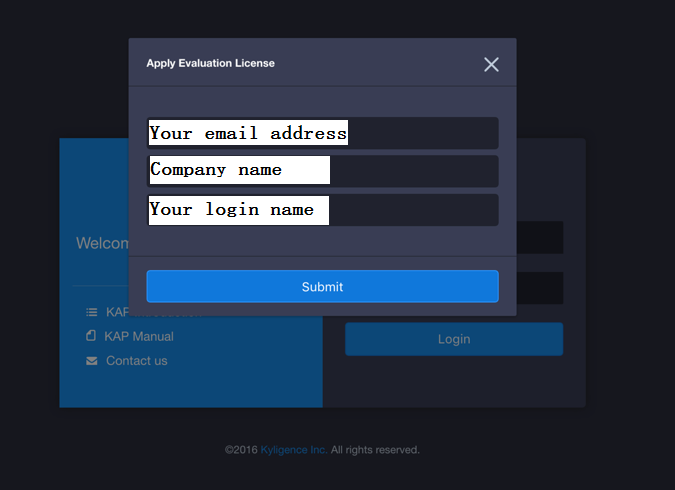
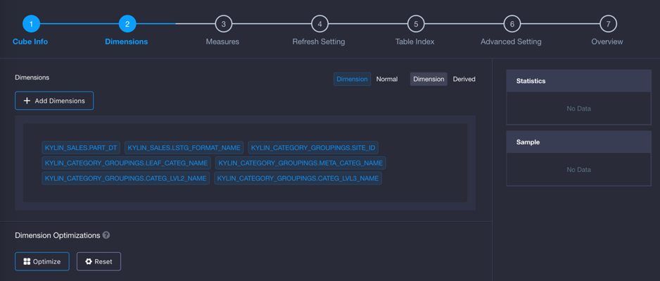
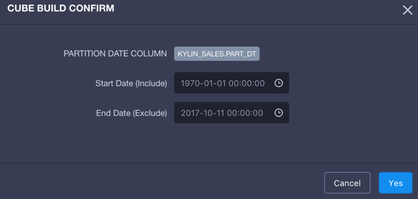
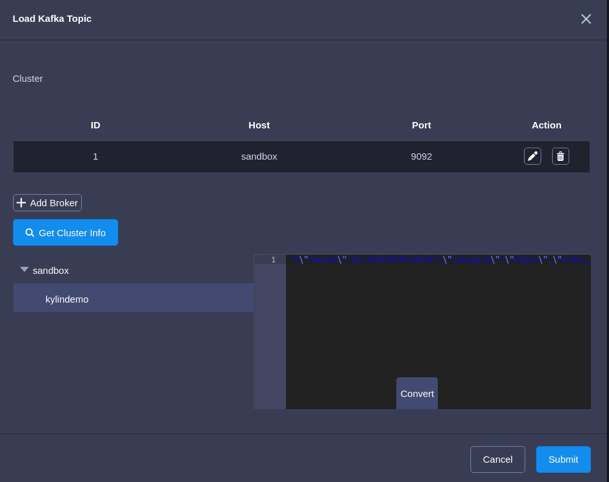
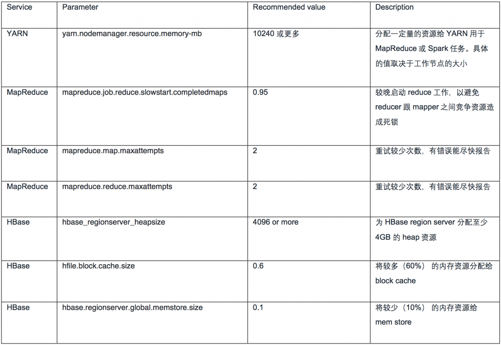

## 在 Microsoft Azure HDInsight 上部署

### Azure HDInsight

微软 Azure 云的 HDInsight 服务，是全托管的云上 Hadoop 服务，提供了 99.9% 的服务可靠性保证。它为您提供了优化的基于开源技术的分析计算基础，HDInsight 服务包括 Spark、Hive、MapReduce、HBase、Storm、Kafka，以及 Microsoft R Server 等技术。

Azure 云架构使得计算与存储能够分离；由于 Azure Blob Storage 和 Azure Data Lake 的高可用、高性能及低成本，用户可以方便地启动集群，扩大或缩减集群规模，甚至停止集群，而无需担心丢失数据。

### KAP on HDInsight

在 Azure HDInsight 中，您可以轻松地部署使用 KAP。KAP 可以在 HDInsight 集群的任意一个节点上运行，它通过标准 API 与 Hadoop 集群服务（如 Hive、YARN、HBase 等）进行通信。KAP 通过读取本地客户端的配置，自动发现各个服务，无须在集群上进行额外的安装和配置，只需运行 “kylin.sh start” 命令即可启动 KAP。如果要卸载，也只需要一个简单的 “kylin.sh stop” 命令就可以停止。

HDInsight 的应用程序平台提供了一种简便办法，让第三方应用提供商能够轻松地开发和分发他们的基于 Hadoop 的应用程序。HDInsight 应用程序平台会自动创建并配置一个Hadoop 的边缘节点 (edge node)。第三方应用开发者只需要提供一个安装他们应用的 ARM (Azure Resource Manager) 模版和 shell 脚本即可，其它事情都交给 Azure 处理。这是一个非常友好的功能，使得在 HDInsight 上自动安装 KAP 变得简单。图 1 是 KAP on HDInsight 的架构图。


通过参考 Azure 的 [Iaas-Applications](https://github.com/hdinsight/Iaas-Applications) 项目示例，我们开发了为 KAP 定制的 ARM 模版，并成功在 HDInsight 上部署启动了 KAP。此后，我们持续改进模版和脚本以丰富更多功能。如今，KAP 及敏捷 BI 工具 KyAnalyzer 都做为 HDInsight 的应用程序一起安装，并发布到 Azure 全球平台；用户可以在很短的时间内获得一个云上的大数据分析平台和 BI 工具。

高级用户可能期望对 Hadoop 和 KAP 进行深入调优以获得更好的性能。HDInsight 内置 Apache Ambari 作为配置管理及监控工具，用户可以通过 Ambari 的 web 界面或 API 对 Hadoop 各项服务的参数进行配置优化，Ambari 会自动将配置更新到每个节点，包括 KAP 所运行的节点。对于 KAP 的相关配置，可以通过 SSH 的方式登录到节点上进行配置，也是很容易可以做到的。

### 安装 KAP

如今 KAP 已经在微软 Azure 云（包括 Azure 海外以及由世纪互联运营的 Azure 中国）全面上线。一些客户已经开始使用 HDInsight + KAP 方案。Kyligence 自身也积极地在各项业务（如开发、测试、培训、在线演示、概念验证等）中使用这套组合。要启用它，您只需要按下面几个步骤执行：

1) 选择一个 ”HBase” 类型的集群，可以是新集群，也可以是一个已存在的集群。


2) 如果是新建集群，需要点击 ”Custom”，在第三步 “Applications” 页面选择 “Kyligence Analytics Platform” ，如下图所示：


如果是已经存在的 HBase 集群，点击 “Applications”，然后点击 “Add”，在应用程序列表中，选择 “Kyligence Analytics Platform” 进行安装。点击 ”Purchase” 按钮表示您已经阅读并同意相关条款。这里不会产生针对 KAP 的额外费用。安装的 KAP 带有一个月的试用许可，试用期内免费，试用结束后请联系 Kyligence 公司购买正式许可。



3) 集群创建完后，通过 Azure 门户，您可以获取到 KAP 和 KyAnalyzer 的访问地址，如图 5 所示。点击这些地址，可以直接跳转到 KAP 以及 KyAnalyzer 的登录页。在这里您也可以获取运行 KAP 的边缘节点的 SSH 地址。



### **申请试用 License 并登录**

第一次打开时，KAP 检测到没有安装 license，会要求用户提供 license 文件。如果您没有 KAP 的 license，可在这个页面立即申请一个试用 license。点击“申请试用许可”，输入您的 email 地址、公司名称及您的名字，点击”提交“，KAP 会自动下载一个试用 license，随后您就可以继续使用了。两个月免费试用期过后，您可以联系 Kyligence 购买正式 license。



KAP 默认管理员账号的用户名是 “ADMIN”，默认密码是 ”KYLIN”。初次登录后会提示修改密码，为了确保服务安全性，请更改密码并将其记录在安全的地方，供后面使用。

KyAnalyzer 与 KAP 共享用户信息，所以您只需要在 KAP 中管理用户，之后便可以在 KyAnalyzer 中使用。

### **玩转样例 Cube**

KAP 安装时会自动创建一个样例 Cube 以及它所需要的 Hive 表。登录 KAP 后，在左边“建模 -> Cube”页，您会看到此样例 Cube “kylin_sales_cube”。初始时它的状态是”Disabled”，需要构建。点击“操作” -> “构建”，选择结束日期如 ‘2014-01-01’，随后 KAP 会开始构建。


您可以在 “Monitor” 页监控此构建任务直至完成。任务完成后，Cube 的状态会更新为 “Ready”，意味着它可供查询。这时您可以在 ”Insight” 页输入一句查询 SQL，例如：

```
select part_dt, sum(price) as total_selled, count(distinct seller_id) as sellers from kylin_sales group by part_dt order by part_dt;
```

KAP 能够很快返回查询结果。您可以拷贝这条 SQL 到 Hive 命令行中执行，以感受它们的响应时间差异。


至这里您已经体验了如果使用 KAP 来加速查询分析。然而，写 SQL 依然是一件麻烦的事情，您可以使用一些可视化工具（如 KyAnalyzer）通过拖拽选择的方式开展分析。

### **将数据导入至 KAP**

KAP 支持 Apache Hive 和 Apache Kafka 做数据源。Hive 用于批量数据处理，Kafka 用作流数据处理。

要在 KAP 中对批量数据做处理，需要将数据文件描述为 Hive 表格。HDInsight 支持使用Azure Blob Store 以及 Azure Data Lake 作为 Hadoop 的存储，通过它们可以轻松管理和处理海量数据，兼顾高可靠、高可用以及低成本。下面是一个将文件上传到 Azure Blob Store 的例子：

```
export AZURE_STORAGE_ACCOUNT=<your storage account>
export AZURE_STORAGE_ACCESS_KEY=<your storage account access key>
```

```
# list all files in container
azure storage blob list <container>
# upload a file to container
azure storage blob upload <path of a local file> <container> <name in container>
```

Azure Blob Store 是一个对象存储系统，不是普通的文件系统；但它支持以 ”/” 做分隔符从而模拟文件目录树结构。下面的命令会将本地文件 ”airline_2015_01.csv” 上传到容器 ”mycontainer” 中，并使用 ”airline/2015/airline_2015_01.csv” 做远程路径：

```
azure storage blob upload airline_2015_01.csv mycontainer airline/2015/airline_2015_01.csv
```

当文件上传到 Azure Blob Store 后，您可以使用 HiveQL 语句来创建 Hive 表格。您可以在HDInsight Ambari 的 “Hive view” 中，或者通过 SSH 到某个节点后使用 Hive 命令行来执行 HiveQL 语句。下面是一个创建 Hive（带分区）表的样例语句：

```
hive> CREATE EXTERNAL TABLE airline_data (
   Year int,  
   Quarter int, 
   Month int,  
   DayofMonth int, 
   DayOfWeek int, 
   FlightDate date, 
   ...
 ) 
 PARTITIONED BY (Part_year STRING)
 ROW FORMAT SERDE 'org.apache.hadoop.hive.serde2.OpenCSVSerde'
 WITH SERDEPROPERTIES ("separatorChar" = ",") 
 LOCATION 'wasb://<container>@<storage-account>.blob.core.windows.net/airline' 
 TBLPROPERTIES('serialization.null.format'='','skip.header.line.count'='1');
```

请将 contianer 和 storage-account 替换为您的存储账户信息。接下来就可以添加分区：

```
hive> ALTER TABLE airline_data ADD PARTITION (Part_year = '2015') location 'wasb://<container>@<storage-account>.blob.core.windows.net/airline/2015';
```

当表创建好并有至少一个分区后，您就可以在 Hive 中执行查询了，例如：

```
hive> select * from airline_data limit 100;
```

至此已经成功创建了一个 Hive 表，让它使用 Azure Blob Store 上的数据文件。可以登录KAP，在 “Model” -> “Data Source” 页，点击 “Load Hive Table” 按钮来将 Hive 表信息导入到 KAP；导入 Hive 表信息只会同步表的元信息，例如列名、数据类型等，而不会拷贝数据，因此这一步通常非常快。


### **创建模型和 Cube**

当所有表都导入后，您就可以开始创建数据模型。数据模型是创建 Cube 的基础，它可以为多个 Cube 重用。在”建模”页，点击 “+Model”，输入模型名，然后将模型需要用到的表，拖拽到画布上。

在每个 table 上，可以点击设置按钮，然后将其标记为事实表 (fact table) 或查找表 (lookup table)。事实表会以蓝色高亮显示。随后您可以将两张表的外键和主键以拖拽的方式链接起来。

KAP 会自动检测每个列的数据类型以推断其是维度或度量，或者两者都不是；维度、度量分别以 ”D” 和 ”M” 的前缀标记，“-” 表示两者都不是。如果自动检测的与实际情况不符，您可以点击其切换。


保存模型的时候，KAP 会自动触发一个异步任务来对模型进行采样和分析。您可以在“监控”页面追踪此任务的进度。这些采样统计信息会帮助 KAP 来理解模型，并帮助您更好地创建 Cube。

保存模型后，就可以开始创建 Cube。Cube 是一种多维空间的数据结构，包含维度和度量。KAP 支持在一个 Cube 中包含数十个维度和上百个度量。KAP 不仅支持普通度量（如SUM、COUNT、MAX、MIN、DISTINCT COUNT 等），还支持高级度量，如 Top- N、Percentile，以及基于 Bitmap 的精确去重计数器等。点击 “+Cube”，KAP 会启动一个向导带领您一步步完成 Cube 创建。



### **构建 Cube**

Cube 创建好以后，需要将数据加载构建进 Cube。在 Cube 页，点击 “Action” -> “Build”。如果数据模型是分区的，那么需要指定一个源数据的时间范围，如果不是分区的，那么会将所有数据加载进 Cube。



触发 Cube 构建后，一个构建任务会被启动并执行，可以在 “Monitor” 页面监控此任务的进度。 Cube 构建可能会花费数分钟到数小时来完成，取决于数据规模、模型复杂度、集群规模等多种因素。 可以点击某个具体任务以查看每一步的具体信息。如果某个步骤是 MR 任务，KAP 会显示出任务在 YARN 资源管理器上的链接地址。当构建完成后，Cube 状态会自动更新为 “Ready”，意味着可以开始查询了。

### **执行查询**

点击 “Insight” 页，您可以编写一个 SQL 查询语句并点击 “Submit”，语句会被提交到服务器端执行并将结果展示在前端页面。

### **使用 KyAnalyzer 敏捷分析**

您可以使用与 KAP 相同的账户登录到 KyAnalyzer ，在 “Admin Console” 页，点击 “Sync Cubes from Kylin”，然后选择 ”kylin_sales_cube” 进行同步，这样这个 Cube 的定义会被导入到 KyAnalyzer。


点击 ”New query” 打开一个新的空白页，点击 ”Cubes” 旁的刷新按钮，在下拉列表中选择 ”kylin_sales”，点击选择一个维度和一个度量，KyAnalyzer 会自动生成查询语句、发送查询并展示结果。


点击右上角的 ”Chart Mode” 按钮，KyAnalyzer 会根据结果数据生成图表，如下图所示，是不是很容易？


现在您已经创建了一个 Cube，并通过拖拽的方式生成了第一个图表。如果需要，您还可以将 KAP 跟更高级的 BI 工具如 Tableau、PowerBI、Excel 等进行集成。有关详细信息，参阅手册中的“与可视化工具集成”一章。

### **与 HDInsight Kafka 的集成**

Apache Kafka 是一个开源分布式消息平台，它能够每秒处理上百万次的并发读写。KAP 支持从 Kafka (v0.10+)  读取数据。通过集成 Kafka，KAP 可以持续将数据构建进 Cube，从而大大减少数据从产生到被检索分析的延迟。

HDInsight 的 Kafka 服务提供了受管理的、高可用的 Kafka 服务。您可以通过 Azure 门户或 API 快速创建一个 Kafka 集群。您可以创建一个 Kafka 集群，跟已有的含 KAP 的 HDInsight 集群一起使用。为了确保 Kafka 版本的一致，请为这两个集群选择相同的 HDInsight 版本，否则您需要在 KAP 节点上下载跟服务器端相匹配的 Kafka 客户端。

HDInsight 的 Kafka 无法使用公网 IP 地址，所以为了使得 KAP 集群与 Kafka 之间能够通信，建议使用相同的虚拟网，或使用 VPN 服务。

KAP 默认不携带 Kafka 客户端；因此如果直接使用它去连接 Kafka 数据源的话，您会得到 “ClassNotFoundException” 的错误。要解决这个问题，需要 SSH 到 KAP 节点，在 KYLIN_HOME/bin/find-kafka-dependency.sh 中手动指定 KAFKA_HOME 的环境变量：

```
ssh sshuser@KAP.CLUSTERNAME-ssh.azurehdinsight.net
sudo vi /usr/local/kap/bin/setenv.sh
```

在文件开始位置，加入下面一行（请使用具体环境中存在的 Kafka 安装路径）：

```
export KAFKA_HOME=/usr/hdp/2.5.5.3-2/kafka
```

随后您可以执行这个脚本以检验它是否能够寻找 Kafka 的客户端 jar 文件：

```
sshuser@ed10-kapdem:~$ /usr/local/kap/bin/find-kafka-dependency.sh -v

Turn on verbose mode.

Retrieving kafka dependency...

KAFKA_HOME is set to: /usr/hdp/2.5.5.3-2/kafka, use it to locate kafka dependencies.

kafka dependency: /usr/hdp/2.5.5.3-2/kafka/libs/kafka-clients-0.10.0.2.5.5.3-2.jar
```

如果一切正常，重启 KAP 服务使其生效：

```
sudo systemctl restart kap
```

KAP 重启后，回到 “Model” 页面，点击 “Add Streaming Table”，输入 Kafka broker 的地址信息，它会自动连接 Kafka，列出主题以及样例消息。



 接下来的步骤，只需要按照 KAP 手册中的 “Streaming Cube” 章节继续即可。

### **KAP 在 HDInsight 上的最佳实践**

下面是我们总结的一些在 HDInsight 上使用 KAP 的经验与技巧，可供参考。

**1. 为 HDInsight 集群使用专有的虚拟网络 (virtual network)**

在创建 HDInsight 集群的时候，可以指定某个特定的虚拟网络，用于管理该集群的节点网络配置。如果用户没有指定，Azure 会创建并使用一个默认的虚拟网络。这个默认虚拟网络在 Azure 门户中是不可见的，这意味着您无法对该虚拟网络进行配置定制（如防火墙），也无法在该网络中加入其它实例。因此，为了保留网络配置的灵活性，建议您在创建集群之前，先创建一个虚拟网络，然后用于该 HDInsight 集群。

**2. 优化 Hadoop 设置**

HDInsight 默认的 Hadoop 设置并不是最适合 KAP 的，它将较多的资源分配给了 HBase 服务，给 YARN留下的资源较少。此外，HBase 将较多资源分配给写操作，而 KAP 的场景是较少写操作而较多的读操作，因此可以将更多资源分配给 block cache 以获得更好的查询性能。您可以在 HDInsight 仪表盘（也即 Ambari）中对 Hadoop 设置进行更改。下面是一些推荐设置：



在 Ambari 中更新这些参数设置后，请同步改动到集群的各个节点，并重启相关服务以使设置生效。KAP 服务也需要重启以确保使用最新设置。

**3. 使用多个存储账户**

使用多个存储账户可以更好地利用网络带宽，提高并发 IO 性能，从而提升集群性能。您可以为 Hive 表使用与集群不同的存储账号。

**4. 按需增加或缩减集群规模**

由于源数据和 Hadoop 数据都在 Azure Blob Store 或 Azure Data Lake，您可以方便地增加或缩减集群节点而不用担心数据的丢失。例如，当构建 Cube 的时候，增加节点以提高构建的性能。当构建完成后，恢复到原来的规模以节省费用。

**5. 停止和恢复集群**

KAP 使用 HBase 存储 Cube 元信息以及数据。Azure 的 HBase 数据也跟其它一样，Azure Blob Store 或 Azure Data Lake 存储，价钱比使用虚拟机硬盘要低很多。因此当您暂时不需要使用集群的时候，可以将 HDInsight 集群删除，只保留存储账户。当某天需要使用的时候，再使用同样的存储账户重建 HDInsight 集群，就可以恢复之前的 Cube 了，这对于一些低频使用的场景非常适用。

在删除集群的时候，仍有一些数据需要手工备份：

- KAP/KyAnalyzer 的配置文件及日志

KAP 的配置文件以及 shell 脚本都是做为本地文件存放在 KAP 节点上。如果您对配置做了改动，并且想在重建集群后恢复，那么您需要自行备份改动。可以使用 “Hadoop fs -put” 命令将文件上传到 Hadoop 文件系统，由于它是放在 Azure 存储上，因此不会在集群删除时候丢失。

- Hive 元数据

Hive 使用 SQL 数据库存储元数据，因此当删除集群的时候，如果 SQL 数据库被删除，那么 Hive 表信息也会丢失。因此建议在创建 HDInsight 的时候，使用外部 SQL 实例做为 Hive meta store。如果您的集群没有用外部 SQL 实例的话，则需要手动备份 Hive 脚本。

**6. 启动／停止 KAP 及 KyAnalyzer**

- KAP 和 KyAnalyzer 一起安装在 HDInsight 分配的边缘节点中。您需要使用创建集群时指定的用户名和密码 SSH 登录到节点中进行操作：

```
ssh sshuser@KAP.CLUSTERNAME-ssh.azurehdinsight.net
```

请将 “CLUSTERNAME” 替换为您的集群名称。

- KAP 及 KyAnalyzer 分别安装在 “/usr/local/kap” (KYLIN_HOME) 和 “/usr/local/kyanalyzer” (KYANALYZER_HOME) 目录。可以使用 linux 命令检查这些脚本、配置以及日志，如：

```
tail -200f /usr/local/kap/logs/kylin.log

tail -200f /usr/local/kyanalyzer/tomcat/logs/kyanalyzer.log
```

- KAP 及 KyAnalyzer 被注册为系统服务。使用 systemctl 命令对这些服务进行操作，如：

```
sudo systemctl status kap

sudo systemctl stop kap 

sudo systemctl start kap
```

对 KyAnalyzer 进行操作, 只需要将上面命令中的 “kap” 替换为 “kyanalyzer” 即可。

