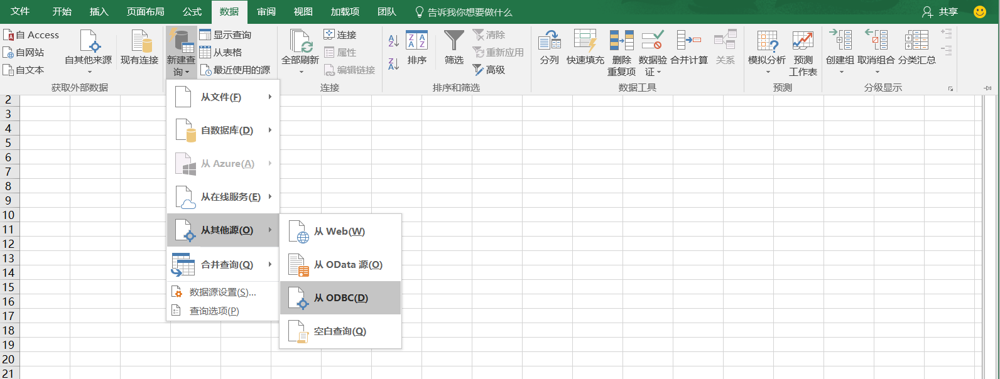

## Excel 2016 集成

Microsoft Excel 是当今Windows平台上最流行的数据处理软件之一，支持多种数据处理功能，可以利用Power Query从ODBC数据源读取数据并返回到数据表中。

### Install ODBC Driver
参考页面[Kylin ODBC 驱动程序教程](../driver/odbc.cn.md)，请确保下载并安装Kylin ODBC Driver __v1.5__. 如果你安装有早前版本，请卸载后再安装。 

### 连接Excel到KAP
1. 从微软官网下载（Excel 2016 内置了Power Query），单击`从其他`下拉按钮，并选择`从 ODBC`项。
   

2. 在弹出的`从 ODBC`数据连接向导中选择数据源名称`kylin` ，也可以点击`高级选项`在SQL文本框中输入您想要执行的SQL语句，单击`确定`，SQL的执行结果就会立即加载到Excel的数据表中。

   
   

> 为了简化连接字符串的输入，推荐创建KAP的DSN，可以将连接字符串简化为DSN=[YOUR_DSN_NAME]，有关DSN的创建请参考：[https://support.microsoft.com/en-us/kb/305599](https://support.microsoft.com/en-us/kb/305599)。

3. 如果您选择不输入SQL语句，Power Query将会列出所有的数据库表，您可以根据需要对整张表的数据进行加载。但是，KAP暂不支持原数据的查询，部分表的加载可能因此受限。
   
4. 稍等片刻，数据已成功加载到Excel中
   
5. 一旦服务器端数据产生更新，则需要对Excel中的数据进行同步，右键单击右侧列表中的数据源，选择`全部刷新`，最新的数据便会更新到数据表中。

   ​
