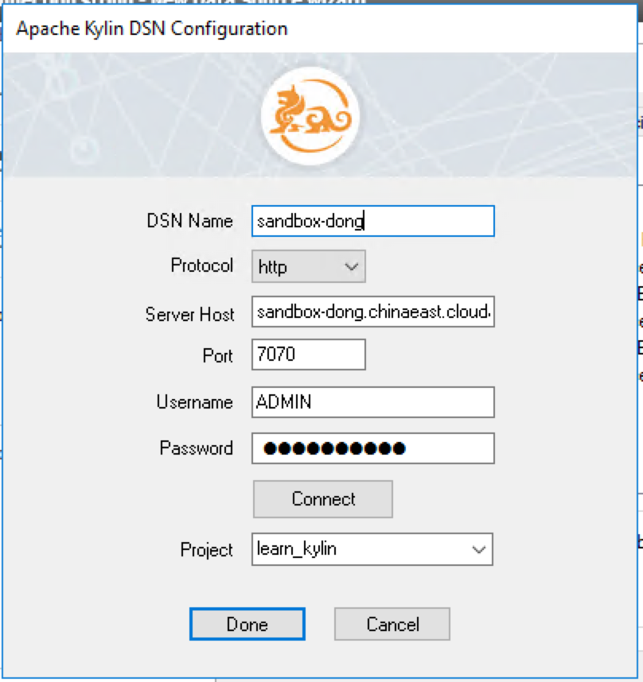
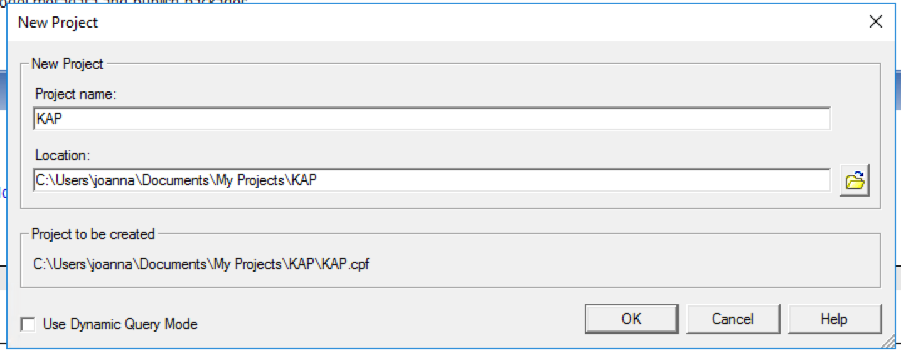
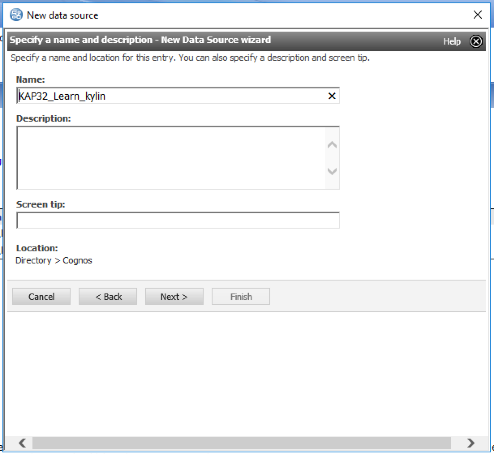
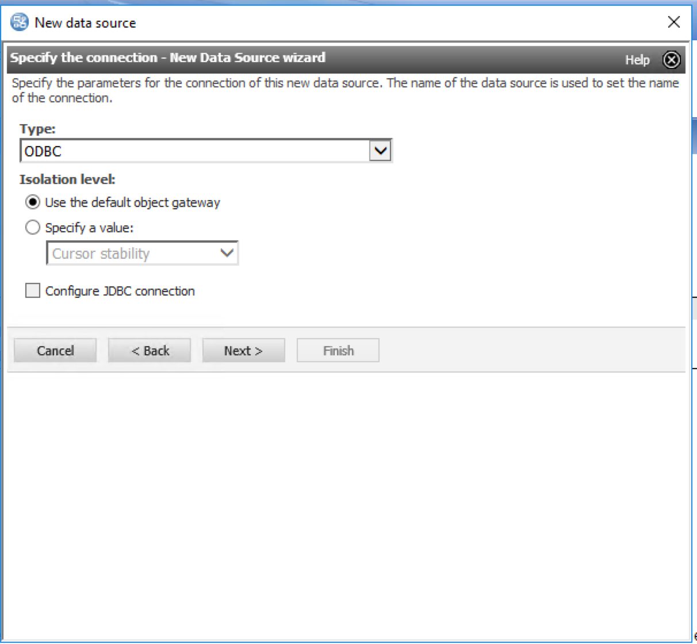
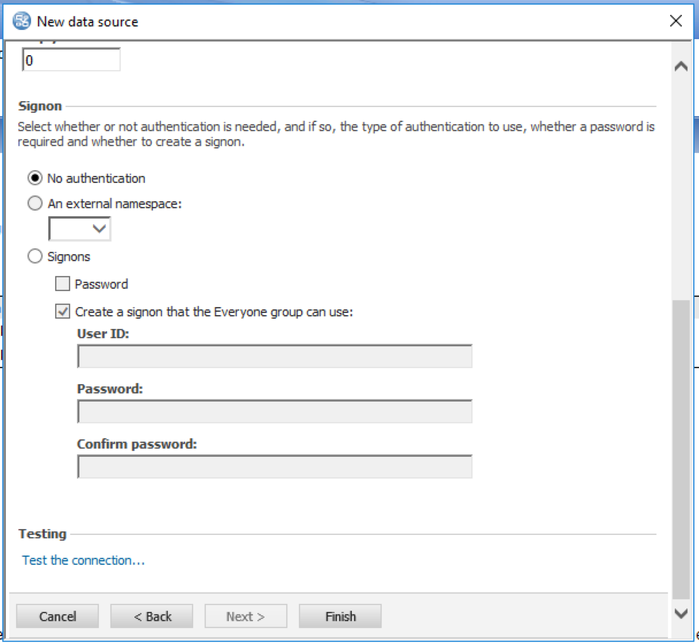
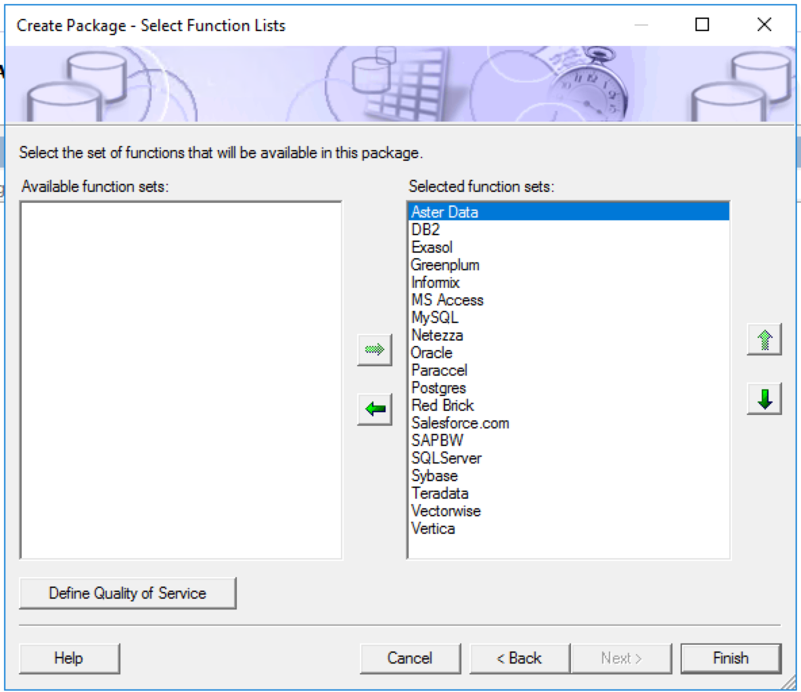
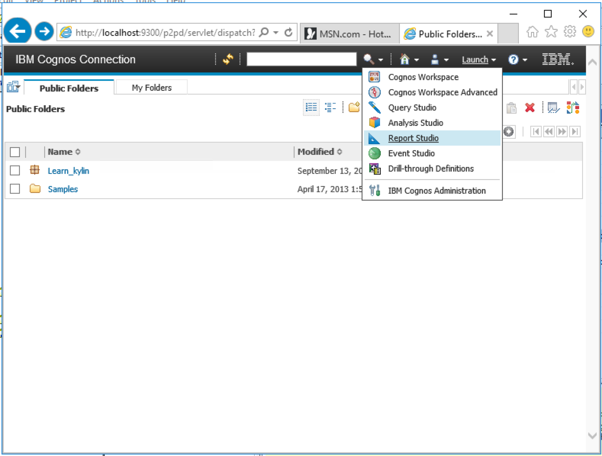
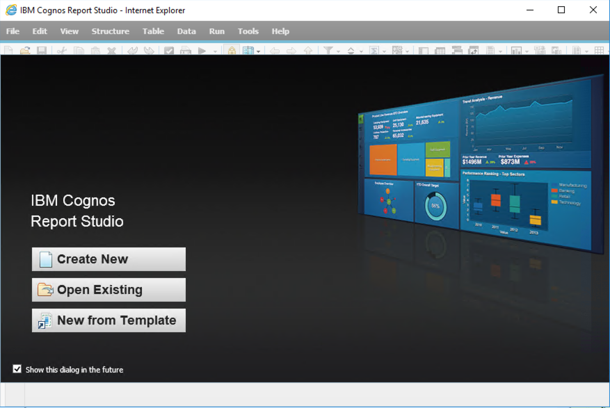
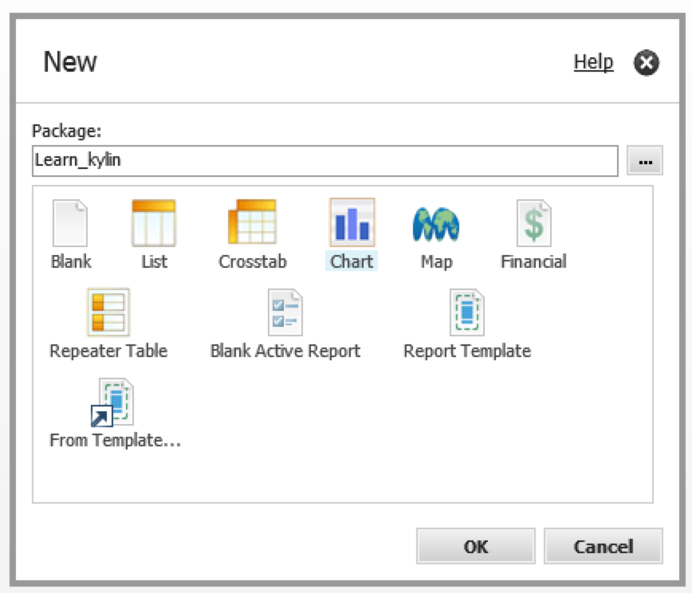
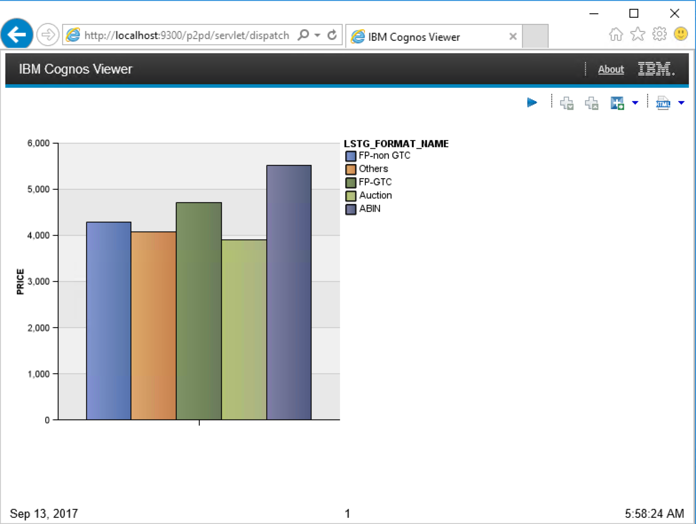

## Cognos 10.X集成

参考页面[KAP ODBC 驱动程序教程](../driver/odbc.cn.html)。安装KAP ODBC Driver v1.6 64 bit或更高版本。如果你安装有早前版本，请卸载后再安装。

Kylin ODBC Driver需要安装在Cognos Server所在的服务器上。

### 创建本地DSN

打开window上的ODBC数据源管理器（64位）创建一个DSN连接KAP。

### 创建一个Cognos数据源

首先打开一个已有Cognos项目或者创建一个新项目。在本例中我们将创建一个新项目。

然后使用`元数据向导`创建新`数据源`。

在`新建数据源向导`第一步中输入数据源名称。

下一步选择`ODBC`作为连接类型。在`隔离级别`中，选择`使用默认对象Gateway`。

下一步在ODBC数据源中填入上一步创建的DSN的名称。

勾选`Unicode ODBC`. 在`登陆`项中勾选`无身份验证`。

随后点击`测试连接`。

如果一切配置正确的话，测试连接会顺利通过。

这样数据源就创建成功了。点击下一步你可以继续在`元数据向导`中测试表的连接。

### 测试连接

首先选择需要导入项目中的表。

下一步的所有参数可以保留默认配置。

现在新数据源义经被导入到项目中了。邮件一个表测试表的连接。

在测试的弹窗中，点击`测试示样`来测试与表的连接。如果连接配置正确，测试结果会返回在弹窗中。

### 发布数据包

在项目查看器中，右键`数据包`->`新建`->`数据包`将需要使用的表进行发布。

第一步为数据包命名。

第二步，选择需要发布的表和列

第三步，选择包中支持的`函数集`，这里可以保留默认的设置。

这样数据包就创建成功了，接下来进入`发布数据包向导`。

下面的步骤可以保留默认配置。

这样数据包就发布成功了。

### 创建一个简单的图表

下面我们可以使用发布好的数据包来制作一个简单的图表。

在Cognos网页端启动Report Studio。

选择之前创建好的数据包。

在Report Studio中选择`新建`。

使用新创建的数据包，选择`图表`。

选择一个图表类型。

将维度和度量拉拽到报表上。

点击菜单中的`运行`键运行报表。

这样你就成功的使用KAP作为数据源创建了一个图表。

