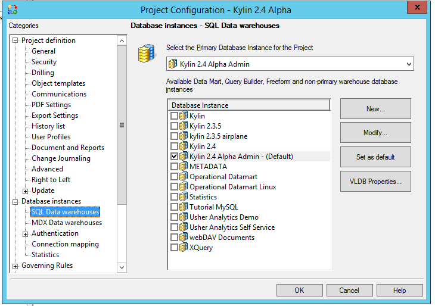
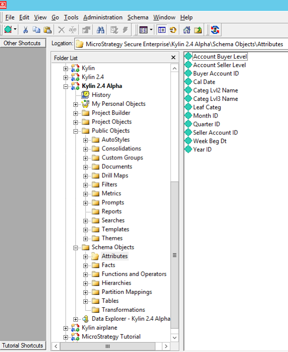

## MicroStrategy 10.X 集成

### 安装 ODBC Driver

参考页面[KAP ODBC 驱动程序教程](../driver/odbc.cn.html)安装KAP ODBC Driver v1.6 64 bit或更高版本。如果你安装有早前版本，请卸载后再安装。

Kylin ODBC Driver需要安装在MicroStrategy Intelligence Server所在的服务器上。

### 创建本地DSN

打开window上的ODBC数据源管理器（64位）创建一个DSN连接KAP。

### 在MicroStrategy中配置Database Instance

打开MicroStrategy Developer，使用有管理员权限的账户登录到需要连接KAP的项目源。登陆后，点击菜单->Administration->Configuration manager->Database Instance，创建新的database instance来连接到上文创建的本地ODBC连接。数据库的连接类型请选用Generic DBMS。

根据你的项目环境的不同，你可能会需要将该database instance设置为已有项目的主数据源或非主数据源，或者你可以创建一个新的项目并设置该database instance为之数据源。你可以通过右键点击一个项目，选择project configuration->database instance来设置。

### 导入Logical Table

打开你的项目，选择菜单->Schema-> Warehouse Catalog导入你需要的KAP数据源的表。

**注意：Microstrategy 会发送查询"select \* from fact\_table"，如果被查询表格数据量太大，Microstrategy 可能需要等待很长时间拿到返回结果。请参见[配置](../config/basic_settings.cn.md#kylinqueryforce-limit)对KAP进行配置绕过该问题。**

### 建立Schema Objects 和Public Objects

建立一些Attribute，Fact和Metric用以建立测试报表

### 创建一个简单的测试报表

现在你可以创建一张简单的报表测试你的Kylin数据源了

### 使用MicroStrategy连接KAP的最佳实践

以下是经笔者测试的MicroStrategy连接KAP的最佳实践，建议按照下面操作配置你的MicroStrategy环境以优化和KAP的连接。

1. KAP2.4.5之前的版本不支持多段SQL，也不支持创建临时表，请在MicroStrategy环境中修改VLDB 配置，设置report intermediate table类型为derived来避免MicroStrategy生成临时表。修改方法为在MicroStrategy的report中菜单选择 Data-> VLDB property-> Tables-> Intermediate Table Type设置为Derived即可。
2. 避免使用以下MicroStrategy功能，因为下面的功能可能会生成多段SQL语句，这些多段的SQL语句无法通过VLDB配置规避。

   1. 使用Datamarts
   2. 使用partitioned tables
   3. 使用custom groups

注：KAP2.4.5及以后的版本，用户可以通过开启查询下压，将有多段语句或创建临时表的语句下压到底层引擎进行查询，目前支持多段语句在Hive上的运行。

1. 字段名和Kylin保留字段冲突会导致SQL报错，具体Kylin的保留字段请参见以下链接：

   https://calcite.apache.org/docs/reference.html#keywords

2. 如果Kylin数据模型中有事实表向维度表的左连接，MicroStrategy生成的SQL也需要产生相同的左连接来击中Cube，默认情况下MicroStrategy仅会生成内连接，可以参照以下MicroStrategy技术文档来修改MicroStrategy的VLDB配置实现左连接：

   https://community.microstrategy.com/s/article/ka1440000009GrQAAU/KB17514-Using-the-Preserve-all-final-pass-result-elements-VLDB

3. 默认情况下MicroStrategy生成的SQL语句在对日期进行过滤时日期的格式为 'mm/dd/yyyy'。这个格式可能会和KAP中的日期格式不一致，导致查询报错。你可以参考以下文章来修改MicroStrategy的配置，使其生成与KAP的日期格式一致的日期过滤查询：

   https://kyligence.zendesk.com/hc/en-us/articles/115001690433-Modify-MicroStrategy-query-date-format-to-be-consitent-with-KAP
