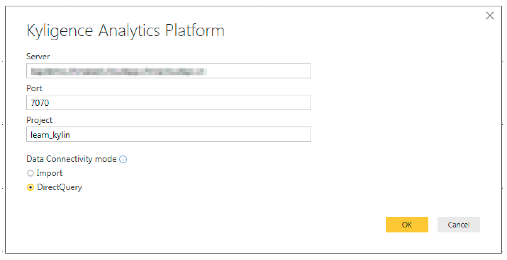
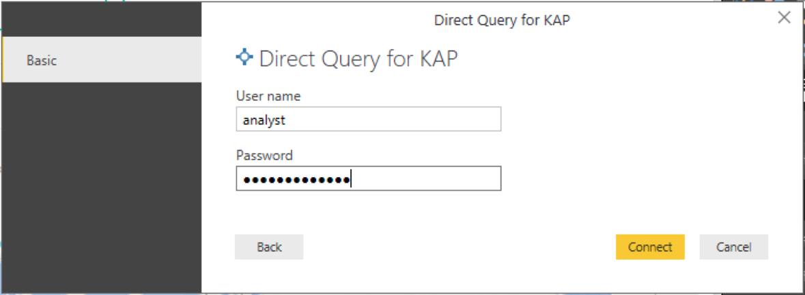
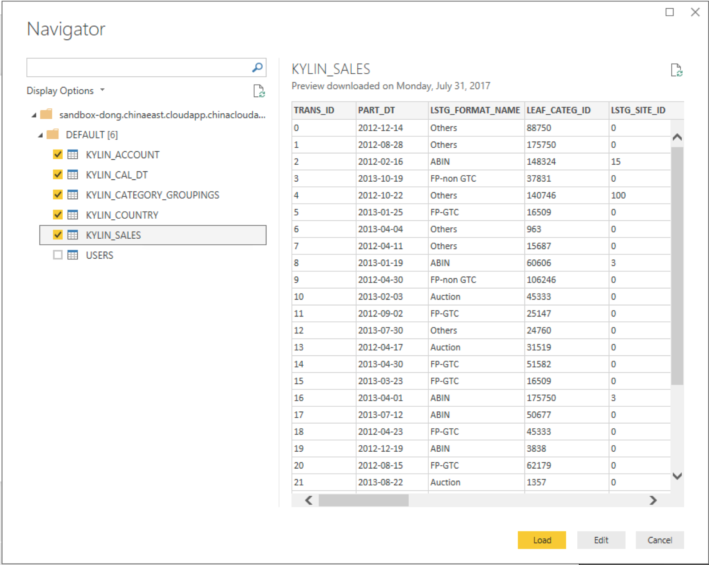

## Power BI Deskop集成

Microsoft Power BI 是由微软推出的商业智能的专业分析工具，给用户提供简单且丰富的数据可视化及分析功能。

### 安装Kyligence ODBC 驱动程序
参考页面[Kyligence ODBC 驱动程序教程](../driver/odbc.cn.md)进行安装。

###   安装Power BI DirectQuery 插件

1. 复制DirectQuery插件文件到`C:\Users\<user_name>\Documents\Microsoft Power BI Desktop\Custom Connectors`文件夹，如果没有`Custom Connectors`这个文件夹，可以手动创建一个。
2. 打开Power BI Desktop中的`Options and settings`中的`Options`。
3. 在`Preview Features`中勾选`Custom data connectors`。
4. 重启Power BI Desktop

### 使用Power BI Desktop连接KAP

1.  启动您已经安装的Power BI Desktop，单击`Get data`按钮，点击`more`在`Database`类别中选中`Kyligence Analytics Platform`。
    

2.  在连接字符串文本框中输入所需数据库的对应信息。连接方式请注意选择`DirectQuery`。

     

3.  输入账号密码进行身份验证。

     

4.  下一步Power BI将会列出项目中所有的表，您可以根据需要选择要连接的表。
     

5.  现在你可以进一步使用Power BI进行可视化分析，首先对需要连接的表进行建模。
     

6.  现在你可以回到报表页面开始可视化分析。

     

