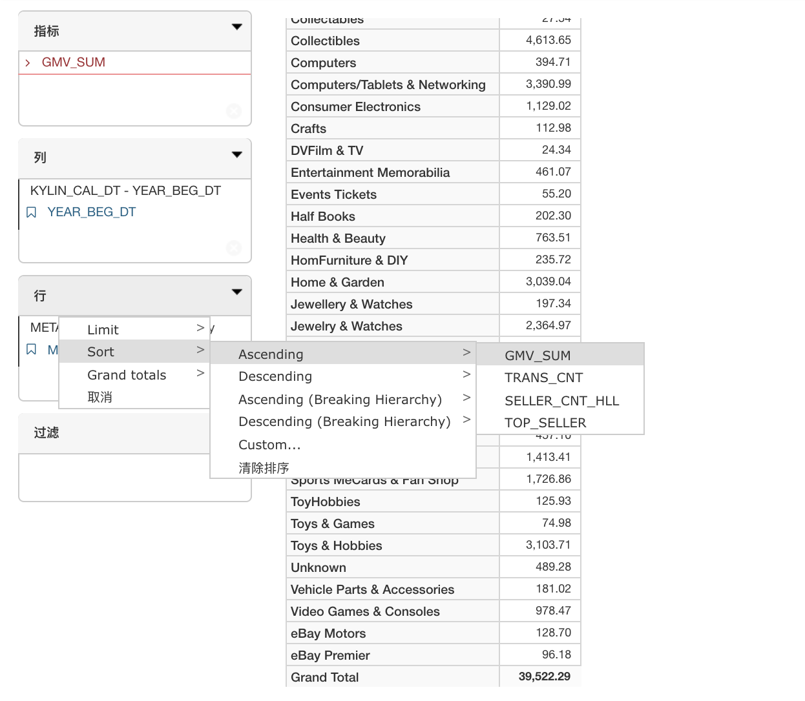
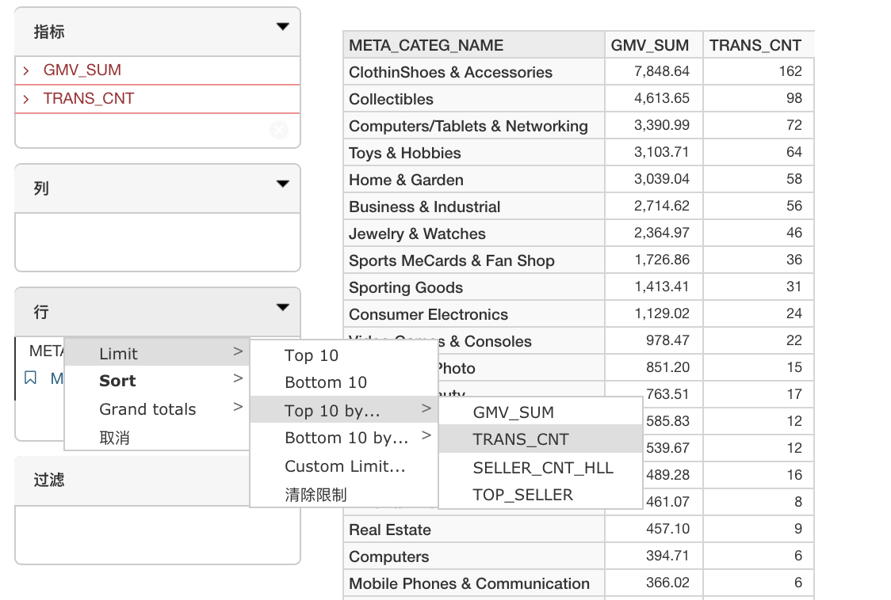
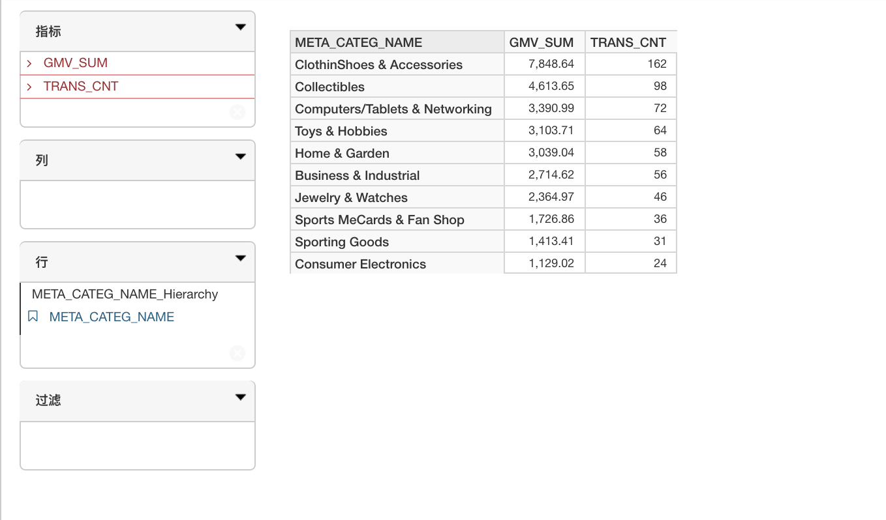
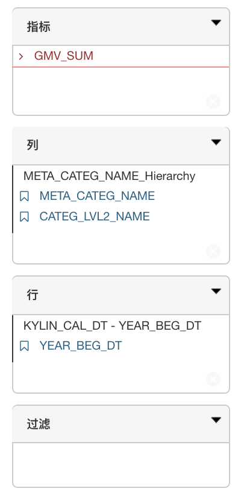
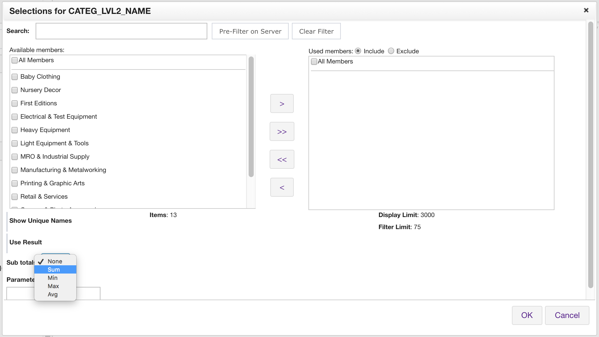
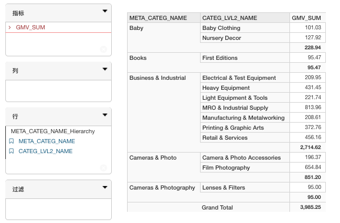
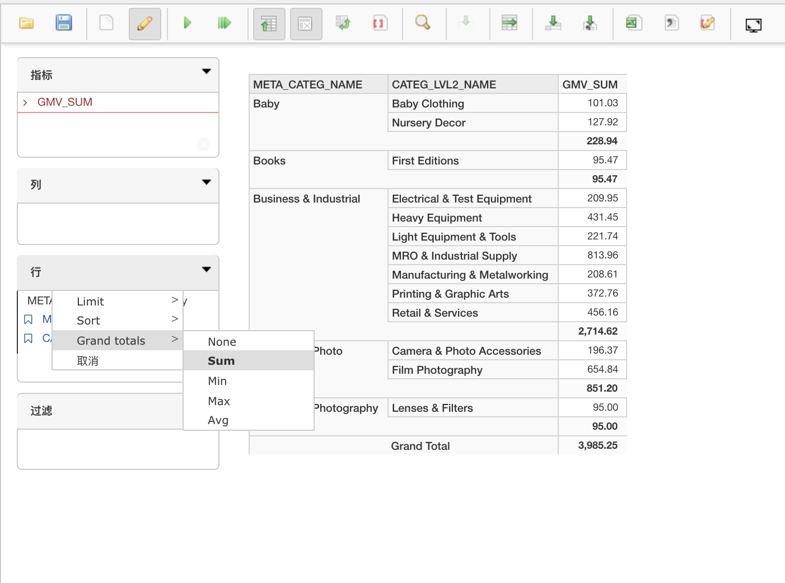

## 数据过滤、排序、排名及汇总计算 

在本节中，我们将向您介绍可在 KyAnalyzer 中执行的几个报表功能：

### 数据过滤

要过滤查询结果，可点击维度名称，随后会弹出过滤对话框。在**搜索**框中输入相应的模式以缩小过滤范围，然后勾选要过滤的数据。可以通过包含 (Include) 和 排除 (Exclude) 两种方式进行过滤。

### 数据排序

### 数据排名

1. 要获取当前查询中排名在前或排名在后的结果，点击列或行中右侧的向下箭头。

2. 选择 **Limit**，然后选择 **Top 10 by...** 或 **Bottom 10 by...**。这样将按指标分别过滤出报表中前 10 项和后 10 项数据。在本例中，我们选择指标 **TRANS_CNT** 来列出它的前 10 项。

  

3. 报表中将显示指定的排名结果，如下所示。
  

### 汇总计算

用户可以计算不同维度层级上数据的分类小计和总计结果。

#### 分类小计

1. 要计算分类小计结果，首先点击行或列中要执行分类小计的维度。在本例中，点击 **CATEG_LEVL2_NAME** 来计算其分类小计。
  

2. 在弹出窗口中的**分类小计**部分，选择所需的聚合方法。在本例中，我们选择 **Sum**。
  

3. 点击 **OK**。这样报表中将显示 **CATEG_LEVL2_NAME** 的分类小计结果，如下所示。
  

#### 总计

1. 要计算当前报表的总计结果，点击**列**或**行**框中右侧的向下箭头。在本例中，我们对**行**计算总计值。
2. 选择 **Grand totals**.
3. 选择所需的聚合方法。在本例中，我们使用 **Sum**。
4. 点击 **OK**。这样报表中将显示**行**的总计结果，如下所示。
  

