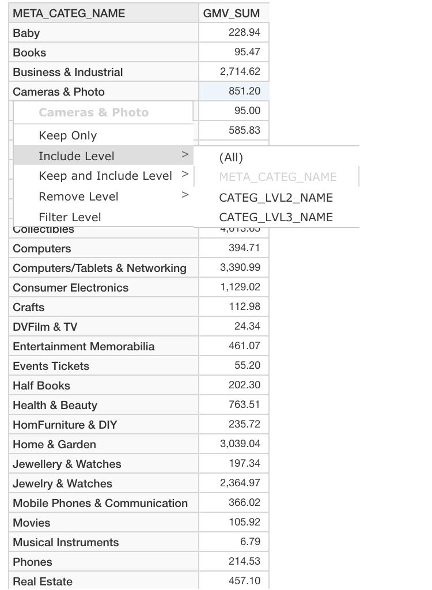
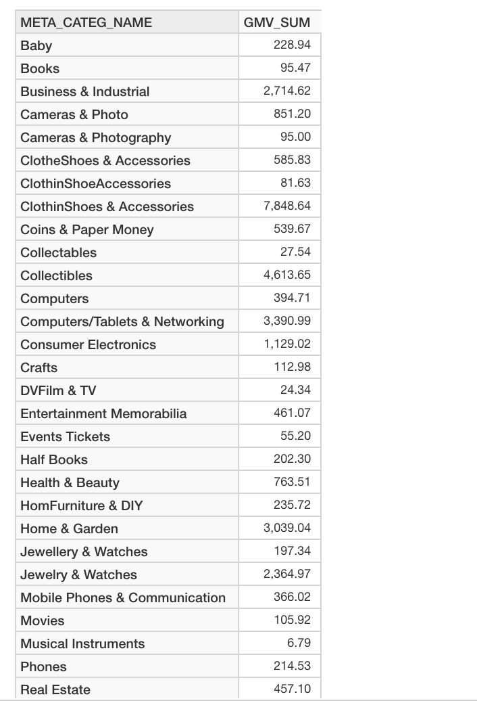
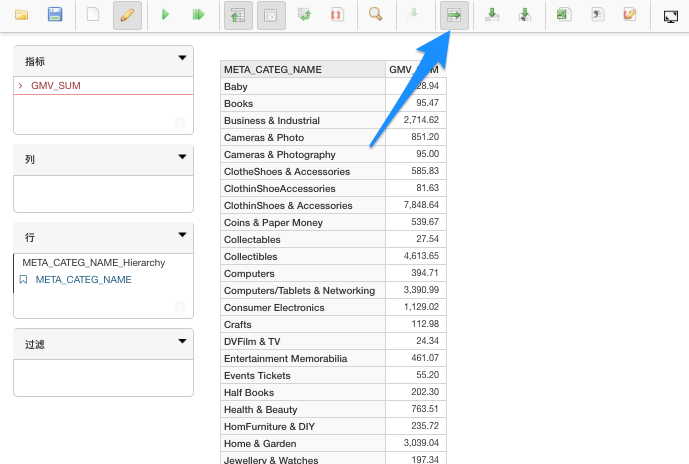
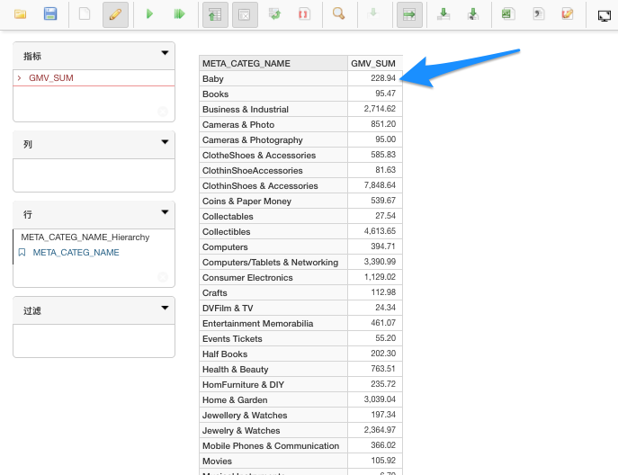
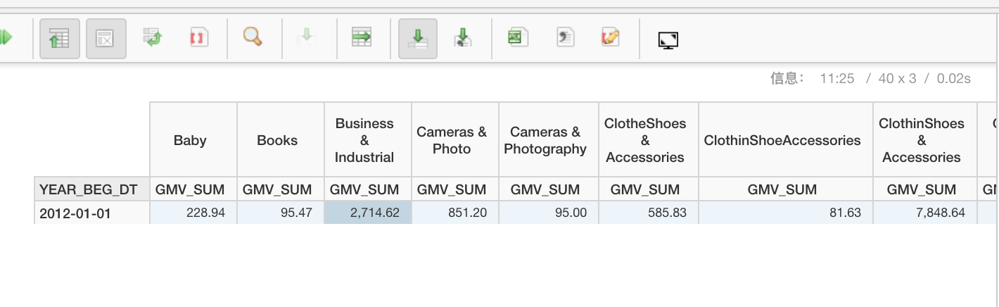

## 下钻、上卷及交叉钻取

在 Learn_kylin 项目中，Cube “kylin_sales_cube” 包含如下层级。本节中我们以 kylin_sales_cube 为例来说明如何执行下钻和上卷操作。

### 下钻

#### 不使用过滤执行下钻操作

1. 要执行下钻操作，先将层级中的一个维度和指标置于报表中。

2. 点击此维度并选择 **Include Level**。
  

3. 选择要下钻的目标维度。

4. 返回的报表中将显示您所选的目标下钻维度。
  

#### 使用过滤执行下钻操作

还可以选择在下钻时使用过滤。这样报表会根据您选择的维度值进行过滤。

1. 要执行下钻操作，先将层级中的一个维度和指标置于报表中。 

2. 点击此维度并选择 **Keep and Include Level**.

3. 选择要下钻的目标维度。
  

4. 返回的报表中将显示您所选的目标下钻维度。

在本例中，点击 **Computers/Tablets & Networking** 中的值触发过滤，使用过滤执行下钻，将只下钻 Computers/Tablets & Networking 下的值。

### 上卷

还可以上卷已经下钻的维度。

1. 要执行上卷操作，则需要上卷的层级维度必需位于报表中。 

2. 点击要上卷的维度，然后选择 **Remove Level**。

3. 选择要上卷的维度。

   

4. 返回的报表中将移除上卷维度。

###交叉钻取

除了下钻和上卷操作，还可以交叉钻取层级中不存在的其他维度。

#### 对行执行交叉钻取

1. 点击顶部菜单上的交叉钻取图标。

   

2. 点击指标。

3. 在弹出菜单中，选择要交叉钻取的维度和指标。

4. 结果将返回上一步中所选的维度和指标。

#### 对列执行交叉钻取

1. 点击顶部菜单的交叉钻取图标。
2. 点击指标。
3. 在弹出菜单中，选择要交叉钻取的维度和指标。
4. 结果将返回上一步中所选的维度和指标。

