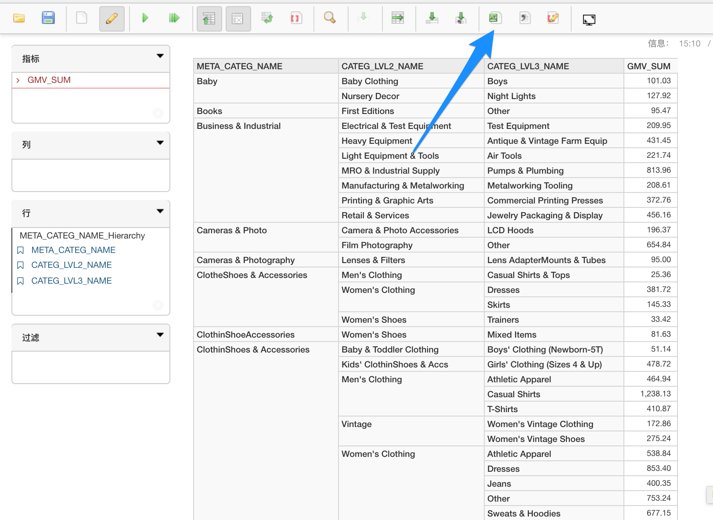
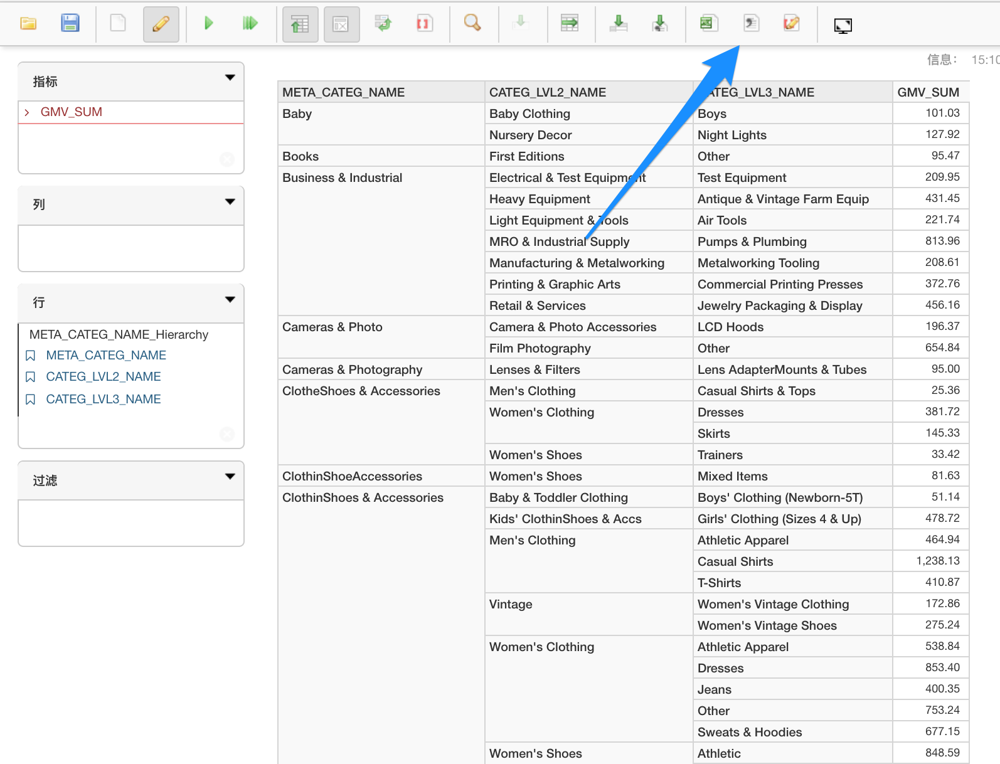

## 导出结果

结果可以导出为多种格式，如 CSV、PDF、Excel 或图片格式。本节列举几种格式加以说明。

### 将网格数据导出为 Excel 格式

### 将网格数据导出为 CSV 格式

默认情况下，所有用户都可将结果导出为 CSV 或 Excel 格式。可以更改设置，仅允许系统管理员将结果导出至 CSV 或 Excel。

编辑 kyanalyzer-server-{version}/conf 下方的 kyanalyzer.properties，设置

`kyanalyzer.web.export.only.admin=false`，仅允许系统管理员将结果导出至 CSV 或 Excel；

`kyanalyzer.web.export.only.admin=true`，允许所有用户执行导出。

### 将图表导出为图片格式

