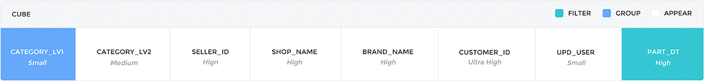
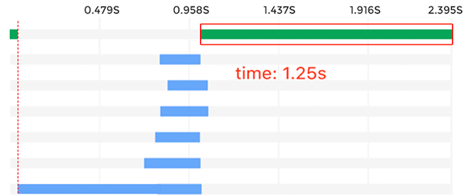

# KyBot案例分析

某电商公司运行Apache Kylin超过21个节点，希望通过KyBot诊断集群的健康状态并获取Cube优化建议。KyBot分析了时间跨度为5天的诊断包，涵盖了98个Cube和7000多个Query，通过分析发现了查询的瓶颈并提供了优化方案。

## 总体情况

Cube **98**个，总大小**871GB**, Cube膨胀率较低；
**86%**以上的查询都在**1秒**以内，**98%**的查询在**5**秒之内, 平均查询性能较好；
构建耗时中位数在**15min**以内，属于正常范围；


## SQL执行分析

```sql
Select CATEGORY_LV1, sum(order_amt) as order_amt, sum(payment_amt) as payment_amt, sum(discount_amt) as discount_amt, sum(shipping_fee) as shipping_fee, sum(tax_amt) astax_amt, sum(coupon_amt) as coupon_amt, count(distinct CUSTOMER_ID) as uv, count(distinct SHIPPING_AGT_ID) as shipping_agt, count(distinct province_id) as province from t_sales_order WHERE PART_DT > ’20160901’ and  PART_DT < ’20161001’ group by CATEGORY_LV1 order by CATEGORY_LV1
```

### Cube索引匹配度分析
在SQL执行过程解析的页面，展示了8个维度，表示Cube中8个维度索引参与了SQL执行，但仅PART_DT是有效的过滤维度， CATEGORY_LV1是有效的聚合分组维度，总体匹配度较低（25%）。中间六个维度之所以参与执行，是因为它们被设置成了mandatory 维度，可以考虑取消mandatory设置，或改用joint等类型。

过滤维度PART_DT位于索引组合的末端，且前置维度基数较大，过滤代价较大，影响查询效率，建议更新索引维度的排序。



### SQL执行生命周期分析

在SQL执行生命周期图中，蓝色是SQL在多个存储节点中的并行查询部分，绿色是SQL在查询节点的执行部分，绿色部分时间较长，说明瓶颈在于查询节点，可以考虑减少数据后聚合压力或增强查询节点性能。



## 优化操作

添加一个Hierarchy聚合组,包含CATEGORY_LV1 和CATEGORY_LV2, 添加一个Joint聚合组，包含SELLER_ID 和 SHOP_NAME，取消之前的Mondatory聚合组。

## 优化结果

查询击中了匹配度更高的Cuboid，查询效率显著提升，查询节点运行时间缩短为0.4秒。

## 客户反馈

根据KyBot的分析，我们有针对性地对Cube的设计进行了优化，增大了查询节点的内存，对比测试表明查询效率得到了显著的提升，接下来我们会根据进一步的分析，继续优化。