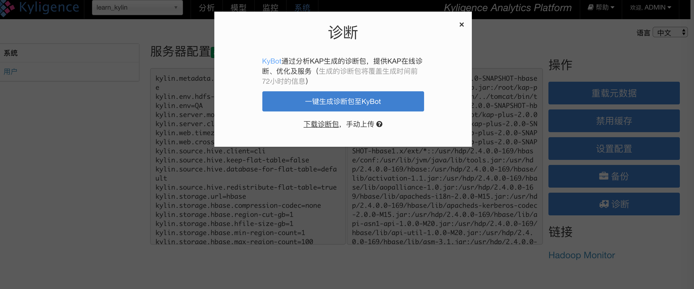
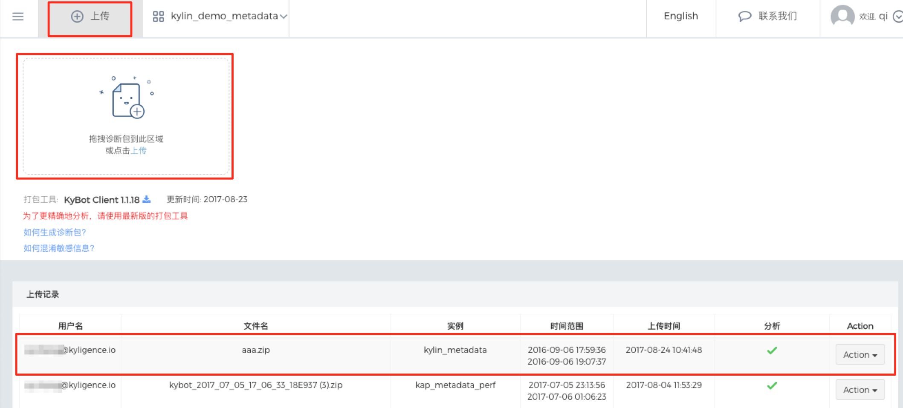
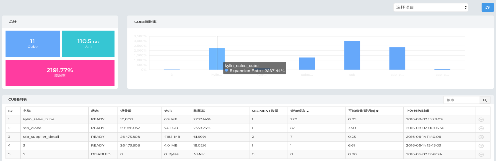
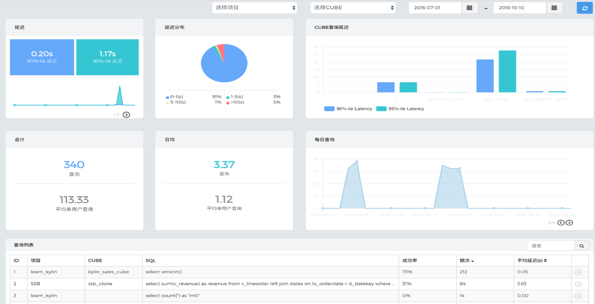
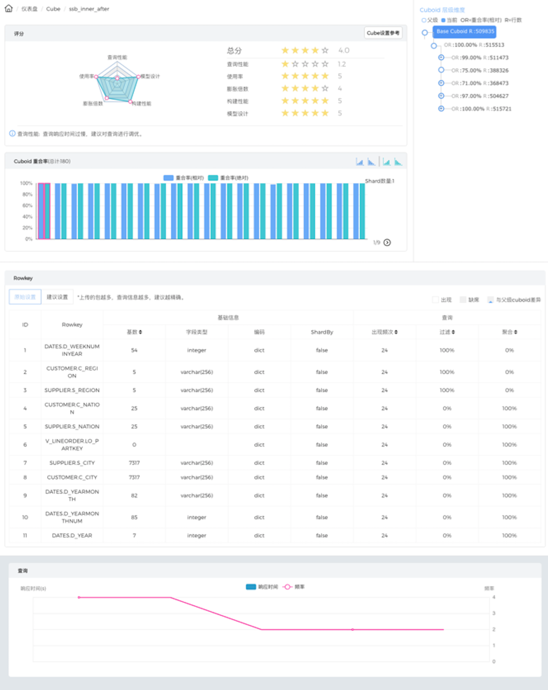
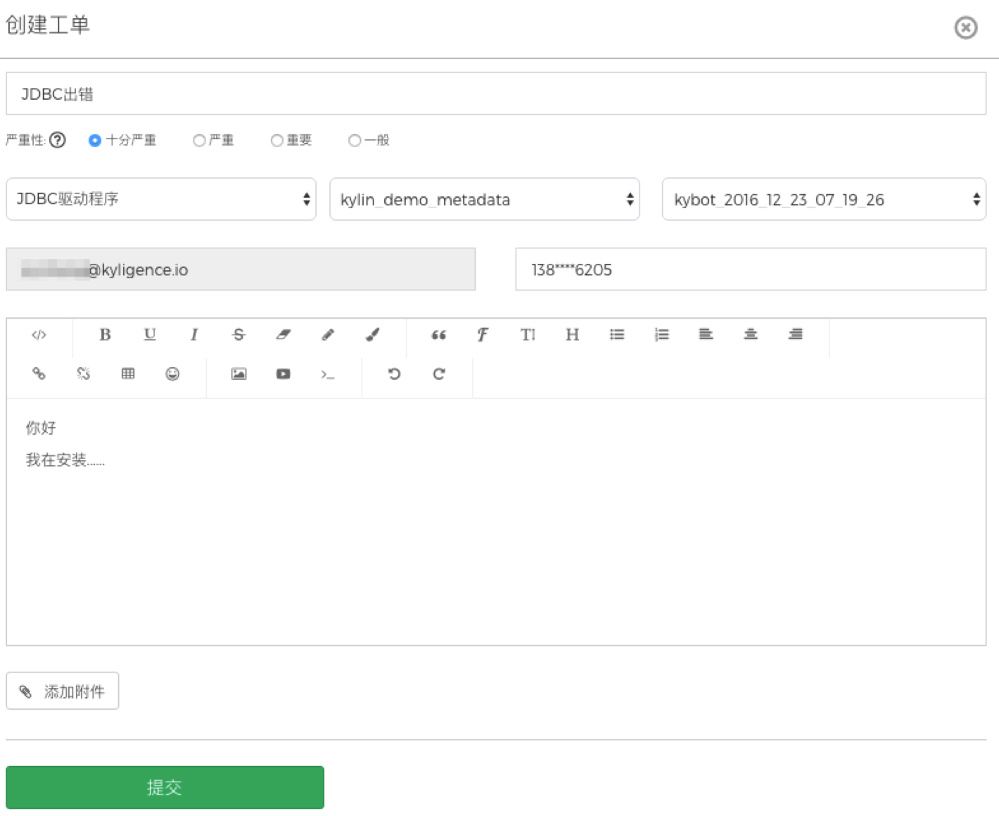

# KyBot介绍及快速入门

## 概述

随着Apache Kylin的深入应用，Kylin集群规模不断扩大，数据存储不断增加，用户访问更加频繁，如何对整个Kylin集群、底层存储、构建任务、Hadoop资源利用等有更多的了解和分析，最大限度的利用相关资源，优化查询性能，提高运行效率，保证应用稳定等逐渐成了Kylin用户群的普遍且急迫的需求。

作为Apache Kylin背后的创业公司，上海跬智信息技术有限公司（Kyligence）推出了KyBot云端服务，为Apache Kylin及其商业版KAP提供 **在线诊断、优化及服务平台** 。KyBot通过分析Kylin的日志等信息，为用户提供可视化仪表盘、系统优化、故障排查、技术支持等服务：

1. **仪表盘：** 以可视化的形式展现Kylin系统的相关内容，包括Cube、用户访问情况、查询延迟、任务构建统计、存储等各方面的信息， 从不同维度提供整个Kylin集群及应用的洞察能力
2. **系统优化：** Kylin提供万亿规模数据集上的亚秒级交互式分析能力，因此，查询的优化是Kylin应用的核心。KyBot可以分析相应的日志为用户提供直观的性能分析试图，通过可视化来展示每一个阶段的性能消耗，以此来帮助用户快速定位瓶颈等。同时，KyBot通过对Cube日志的分析，来帮助用户不断优化数据模型及Cube的设计和存储，以在存储、构建及查询性能间找到最佳的平衡点
3. **故障排查：** 分布式系统在运行过程中不可避免的出现一些异常甚至故障，如何快速的定位和排查这些问题是系统运维的重中之中，KyBot通过解析异常来快速的监控相关故障信息，为用户提供快速诊断能力
4. **技术支持：** 企业级客户可以通过工单快速提交相关的支持请求，结合已经提交的相关日志及分析结果，Kyligence支持工程师可以快速定位并及时给出解决方案，大大降低了沟通成本，提升了服务响应能力


## KyBot是如何工作的？


## 如何使用KyBot？

### 1. 登录注册

KyBot默认访问地址：[https://kybot.io](https://kybot.io)，根据提示完成注册。

### 2. 如何混淆敏感信息

- OBF=混淆 RAW=不混淆
- Cardinality和邮箱账号默认混淆（Cardinality 混淆范围：tiny: &lt;20 small: &lt;100 medium: &lt;1000 high: &lt;10,000 very high: &lt;100,000 ultra high: &gt;=100,000）
- 如hostname设置为OBF，需要定义hostname的模式，如kybot.obf.hostname.pattern=\*.kybot.io

### 3. 生成诊断包

#### KAP用户

如果您使用的是KAP 2.3及以上版本，支持一键上传诊断包到KyBot，操作步骤是：

1.在kylin.properties中配置登陆KyBot的用户名和密码：

```
kap.kyaccount.username // 用户名
kap.kyaccount.password // 密码
```

如果您的KAP服务器需要通过代理才可访问外网，还需添加一下配置项：

```
kap.external.http-proxy-host // http代理服务器地址
kap.external.http-proxy-port // http代理服务器端口
```

2.登陆KAP WEB UI，单击系统页面的"诊断"按钮，弹出以下提示框


3.单击“一键生成诊断包至KyBot”；如果您的KAP节点无法访问外网，也可以单击“下载诊断包”将诊断包下载到本地，然后手动上传到KyBot。（上传步骤见下文）

4.稍等片刻，待诊断包上传成功，访问[KyBot网站](https://kybot.io)即可查看 

5.如果您的KAP时集群部署方式，需要对每个KAP节点分别上传诊断包

如果您使用的是KAP 2.3以下版本，需要下载诊断包并手动上传到KyBot，操作步骤是：
登录每一个KAP节点的WEB UI,点击系统页面的"诊断"按钮,生成诊断包


#### Kylin 用户

① 下载KyBot Client (支持Apache Kylin1.5.0以上及KAP全部版本)下载路径：登录KyBot 官网https://kybot.io，在首页点击上传，然后点击"打包工具: KyBot Client 1.0.1"即可下载。

② 解压到每个Kylin节点的$KYLIN\_HOME/kybot目录

③ 在每个Kylin节点运行$KYLIN\_HOME/kybot/kybot.sh来生成诊断包


### 4.诊断包上传

登录KyBot网站，单击页面顶部的"上传"按钮，即打开上传页面，单击"上传诊断包"按钮，选择一个生成好的KyBot诊断包，并等待其上传成功，上传成功后即加入分析队列，用户可以在上传页面查看分析进度，分析好之后就可使用全部功能。




## 页面功能介绍

### 1. 仪表盘

洞悉KAP（Apache Kylin）集群的健康情况

- #### Cube使用情况统计



- #### Query执行情况统计



### 2. 调优

优化Cube和查询, 找到系统瓶颈，给予优化建议

- #### Cube 详情及使用分析



- #### SQL查询解析及统计分析


### 3. 故障排查

基于知识库和日志分析，提供有效的故障解决方案

- #### 异常统计


- #### 故障追踪


### 4. 技术支持

Kyligence提供的Apache Kylin原厂支持，用户可以通过KyBot提交工单获取Kyligence的技术支持。 
