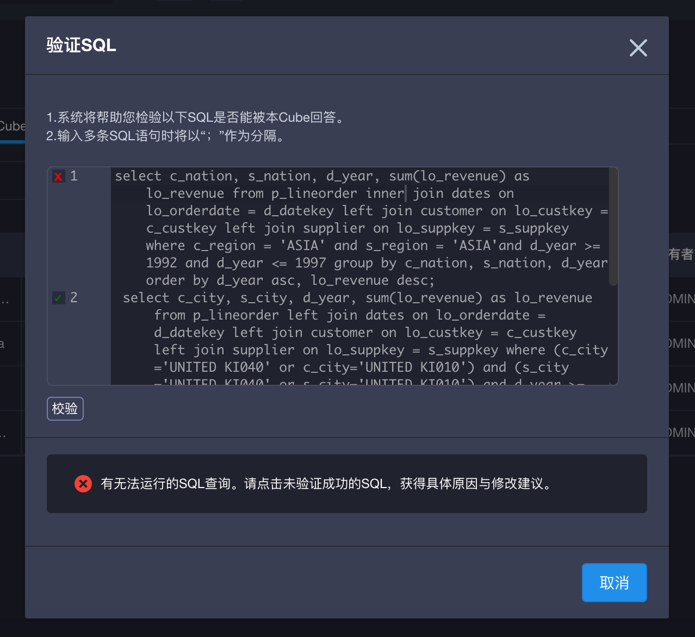
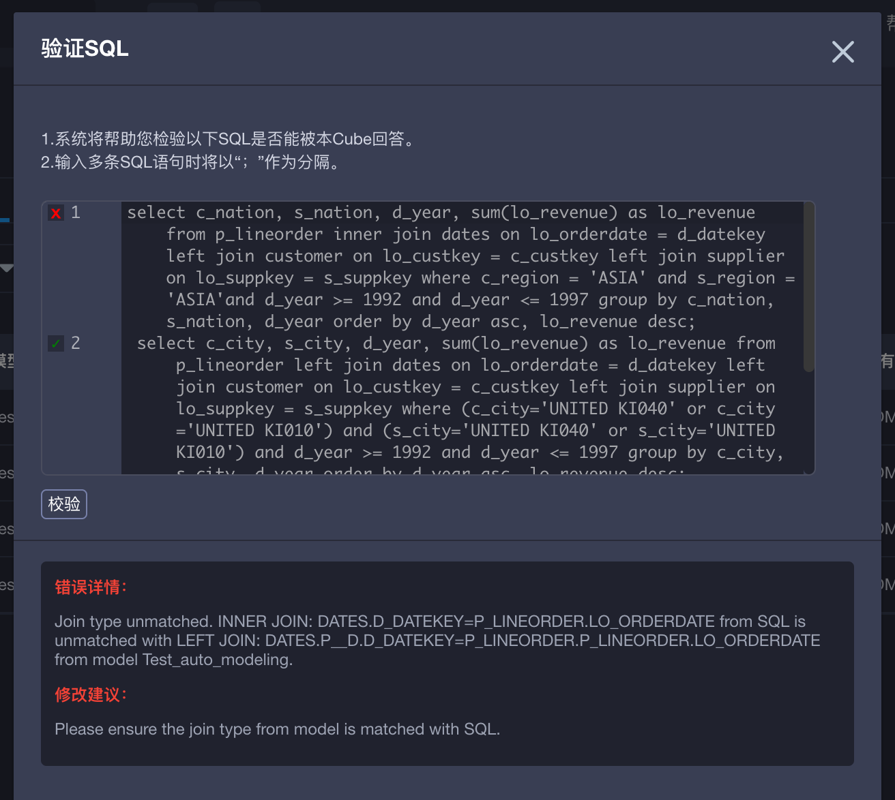

## 验证 SQL 

很多用户在设计好模型或cube后，就希望立即得知该模型或cube的设计是否合理，能否良好的满足某些查询需求，进而快速得到反馈，修改设计。从KAP 2.5开始，每一个设计好的模型或cube都可以在不需要构建cube的情况下，直接得到验证。

### 使用方法

第一步，当你设计好一个模型或cube，保存该模型／cube后可以在右上角点击“验证SQL”。

第二步，在弹出的输入框中粘贴你希望验证的查询语句（SQL）。

第三步，输入完点击左下角的校验并等待校验结果。如果设计合理，可以良好的回答所有查询语句（SQL），展示如下图。

第四步，如果验证SQL有未通过的部分，则可以通过点击该条查询前端的“x”，了解设计模型或cube的具体方法，来满足该查询。

