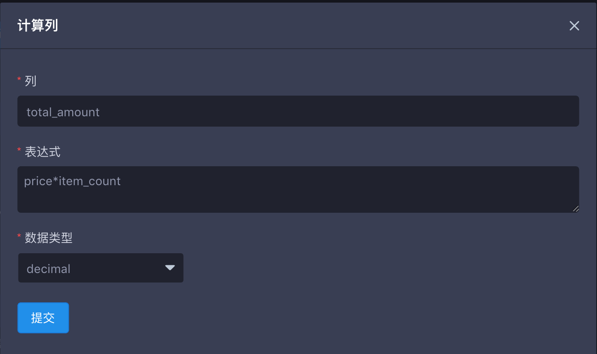
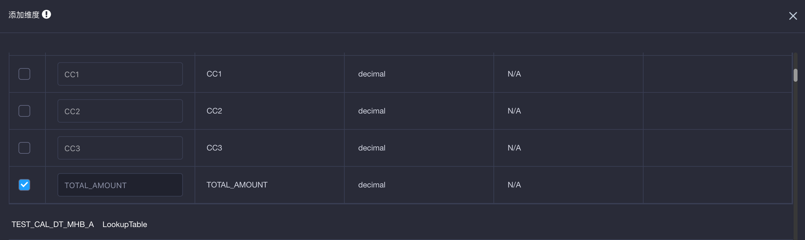

## 计算列（Computed Column）简介

计算列允许用户将数据的抽取／转换／重定义等操作预先定义在模型中，增强数据语义层模型，将查询运行时计算转换为Cube预计算。充分利用KAP的预计算能力，进一步提升查询效率。Computed Column可以支持Hive UDF，从而重用已有业务代码。

## 创建计算列

KAP允许用户为每个模型中定义各自的计算列。每个计算列基于模型中的某个表，是该表上若干列（一个或者多个）的运算的结果。例如模型中有一个事实表kylin_sales，kylin_sales上有以下列：price (交易的单价)，item_count（交易数量）和part_dt （交易时间），用户可以在kylin_sales上定义两个计算列：total_amount = price * item_count 和 deal_year = year(part_dt)。这样，在创建cube的时候，用户不仅可以选择原来的price/item_count/part_dt作为cube中的维度或者度量，还能选择total_amount/deal_year作为cube的维度或者度量。

点击下图箭头所指的计算器按钮，就可以根据提示创建计算列，

其中需要填写：

- *列*：定义计算列的名称
- *表达式*：计算列的表达式定义。注意：只允许使用当前表上的列进行计算，不支持跨表的表达式
- *数据类型*：定义计算列的类型

在模型中定义完计算列后，需要在创建cube添加维度/度量的时候选入计算列，计算列被预计算后，才能体现性能优势。

## 显示vs隐式查询

在一个表上创建了计算列后，逻辑上这个计算列就被拼接到了这个表的列列表中。用户可以像查询普通的列一样查询这个列（能够被查询的前提是这个某个ready状态的cube/rawtable包含了该列，或者启用了Query Pushdown）。在上面的kylin_sales例子中，如果用户创建并构建了一个包含sum(total_amount)度量的cube，用户可以直接查询select sum(total_amount) from kylin_sales。我们将这种查询方式成为计算列的显示查询。

或者，用户也可以假装表上没有计算列，直接使用计算列背后的表达式进行查询，接着上面的例子，用户可以查询select sum(price*item_count) from kylin_sales。KAP会分析到price*item_count可以由计算列total_amount替代，且sum(total_amount）已经在某个cube中被与预计算完毕，为了更好的性能，KAP会将用户原始查询翻译为select sum(total_amount) from kylin_sales，以求更佳的性能。我们将这种查询方式成为计算列的隐式查询。

隐式查询默认没有被开启，为了开启它，用户需要在KYLIN_HOME/conf/kylin.properties中添加`kylin.query.transformers=org.apache.kylin.query.util.ConvertToComputedColumn` 

