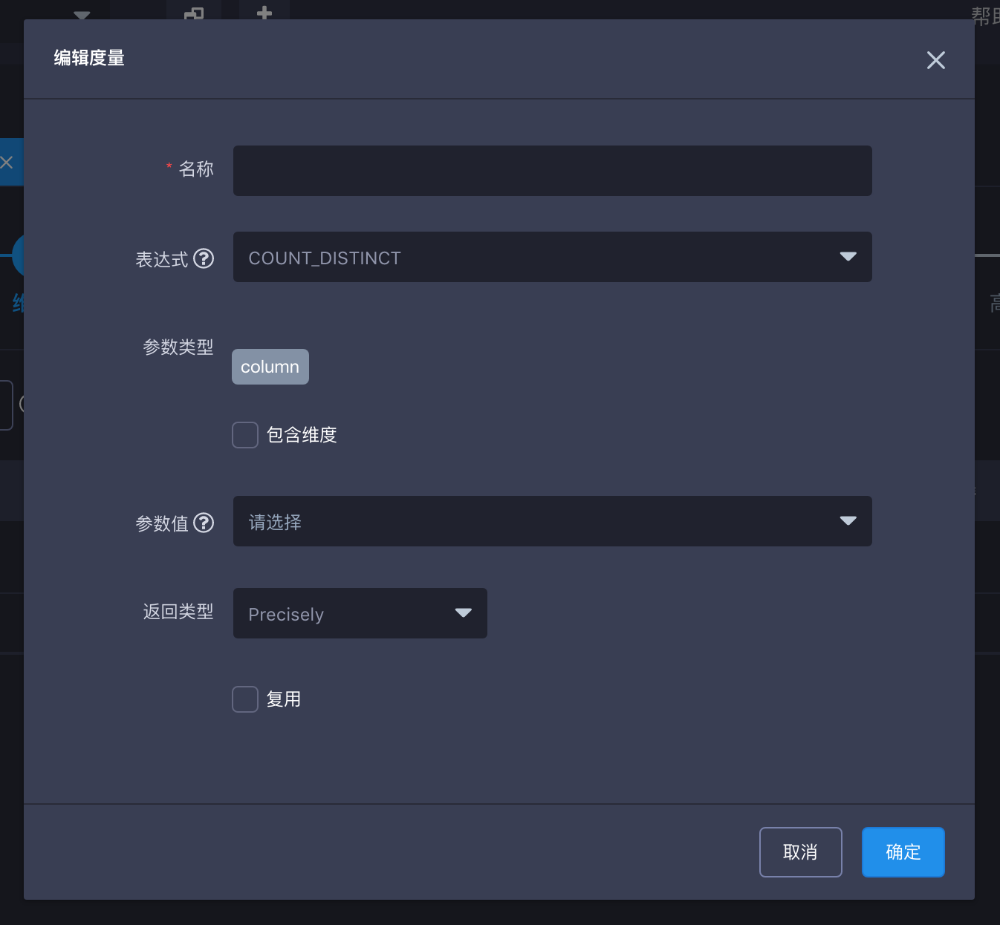

## Count Distinct 精确查询

Count distinct是一个对大多数数据分析师都很常用的函数。KAP 从版本v2.1以来通过位图算法支持了Count distinct 精确查询。对于数据型为tinyint， smallint和int的数据，KAP将把数据对应的值直接打入位图中。对于数据型为long，string和其他的数据，KAP将他们编码成字符串放入字典，然后再将对应的值打入位图。返回的度量结果是已经序列化的位图数据，而不仅是计算的值。这确保了不同的segment中，甚至跨越不同的segment来上卷，结果也是正确的。

### 查询前提

在使用count distinct 查询之前，你需要确认目标列是否预存了count distinct的预计算结果。在Cube展示界面点击需要查看的Cube的名称，可以通过点击Cube Designer界面的 **度量（measures）** 来查看Cube中所有measure的预计算信息。如果目标列已经被进行过 count distinct的预计算（**表达式**(Expression)为count_distinct 并且 **返回类型**(Return Type)为 **bitmap**）则意味着此列可以直接进行count distinct的精确查询。否则，你需要创建新Cube来存储目标列的count distinct预计算结果。

### Count Distinct 精确查询设置 

首先在创建新Cube的界面，点击左下角**添加度量** 来开始新度量的设置。

然后，在编辑度量窗口从 **参数值** 下拉列表中选择目标列，并从 **表达式** 选择 **COUNT_DISTINCT**。之后请谨慎选择 **返回类型** 中的误差选项。KAP提供count distinct的近似查询和精确查询。如需要得到某列的精确查询预计算值，你应选择基于位图（bitmap）算法的返回类型: **Precisely**。这种精确查询将会在**存储资源充足**的情况下返回一个非常精确的结果。例如，如果查询数据为百万级，则返回的一个结果的大小将为百兆左右。

> Count distinct 精确查询因为使用位图算法，所以需要耗用的资源也较多，在使用count distinct 精确查询计算具有**亿级**基数的表时，请咨询[Kyligence技术支持](../../introduction/get_support.cn.md)评估集群资源是否充足。

KAP在默认状态下会将值编码进Cube segment级的字典。设置count distinct精确查询时，被设置的列的值都会被编码进 **全局目录** 来确保一个值只被编码为一个ID，即使是在不同的segment中。

当cube中已有一列（例如：城市）被设置为count distinct精确查询的度量时，与该列具有层级关系的列（例如：省份／国家），可以直接**复用**该列的编码。设置时，依然在返回类型里选择**Precisely**且勾选☑️复用的复选框。

### 参考文献

[Use Count Distinct in Apache Kylin](http://kylin.apache.org/blog/2016/08/01/count-distinct-in-kylin/) (Yerui Sun)

