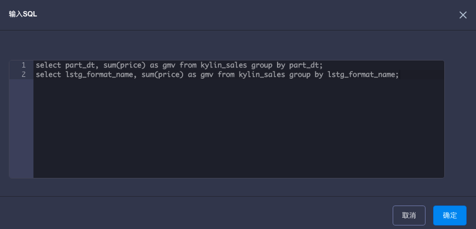
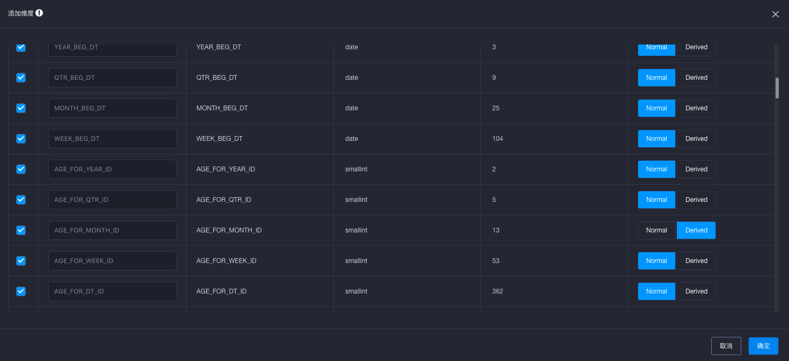
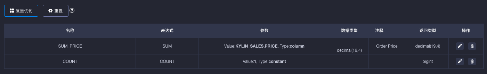

## 一键优化

从2.4版本开始，KAP提供了一个Cube优化器，基于原始数据的数据特性和SQL查询记录，在用户进行Cube设计时给出参考建议，有助于降低Cube的膨胀率，并提升查询和构建的性能。用户可以根据实际业务需要，再对建议的结果进行微调。

### 基本原理

优化器对原始数据的数据特性和查询模式进行分析，根据Cube调优的最佳实践，推荐出优化的Cube设计，主要包括以下内容：

- 维度设置：优化器会推荐维度的类型，如普通维度或衍生维度
- 度量设置：优化器对查询模式进行分析，推荐出最常用的度量
- 聚合组：优化器会推荐每个聚合组的规则，如层级维度、必须维度、暴力剪枝等，用于降低Cuboid数量
- Rowkey：优化器会推荐每个Rowkey的设置（如编码等）、顺序

为了获取准确的推荐结果，优化器需要以下数据作为输入：

- 模型检测（必需）：在进行”一键优化“之前必须完成模型检测，模型检测结果是优化器不可缺少的输入
- SQL查询记录（可选）：一组历史查询或目标查询的SQL语句，在推荐度量、聚合组、Rowkey时有引导作用

### 操作步骤

1. 对一个数据模型进行模型检测。如果模型检测已通过，请跳过该步骤。了解模型检测，请单击[这里](../model_check.cn.md)。
2. 使用这个数据模型创建Cube，在”Cube信息“页单击”输入SQL“按钮，并在弹窗中输入SQL语句。如果有多条SQL，请使用分号进行分隔。

3. 在”维度“页单击”添加维度“按钮，勾选希望添加到Cube的维度。其中，维度类型的默认值就是优化器的推荐结果，如下图所示。

4. 单击”维度优化“按钮，可以为聚合组自动推荐优化规则，如必须维度、层级维度、联合维度等；此外，Rowkeys的配置和顺序也自动设置为推荐结果。

5. 在”度量“页单击”度量优化“按钮，优化器推荐出的度量会自动填充在维度列表中。

6. 基于实际业务需求，用户可以对推荐的维度、聚合组、Rowkey、度量等进行优化，并进行保存。

