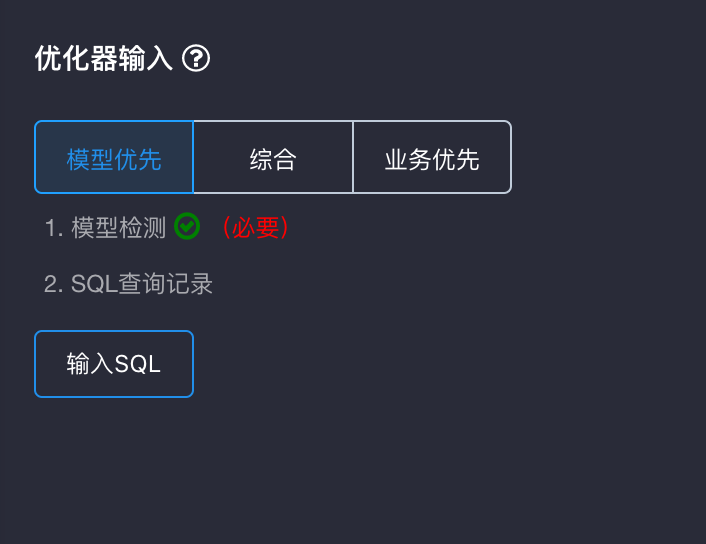
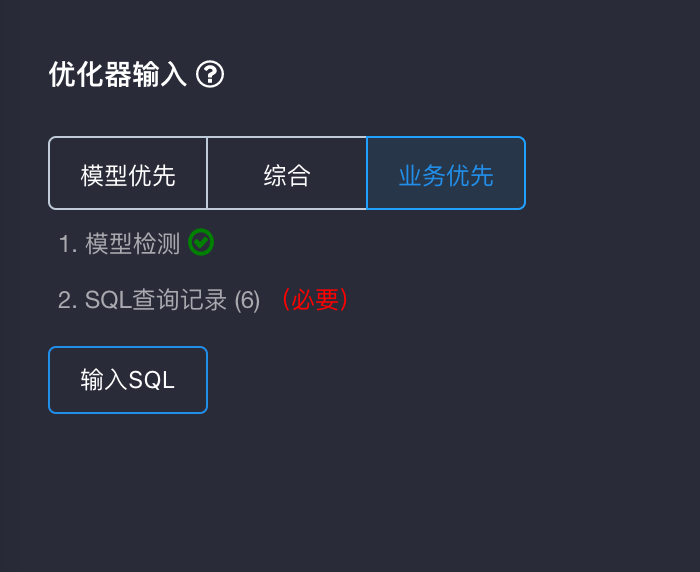
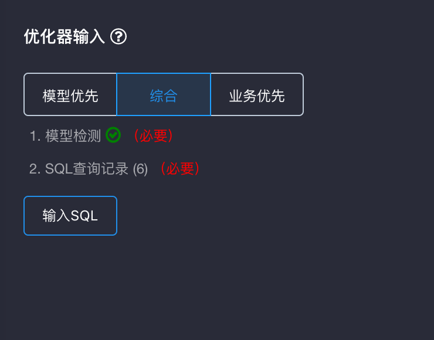
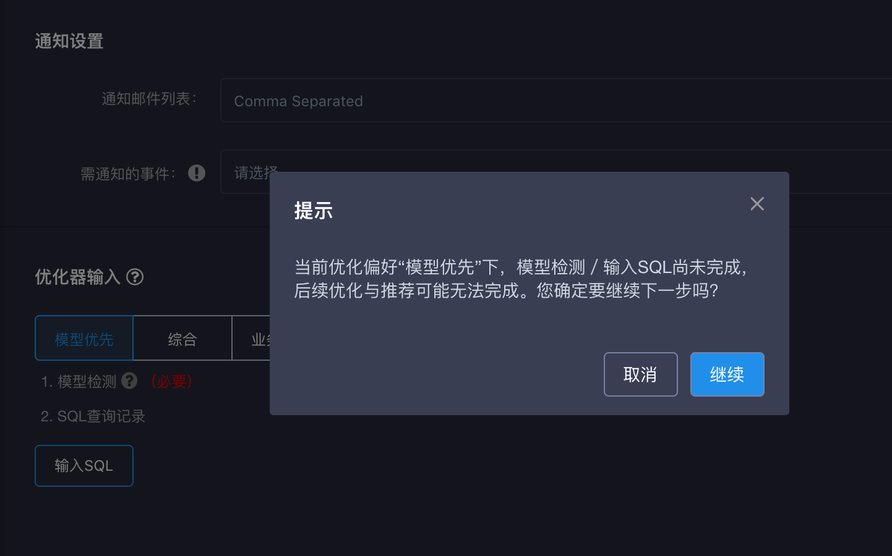
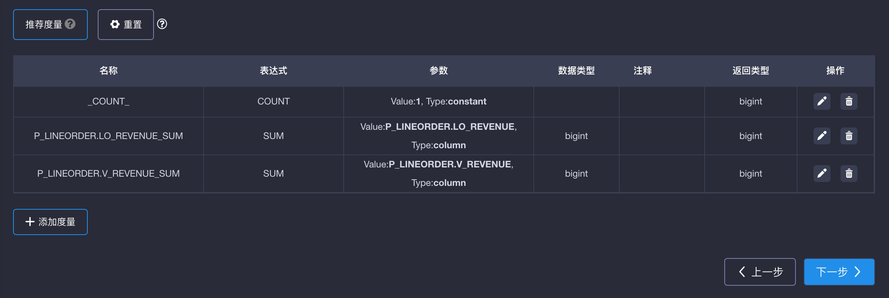

## Cube优化器

从KAP 2.5开始，KAP提供了一个Cube优化器, 可以由您选择适合的cube优化方法，进行Cube设计时给出参考建议，有助于降低Cube的膨胀率，并提升查询和构建的性能。

### 基本原理

优化器对原始数据的数据特性和查询模式进行分析，根据Cube调优的最佳实践，推荐出优化的Cube设计，主要包括以下内容：

- 优化偏好：

  - 模型优先：主要参考模型检测结果，即模型的数据特征。输出为一个聚合组，优化对应模型中所有的维度，生成的cube更适用于**灵活度高**的查询。

    

  - 业务优先：主要参考输入的SQL语句，推荐N个完全由必要维度组成的聚合组，生成的cube**定向回答**这些SQL语句。

    

  - 综合：综合两种优化偏好，适用于**部分查询定向**、**部分查询灵活**的场景。
    综合偏好设置，可以同时满足两种查询偏好，但生成的聚合组较多，后续构建所需资源较多。

    

- 维度设置：优化器会根据输入的SQL，推荐维度以及维度类型，如普通维度或衍生维度。

- 度量设置：优化器会根据输入的SQL，对查询模式进行分析，推荐出常用的度量。

- 聚合组：优化器会推荐每个聚合组的具体优化规则，如层级维度、必须维度、最大组合维度数等，用于降低Cuboid数量。

- Rowkey：优化器会推荐每个Rowkey的设置（如编码等）和顺序。

### 优化输入条件

为了获取准确的推荐结果，优化器需要以下数据作为输入，不同的优化偏好需要不同的条件（如上图）：

- 优化偏好：旨在给出不同的优化风格，满足不同的查询需求与场景。

  > 已选择的优化偏好下，必要的输入条件未满足时，会在进入下一步前提醒您（如下图）。

  

- 模型检测：旨在收集模型的数据特征，模型检测结果是优化器不可缺少的输入。

- SQL查询记录：一组历史查询或目标查询的SQL语句，在推荐维度、度量、聚合组、Rowkey时有引导作用。

  ​

### 操作步骤

1. 对一个数据模型进行模型检测。如果模型检测已通过，请跳过该步骤。了解模型检测，请单击[这里](../model_check.cn.md)。
2. 使用这个数据模型创建Cube，在”Cube信息“页单击”输入SQL“按钮，并在弹窗中输入SQL语句。如果有多条SQL，请使用分号进行分隔。

3. 在”维度“步骤下，打开”添加维度“页面，可以通过点击“推荐维度”获得优化器根据SQL输出的维度。另外，您也可以勾选希望添加到Cube的维度。维度类型的默认值也是优化器的推荐结果，如下图所示。

   ​

4. 单击”维度优化“按钮，可以为聚合组自动推荐优化规则，如必须维度、层级维度、联合维度等；此外，Rowkeys的配置和顺序也自动设置为推荐结果。

5. 在”度量“页单击”推荐度量“按钮，优化器推荐出的度量会自动填充在维度列表中。

   ​

6. 基于实际业务需求，用户可以对推荐的维度、聚合组、Rowkey、度量等进行优化，并进行保存。

