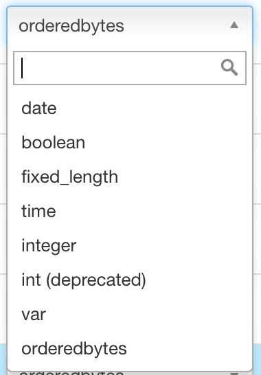

## 创建明细表

明细表用来支持明细查询，而且明细表的创建流程是镶嵌在Cube内。本文主要介绍了明细表的创建流程，其中，数据是来自KAP的样例数据。

打开KAP网络版的UI界面，选择左上角的项目列表中的项目 `KAP_Sample_1` 。Cube的创建过程请见 `Cube` 这页。

明细表的定义出现在第六步，默认状态下它是被禁止的。 

选取 `Config Raw Table` 来查看明细表的定义。

### 编码

在每行点击 `Encoding`下拉列表 ，用户可以为每列选择编码 。编码的默认值是 `orderedbytes`。

1. “orderedbytes” 编码可用于所有类型。它会在编码时保持数据的顺序。它也是大多数情况下的默认的编码。
2. "var”  编码类似于`orderedbytes`，除了它不会存顺序。因此该编码不建议使用，请用 `orderedbytes`代替。 
3. "boolean" 适用于字段值为: true, false, TRUE, FALSE, True, False, t, f, T, F, yes, no, YES, NO, Yes, No, y, n, Y, N, 1, 0
4. "integer" 适用于字段值为整数字符, 支持的整数区间为[ -2^(8*N-1), 2^(8*N-1)] . 
5. "int" 已弃用, 请使用最新的integer编码. 
6. "date" 适用于字段值为日期字符, 支持的格式包括yyyyMMdd、yyyy-MM-dd、yyyy-MM-dd HH:mm:ss、yyyy-MM-dd HH:mm:ss.SSS, 其中如果包含时间戳部分会被截断. 
7. "time" 适用于字段值为时间戳字符, 支持范围为[ 1970-01-01 00:00:00, 2038/01/19 03:14:07] , 毫秒部分会被忽略.  time编码适用于time, datetime, timestamp等类型. 
8. "fix_length" 适用于超高基场景, 将选取字段的前N个字节作为编码值, 当N小于字段长度, 会造成字段截断, 当N较大时, 造成RowKey过长, 查询性能下降.  只适用于varchar或nvarchar类型.
9. "fixed_length_hex" 适用于字段值为十六进制字符, 比如1A2BFF或者FF00FF, 每两个字符需要一个字节.  只适用于varchar或nvarchar类型. 

注意`dict`编码在rawtable中并不支持

### Index

在每行点击 `Index`下拉列表， 用户可以为每列选取对应的索引类型。默认的索引类型为`discrete`。

1. `discrete` 索引是默认索引，它表示只有相等的索引可用于该行。
2. `fuzzy` 索引是服务于含有 `Like` 过滤的查询。 如果某行可能应用 `Like` 过滤，请将其设置为 `fuzzy` 索引。
3. `sorted` 索引表示该行被选取， 同时目前有且只有一行可以在一张表中被设置为 `sorted` 。默认状态下，数据模型中分区的行会被选为 `sorted` 行。
