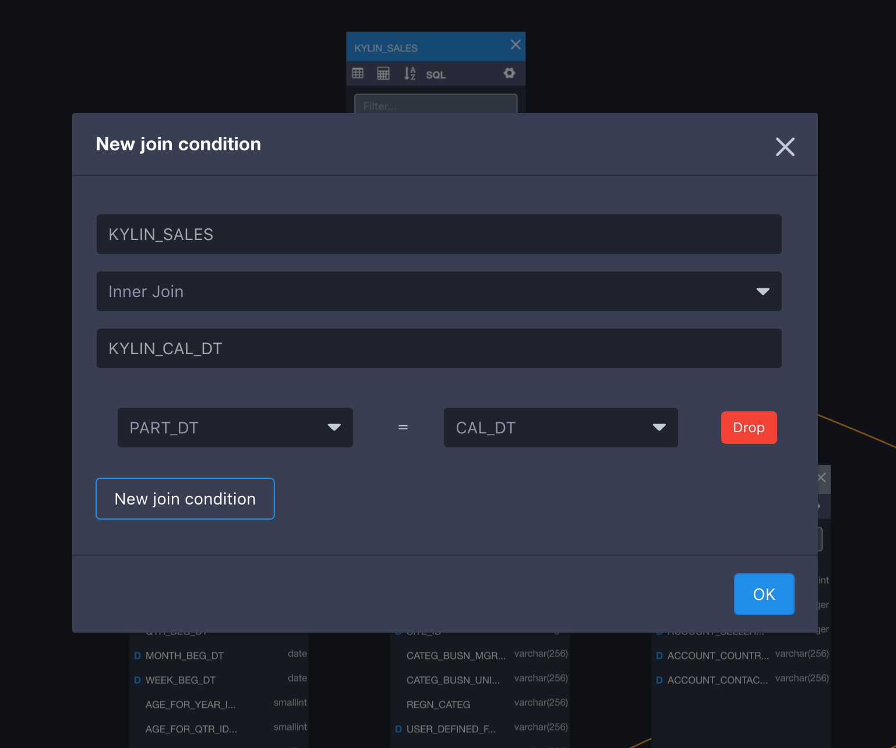

## 设计模型
在数据源就绪的基础之上，我们开始设计模型。以KAP自带的数据集为例，该数据集的数据模型包含1个事实表和4个维表，表间通过外键进行关联。实际上，并不是表上所有的字段都有被分析的需要，因此我们可以有目的地仅选择所需字段添加到数据模型中。然后，根据分析师用户的具体分析场景，把这些字段设置为维度或度量。

### 创建步骤
第一步，打开KAP的Web UI，在左上角项目列表中选择刚刚创建的*learn_kylin*项目，然后进入“模型”页面，并创建一个模型。

第二步，为模型选择事实表（*Fact Table*）和查找表（*Lookup Table*）。从左边的表工具箱中拖出您希望用来建模的表，拖至建模画布（页面中央）并将kylin_sales的表类型转化为事实表。为了建立下文所需的雪花模型，请您选择拖出的表分别为：一张事实表 (`KYLIN_SALES`) 和四张维度表 (`KYLIN_CAL_DT`, `KYLIN_CATEGORY_GROUPINGS`,`KYLIN_ACCOUNT`, `KYLIN_COUNTRY`)。

第三步，建立表连接关系。在KAP2.4系列中，表与表关系的建立可以通过拖拽表上的列完成。当你希望建立一个表连接（join），从事实表（外键所在表）指向维度表（主键所在表），比如，“KYLIN_SALES *Inner Join* KYLIN\_CAL\_DT on KYLIN\_SALES.PART_DT=KYLIN\_CAL\_DT.CAL\_DT”, 则将`PART_DT`从`KYLIN_SALES`拖至`KYLIN\_CAL\_DT`，如下图所示的窗口将会弹出。

参照以上方法，设置好所有连接条件（如下所示）：

1. KYLIN_SALES *Inner Join* KYLIN\_CAL\_DT 

   连接条件：

   DEFAULT.KYLIN\_SALES.PART_DT = DEFAULT.KYLIN\_CAL\_DT.CAL\_DT

2. KYLIN_SALES *Inner Join* KYLIN\_CATEGORY_GROUPINGS 

   连接条件：

   KYLIN_SALES.LEAF_CATEG_ID=KYLIN\_CATEGORY\_GROUPINGS.LEAF_CATEG_ID

   KYLIN_SALES.LSTG_SITE_ID=KYLIN\_CATEGORY\_GROUPINGS.SITE_ID 

3. KYLIN_SALES *Inner Join* BUYER_ACCOUNT (alias of KYLIN_ACCOUNT)

   连接条件：

   KYLIN_SALES.BUYER_ID=BUYER_ACCOUNT.ACCOUNT_ID 

4. KYLIN_SALES *Inner Join* SELLER_ACCOUNT (alias of KYLIN_ACCOUNT) 

   连接条件：

   KYLIN_SALES.SELLER_ID=SELLER_ACCOUNT.ACCOUNT_ID 

5. BUYER_ACCOUNT (alias of KYLIN_ACCOUNT) *Inner Join* BUYER_COUNTRY(alias of KYLIN\_COUNTRY) 

   连接条件：

   BUYER_ACCOUNT.ACCOUNT_COUNTRY=BUYER_COUNTRY.COUNTRY 

6. SELLER_ACCOUNT (alias of KYLIN_ACCOUNT) *Inner Join* SELLER_COUNTRY(alias of KYLIN\_COUNTRY)

   连接条件：

   SELLER_ACCOUNT.ACCOUNT_COUNTRY=SELLER_COUNTRY.COUNTRY

下图是设置好之后的界面（点击连接中的标志（join），可以展开连接具体内容）：

第四步，从上一步添加的事实表和维度表中选择需要作为维度（D: Dimension）的字段。一般的，时间经常用来作为过滤条件，所以我们首先添加时间字段。此外，我们再添加商品分类、卖家ID等字段为维度，保存后结果如下图所示：

第五步，根据业务需要，从事实表上选择衡量指标的字段作为度量。例如，PRICE字段用来衡量销售额，ITEM_COUNT字段用来衡量商品销量，SELLER_ID用来衡量卖家的销售能力。保存后的最终结果如下图所示：

第五步，点击“保存”并设置日期类型的时间分段。一般来说，销售数据都是与日俱增的，每天都会有新数据通过ETL到达Hive中，需要选择增量构建方式构建Cube，所以需要选择用于分段的时间字段DEFAULT.KYLIN_SALES.PART_DT。根据样例数据可以看到，这一列时间的格式是yyyy-MM-dd，所以选择对应的日期格式。此外，我们既不需要设置单独的分区时间列，也不需要添加固定的过滤条件。设置效果如下图所示。
最终，单击“提交”按钮，到此数据模型就创建成功了。