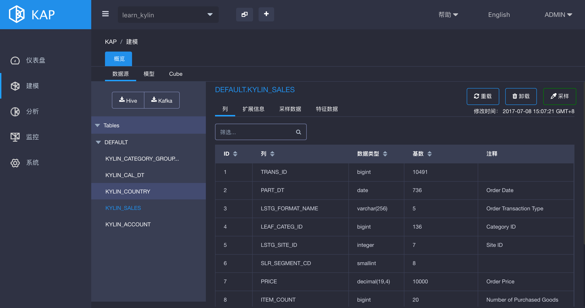
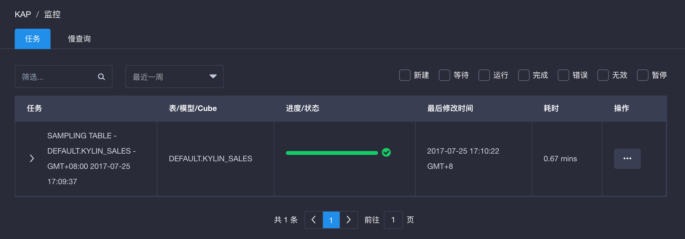
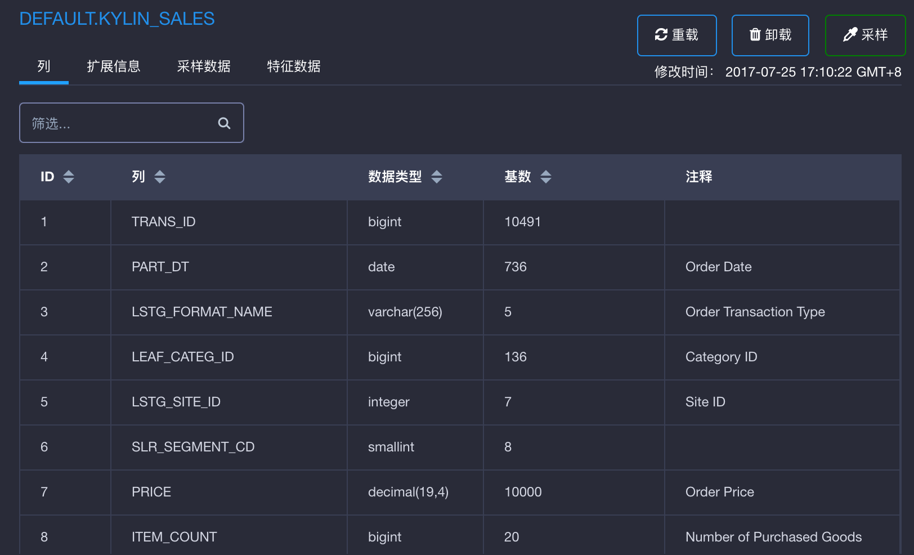
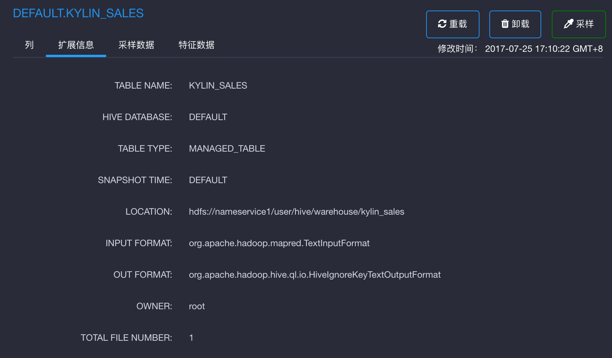
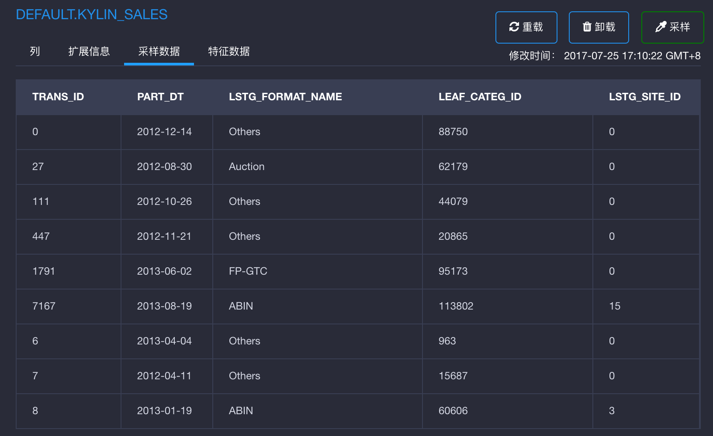
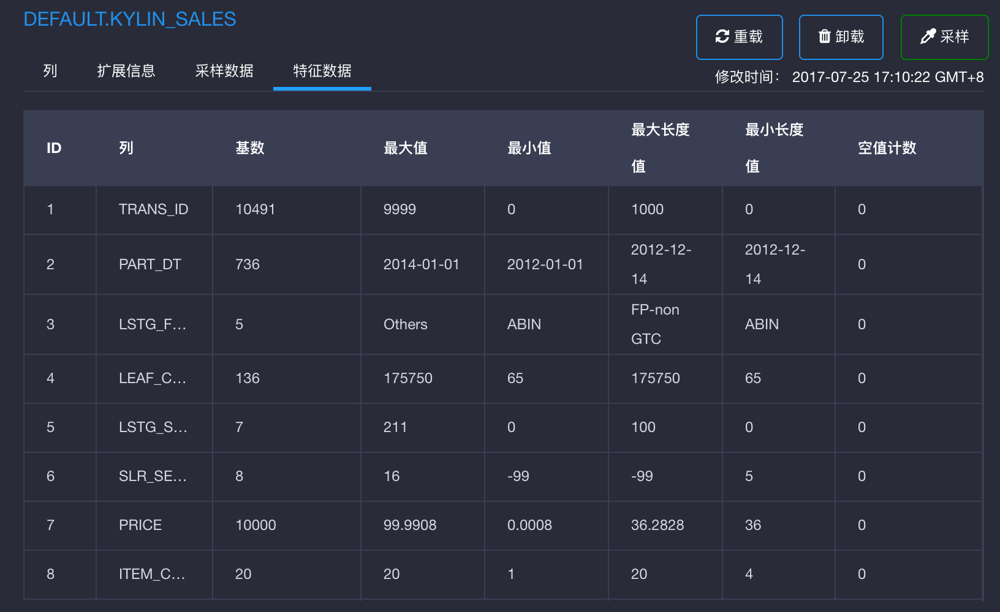
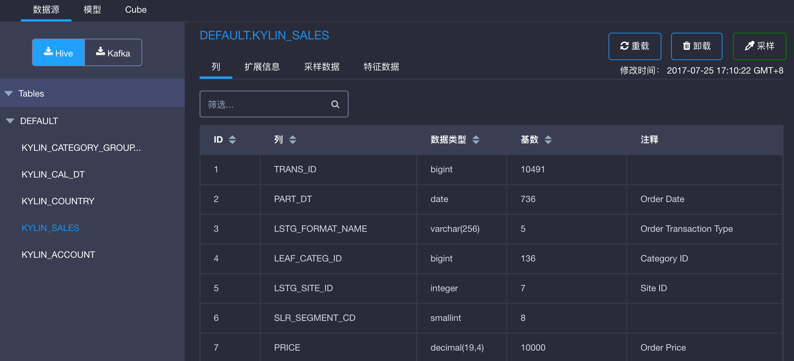

## 表的统计信息收集

表的采样信息包括每列的基数和抽样数据等，这些信息能够帮助用户设计更好的数据模型和Cube。这一节将介绍如何在KAP中收集表的统计信息。在导入源表的元数据时，KAP支持用户进行**单表采样**和**多表采样**。

### 单表采样

打开KAP GUI，选取项目**learn_kylin**, 点击左侧导航栏中的**建模**，再点击对应模型页中的**数据源**，最后选择需要收集统计信息的表`KYLIN_SALES`后点击右上角的**采样**。

点击右上角的**采样**后，弹出的对话框用于设置**采样比例**，如果用户想扫描全表数据则直接点击**提交**按钮，否则可以选择稍低的采样比例（80%）再点击**提交**按钮。

> 注意：表的采样比例可选范围分别为20%－40%－60%－80%－100%，默认状态为100%。采样比例越高，则采样结果越准确，但可能耗用较多资源。除在个人沙箱中使用外，在合适资源配置的环境下（参见[推荐配置](../config/recommend_settings.cn.md)），表的采样都会在十几分钟完成。

点击左侧导航栏中的`监控`按钮，用户可以看到该表的采样任务已经启动。表采样任务的名称格式为：SAMPLING TABLE-Database Name.Table Name-Job Start Time。

等该任务结束。返回到之前的**数据源**标签页选择表**KYLIN_SALES**，此时用户能够看到收集到的统计信息。详细统计信息分别列在**列** 、**扩展信息**、**采样**和**采样数据**中。

### 多表采样

打开KAP GUI，选取项目**learn_kylin**, 点击左侧导航栏中的**建模**，再点击对应模型页中的**数据源**，点击左侧**从Hive同步表**的按钮。

点击**从Hive同步表**的按钮后，会弹出表的加载窗口。选择加载多张表后，可以勾选**收集表信息**以对这些表同时采样。

采样任务触发后的任务查看与采样信息展示同上（单表采样）。