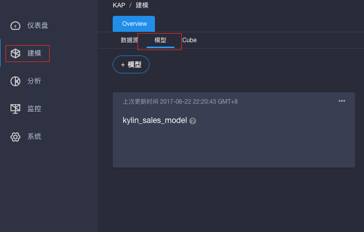
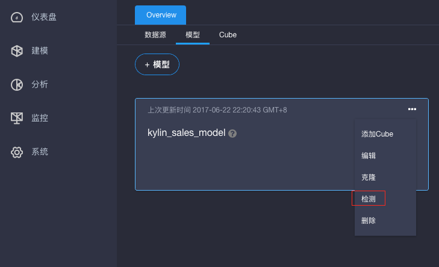
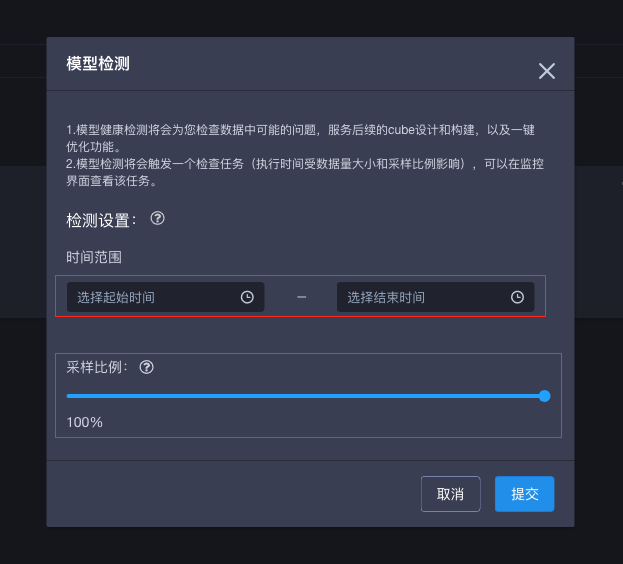
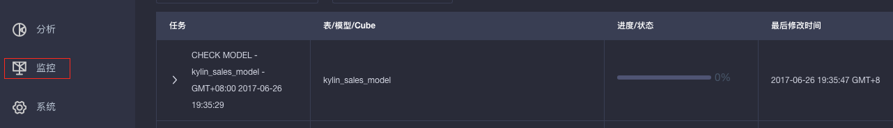
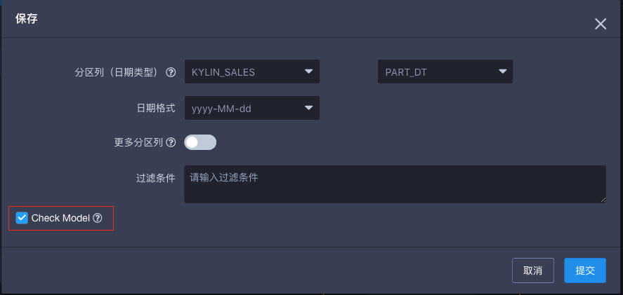
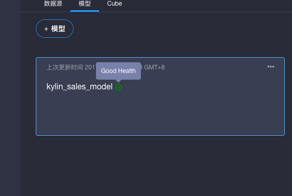

## 数据模型的检测

数据模型的检测主要是针对创建好的数据模型进行一系列的检查，包括检查维表的主键里是否存在重复的值，是否存在数据倾斜的可能性，连接的条件是否合理。这些信息能够帮助用户在构建Cube前就判断出数据模型是否合理，以免在构建Cube时发现问题再修改模型。同时，模型检测还会进行单列以及两列的基数计算，用于辅助优化Cube。这一章将介绍如何在KAP中进行模型检测。

**Step1.** 打开KAP网页前端，选取一个项目，比如: learn_kylin,  点击左侧导航栏的**建模**，再点击右侧**模型**标签页。

**Step2.** 对于一个已存在的模型，比如：kylin_sales_model, 点击右上角的菜单，选择**检测**

**Step3. 设置**

时间范围。要求设置一个获取数据的时间框，因为如果模型有时间分区的列，可以设置起始－终止时间范围来限定获取的数据范围，避免检测全量数据。默认不选择就是检测全量数据。

采样比例。表示在选定的时间段内的数据只进行部分检测，比如，50%比例表示每两条数据只检测一条，以此类推。

**Step4.** 设置都完成后，点击提交按钮，则开始检测任务，可以点击左侧导航栏的**监控**观察任务进度。

如果是创建或者编辑一个模型，在点击**保存**后，会弹出一个对话框询问是否进行模型检测，默认会勾选，提交后将启动一个模型检测任务，同样可以在监控里可以管擦到进度。

如果模型检测顺利完成，建模－模型页面可以看到检测后的状态，本例中模型状态为健康，如果模型有问题将出现对应的状态及详细信息。

