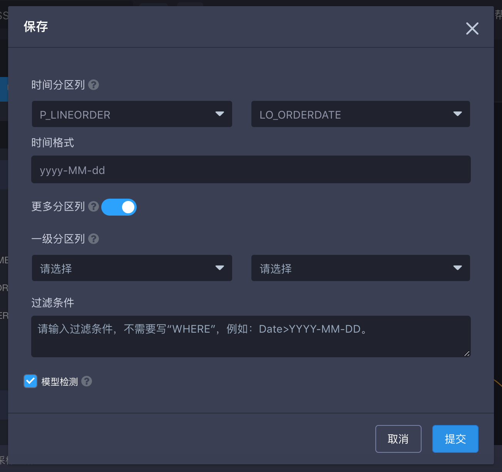
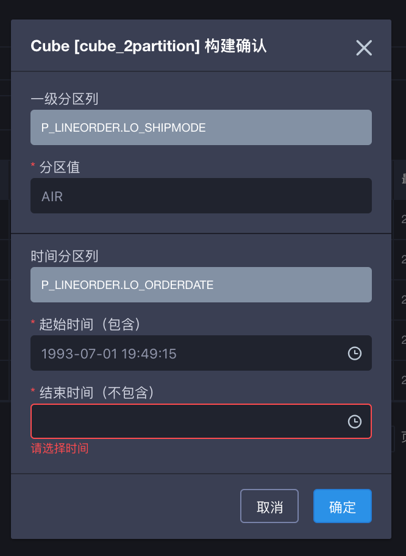

## 多级分区模型

常见的模型是按照时间分区的。但在一些多租户的使用场景中，除了时间之外，需要另一个维度（分区列）来区分不同的子机构或子业务。这里我们将时间分区之外的分区维度统一称为多级分区。目前，KAP 2.5.2开始，已经可以支持时间分区与一级分区。

### 多级分区的概念

- 基本概念：分区列分为时间分区列与多级分区列，当前只支持新增一级分区。
- 常用概念：
  - 时间分区列：可以支持日期或更细粒度的时间分区；
  - 多级分区列：时间分区列之外的分区维度，目前新增一级分区列；
  - 分区值：构建时，一级分区列中具体的值，常在该分区值上增量构建segment；

### 基本使用

1. 创建模型的一般流程可以参照 [设计模型](data_modeling.cn.md)；

2. 模型保存时，如果在时间分区列选择更多分区列，即可建立多级分区（目前只有一级）；

   

   ​

3. cube构建时，已有多级分区列的cube需要选择多级分区列与对应的时间分区列；

   