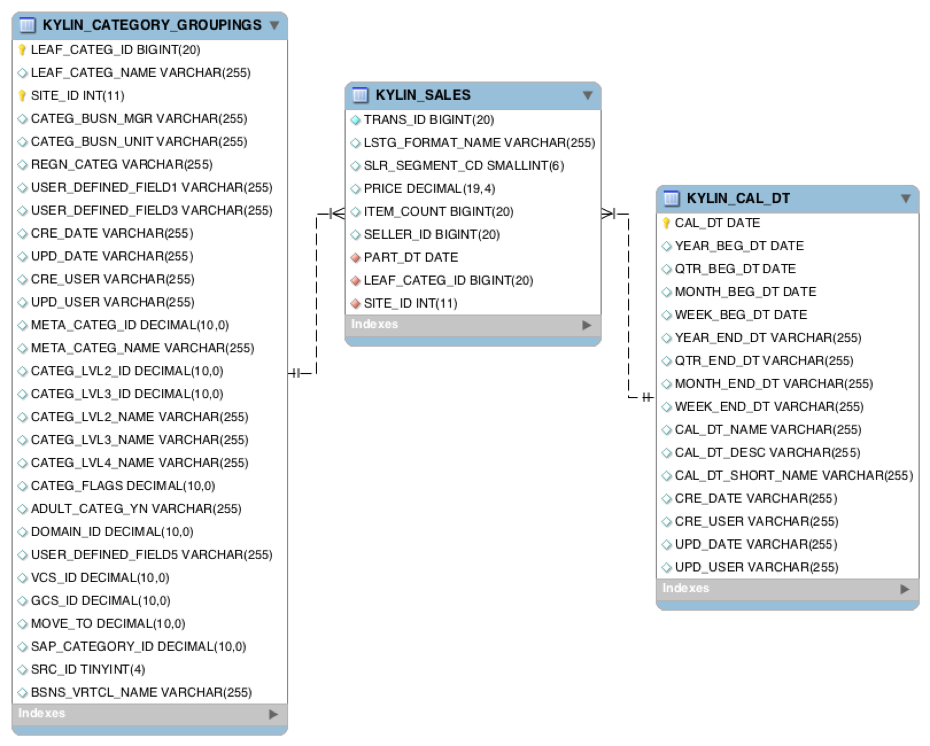

## 样例数据集KAP
二进制包中包含了一份用于测试的样例数据集，总共大小仅1.5MB左右，共计5张表，其中事实表有10000条数据。因为数据规模较小，方便在虚拟机中进行快速实践和操作，用户可以自行搭建Hadoop Sandbox的虚拟机并快速部署KAP，然后导入该数据集进行试验。

KAP仅支持星型数据模型，这里用到的样例数据集就是一个规范的星型模型结构，它总共包含了5个数据表：

- *KYLIN_SALES* 是事实表，保存了销售订单的明细信息。每一列保存了卖家、商品分类、订单金额、商品数量等信息，每一行对应着一笔交易订单。
- *KYLIN_CATEGORY_GROUPINGS* 是维表，保存了商品分类的详细介绍，例如商品分类名称等。
- *KYLIN_CAL_DT* 是维表，保存了时间的扩展信息。如单个日期所在的年始、月始、周始、年份、月份等。
- *KYLIN_ACCOUNT*是用户账户表，每行是一个用户。用户在事实表中可以是买方(Buyer)或者卖方(Seller)。通过ACCOUNT_ID链接到*KYLIN_SALES*的BUYER_ID或者SELLER_ID上。
- *KYLIN_COUNTRY*是用户所在的国家维表，链接到*KYLIN_ACCOUNT*。

这5张表一起构成了整个星型模型的结构，下图是实例-关系图：

### 数据表与关系

| 表                        | 字段                  | 意义       |
| :----------------------- | :------------------ | :------- |
| KYLIN_SALES              | PART_DT             | 订单日期     |
| KYLIN_SALES              | LEAF_CATEG_ID       | 商品分类ID   |
| KYLIN_SALES              | SELLER_ID           | 卖家ID     |
| KYLIN_SALES              | BUYER_ID            | 买家ID     |
| KYLIN_SALES              | PRICE               | 订单金额     |
| KYLIN_SALES              | ITEM_COUNT          | 购买商品个数   |
| KYLIN_SALES              | LSTG_FORMAT_NAME    | 订单交易类型   |
| KYLIN_CATEGORY_GROUPINGS | USER_DEFINED_FIELD1 | 用户定义字段1  |
| KYLIN_CATEGORY_GROUPINGS | USER_DEFINED_FIELD3 | 用户定义字段3  |
| KYLIN_CATEGORY_GROUPINGS | UPD_DATE            | 更新日期     |
| KYLIN_CATEGORY_GROUPINGS | UPD_USER            | 更新负责人    |
| KYLIN_CATEGORY_GROUPINGS | META_CATEG_NAME     | 一级分类     |
| KYLIN_CATEGORY_GROUPINGS | CATEG_LVL2_NAME     | 二级分类     |
| KYLIN_CATEGORY_GROUPINGS | CATEG_LVL3_NAME     | 三级分类     |
| KYLIN_CAL_DT             | CAL_DT              | 日期       |
| KYLIN_CAL_DT             | WEEK_BEG_DT         | 周始日期     |
| KYLIN_CAL_DT             | MONTH_BEG_DT        | 月始日期     |
| KYLIN_CAL_DT             | YEAR_BEG_DT         | 年始日期     |
| KYLIN_ACCOUNT            | ACCOUNT_ID          | 用户账户ID   |
| KYLIN_ACCOUNT            | ACCOUNT_COUNTRY     | 账户所在国家ID |
| KYLIN_COUNTRY            | COUNTRY             | 国家ID     |
| KYLIN_COUNTRY            | NAME                | 国家名称     |
