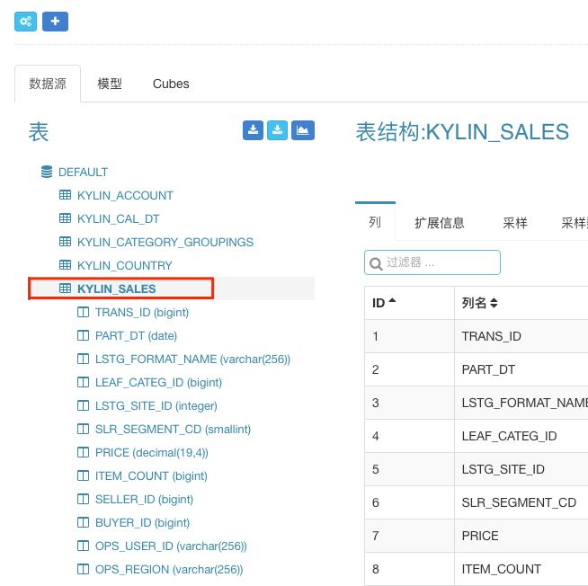
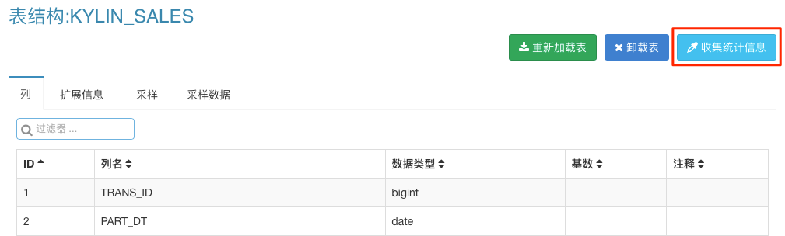

## 表的统计信息收集

表的统计信息包括每列的基数和抽样数据等，这些统计信息能够帮助构建用户构建更好的Data Model和Cube。这一章将介绍如何在KAP中收集表的统计信息。

打开KAP网页前端，选取项目`KAP_Sample_1`, 点击顶部导航栏中的`模型`，再点击模型页中的`数据源`标签页，最后选择需要收集统计信息的表`KYLIN_SALES`。

点击右侧的`收集统计信息`按钮。

弹出的对话框用于设置信息收集的配置，如果用户想扫描全表数据则直接点击`采样`按钮，否则将扫描的行数填入输入框中再点击`采样`按钮。

点击顶部导航栏中的`监控`按钮，用户可以看到该统计信息收集的任务。

等待该任务结束。

返回到之前的`数据源`标签页选择表`KYLIN_SALES`，此时用户能够看到收集到的统计信息。详细统计信息分别列在`列` 、`扩展信息`、`采样`和`采样数据`等标签页中。

