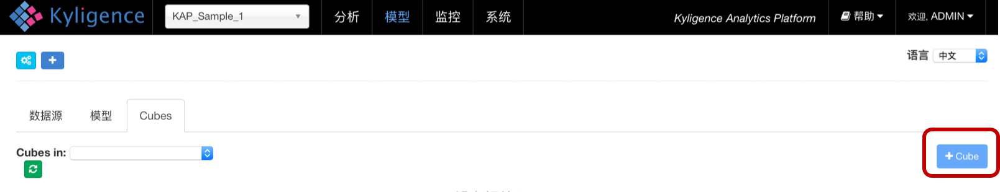
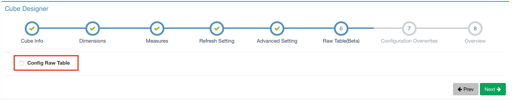

## 创建明细表

明细表用来支持明细查询，而且明细表的创建流程是镶嵌在Cube内的。本文主要介绍了明细表的创建流程，其中，数据是来自KAP的样例数据。

打开KAP网络版的UI界面，选择左上角的项目列表中的项目 `KAP_Sample_1` 。Cube的创建过程请见 `Cube` 这页。

明细表的定义出现在第六步，默认状态下它是被禁止的。 

点击 `Config Raw Table` 来查看明细表的定义。

### 编码

在每行点击 `Encoding`下拉列表 ，用户可以为每列选择编码 。编码的默认值是 `orderedbytes`。

1. `date` 是用于日期类型的字段，例如 “20160101” 或 “2016-01-02”。它只存储日期信息，不包括时、分和秒， 也就是说下午4时和下午6时在日期型中是一样的。日期数据一般被存为长数据类型。 
2. `boolean` 是为了布尔数据，比如“true”和“false”。这类数据会被存为布尔数据。 
3. `fixed_length` 用于字符串并且 `Length`也需要设置，表明存储多少字节。超出 `Length`的字符串部分将被切掉来满足设置。`Length` 被定义在 `Encoding`中下一行。
4. `time` 用于时间型数据。改数据型不同于日期型数据，因为它不仅存储日期信息，还会存储时、分、秒，甚至亚秒等信息。该数据类型也会被存为长数据。
5. `integer` 只服务于整型数据和长数据型。在这种数据型中， `Length`也是需要设置的并且长度上线为8。用户可以将宽度设置为8， 这对于所有可能的较长的值来说都是比较安全的。较小的长度值可以节约存储空间。例如， 如果用户数据的范围是从-2到89，只用1个字节即可，因而在此例中长度值设置为1最好。
6. `int` 已弃用。对于新用户来说，请选取 `integer` 。
7. `var` 是一种特殊的编码。系统会根据hive表的行类型而选取一种编码。
8. `orderedbytes` 可用于所有类型。它会在编码时保持数据的顺序。它也是默认的编码类型并且必需的当该行被设置为 `sorted` 。此索引的解释将在下一节中详述。 

### Index

在每行点击 `Index`下拉列表， 用户可以为每列选取对应的索引类型。默认的索引类型为`discrete`。

1. `discrete` 索引是默认所以，它表示只有相等的索引可用于该行。
2. `fuzzy` 索引是服务于含有 `Like` 过滤的查询。 如果某行可能应用 `Like` 过滤，请将其设置为 `fuzzy` 索引。
3. `sorted` 索引表示该行被分类， 同时目前有且只有一行可以在一张表中被设置为 `sorted` 。默认状态下，数据模型中分区的行会被设置为 `sorted` 行。