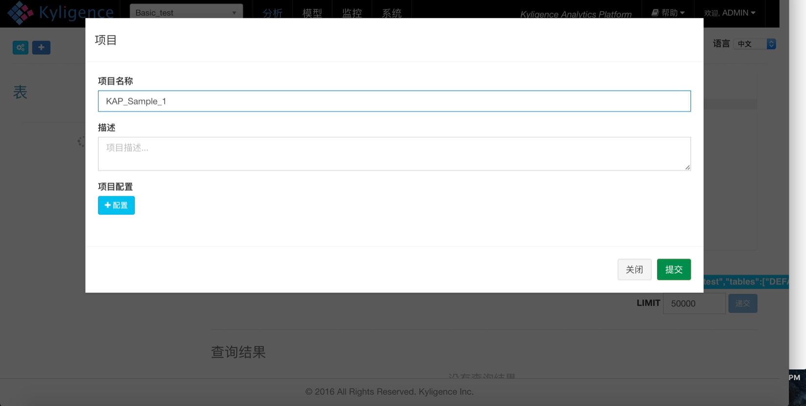
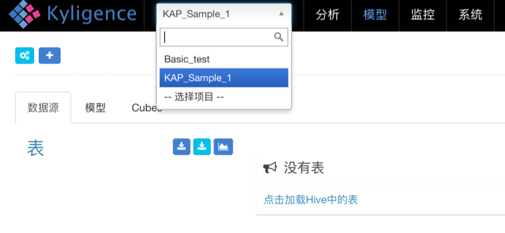
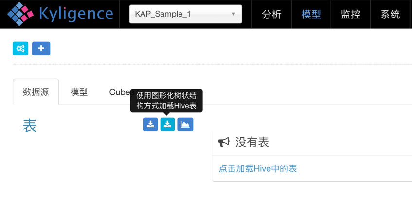
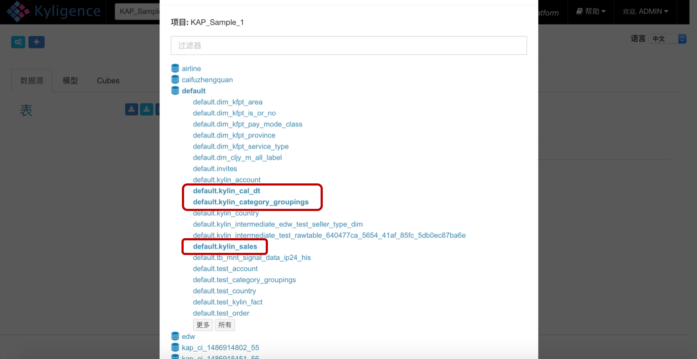
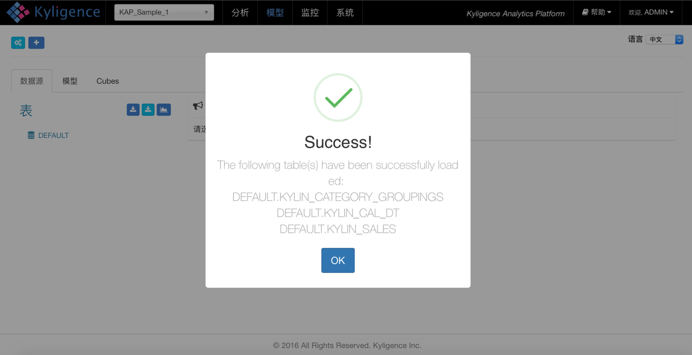
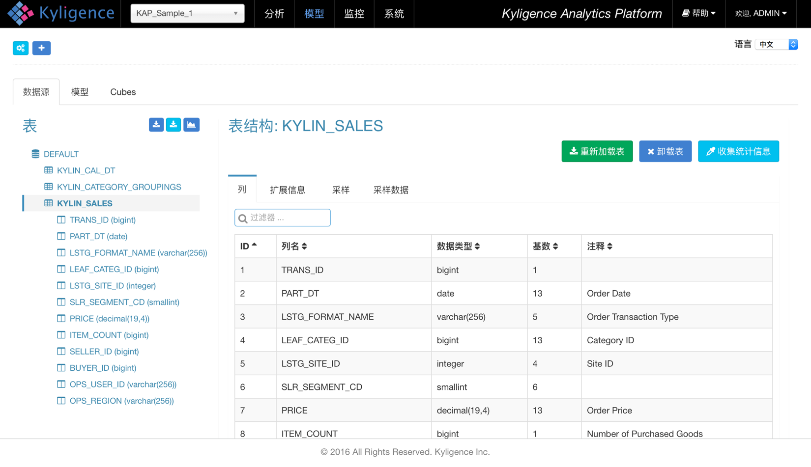

## 样例数据与数据导入
KAP的二进制包中包含了一份用于测试的样例数据集，总共大小仅1MB左右，共计3张表，其中事实表有10000条数据。因为数据规模较小，方便在虚拟机中进行快速实践和操作，用户可以自行搭建Hadoop Sandbox的虚拟机并快速部署KAP，然后导入该数据集进行试验。

### 样例数据集介绍

KAP目前仅支持星型数据模型，这里用到的样例数据集就是一个规范的星型模型结构，它总共包含了3个数据表：

- *KYLIN_SALES* 该表是事实表，保存了销售订单的明细信息。每一列保存了卖家、商品分类、订单金额、商品数量等信息，每一行对应着一笔交易订单。
- *KYLIN_CATEGORY_GROUPINGS* 该表是维度表，保存了商品分类的详细介绍，例如商品分类名称等。
- *KYLIN_CAL_DT* 该表是维度表，保存了时间的扩展信息。如单个日期所在的年始、月始、周始、年份、月份等。这三张表一起构成了整个星型模型的结构，下图是实例-关系图（图中未列出表上的所有列）：
  

### 样例数据表关系


| 表                        | 字段                  | 意义      |
| ------------------------ | ------------------- | ------- |
| KYLIN_SALES              | PART_DT             | 订单日期    |
| KYLIN_SALES              | LEAF_CATEG_ID       | 商品分类ID  |
| KYLIN_SALES              | SELLER_ID           | 卖家ID    |
| KYLIN_SALES              | PRICE               | 订单金额    |
| KYLIN_SALES              | ITEM_COUNT          | 购买商品个数  |
| KYLIN_SALES              | LSTG_FORMAT_NAME    | 订单交易类型  |
| KYLIN_CATEGORY_GROUPINGS | USER_DEFINED_FIELD1 | 用户定义字段1 |
| KYLIN_CATEGORY_GROUPINGS | USER_DEFINED_FIELD3 | 用户定义字段3 |
| KYLIN_CATEGORY_GROUPINGS | UPD_DATE            | 更新日期    |
| KYLIN_CATEGORY_GROUPINGS | UPD_USER            | 更新负责人   |
| KYLIN_CATEGORY_GROUPINGS | META_CATEG_NAME     | 一级分类    |
| KYLIN_CATEGORY_GROUPINGS | CATEG_LVL2_NAME     | 二级分类    |
| KYLIN_CATEGORY_GROUPINGS | CATEG_LVL3_NAME     | 三级分类    |
| KYLIN_CAL_DT             | CAL_DT              | 日期      |
| KYLIN_CAL_DT             | WEEK_BEG_DT         | 周始日期    |


### 创建项目

打开KAP的Web UI，如下图所示的操作创建一个新的项目（Project），并将其命名为KAP_Sample_1。这个项目将作为我们导入和使用样例数据的项目。



在Web UI的左上角选择刚刚创建的项目，表示我们接下来的全部操作都在这个项目中，在此项目的操作不会对其他项目产生影响。


### 导入样例数据

为了使用KAP中自带的样例数据，需要把数据表导入Hive中。在KAP安装目录的bin文件夹中，有一个可执行脚本，可以把样例数据导入Hive：`$KYLIN_HOME/bin/sample.sh`

执行成功之后，在服务器执行Hive命令行，确认这些数据已经导入成功，命令如下：

```shell
    hive
    hive> show tables;
    OK
    kylin_cal_dt
    kylin_category_groupings
    kylin_sales
    Time taken: 0.127 seconds, Fetched: 3 row(s)
    hive> select count(*) from kylin_sales;
    Query ID = root_20160707221515_b040318d-1f08-44ab-b337-d1f858c46d7d
    Total jobs = 1
    Launching Job 1 out of 1
    Number of reduce tasks determined at compile time: 1
    In order to change the average load for a reducer (in bytes):
      set hive.exec.reducers.bytes.per.reducer=<number>
    In order to limit the maximum number of reducers:
      set hive.exec.reducers.max=<number>
    In order to set a constant number of reducers:
      set mapreduce.job.reduces=<number>
    Starting Job = job_1467288198207_0129, Tracking URL = http://sandbox.hortonworks.com:8088/proxy/application_1467288198207_0129/
    Kill Command = /usr/hdp/2.2.4.2-2/hadoop/bin/hadoop job  -kill job_1467288198207_0129
    Hadoop job information for Stage-1: number of mappers: 1; number of reducers: 1
    2016-07-07 22:15:11,897 Stage-1 map = 0%,  reduce = 0%
    2016-07-07 22:15:17,502 Stage-1 map = 100%,  reduce = 0%, Cumulative CPU 1.64 sec
    2016-07-07 22:15:25,039 Stage-1 map = 100%,  reduce = 100%, Cumulative CPU 3.37 sec
    MapReduce Total cumulative CPU time: 3 seconds 370 msec
    Ended Job = job_1467288198207_0129
    MapReduce Jobs Launched:
    Stage-Stage-1: Map: 1  Reduce: 1   Cumulative CPU: 3.37 sec   HDFS Read: 505033 HDFS Write: 6 SUCCESS
    Total MapReduce CPU Time Spent: 3 seconds 370 msec
    OK
    10000
    Time taken: 24.966 seconds, Fetched: 1 row(s)
```


### 同步Hive表

需要把将刚才在Hive建立的样例数据表同步到KAP当中才能使用。为了方便操作，我们通过“使用图形化树状结构方式加载Hive表“同步样例数据的Hive表，如下图所示：


在弹出的对话框中展开default数据库，并选择需要的三张表，如图所示




导入后系统会自动计算各表各列的维数，以掌握数据的基本情况。稍等几分钟后，我们可以通过数据源表的详情页查看这些信息。
