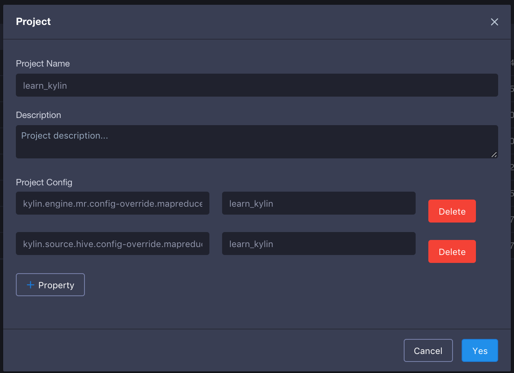
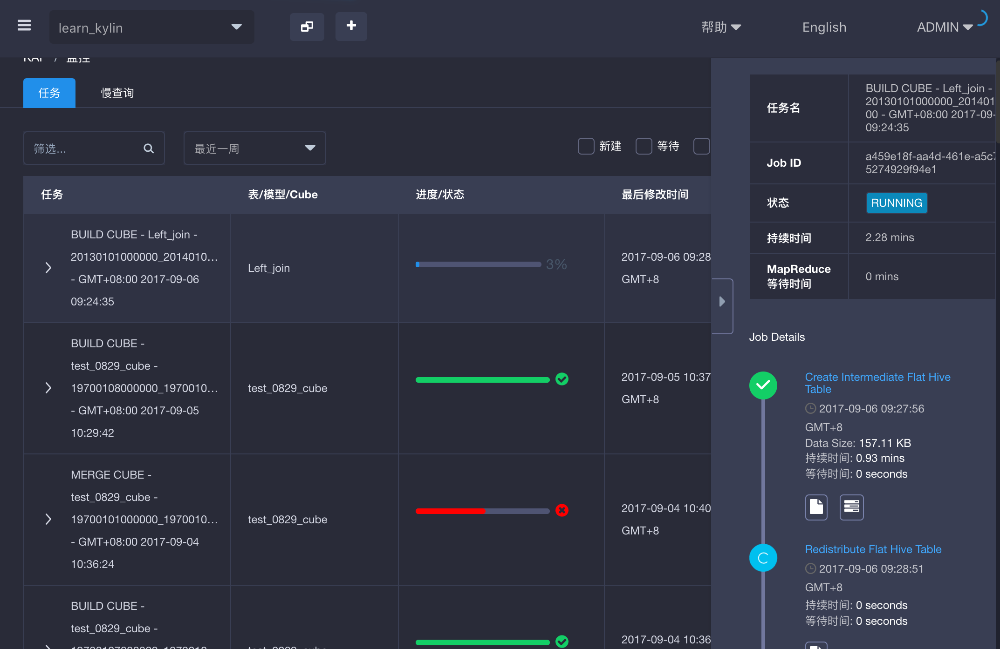

## 配置Hadoop队列

在多租户的场景下，多位租户需要安全的共享一个大型集群，需要对计算资源进行隔离，迪调配。如果每位租户使用单独的KAP项目的情况下，为了实现计算资源的调配隔离，KAP支持对每个项目单独设置Hadoop队列。

默认情况下，KAP的构建任务会发送到集群的default Hadoop队列中。为每个项目配置单独的Hadoop队列，首先需要在YARN队列中添加一个新的队列。

在下面的截图中，笔者创建了一个新的队列*learn_kylin*。

1. 在KAP中进入项目配置页面，选择需要配置队列的项目。
2. 点击编辑项目，然后点击`+property`添加key value如下。

`Kylin.engine.mr.config-override.mapreduce.job.queuename = YOUR_QUEUE_NAME`

`Kylin.source.hive.config-override.mapreduce.job.queuename = YOUR_QUEUE_NAME`

将YOUR_QUEUE_NAME修改为你的队列名称。

如上图所示在本例中项目learn_kylin的Hadoop队列被改为*learn_kylin*。我们可以在learn_kylin项目中出发一个任务测试一下项目的队列是否已被修改。

在Hadoop资源管理器中，可以看到刚才触发的任务已经进入到*Learn_kylin*队列中。

类似的您也可以将其他项目配置到不同的Hadoop队列中已实现计算资源的隔离。