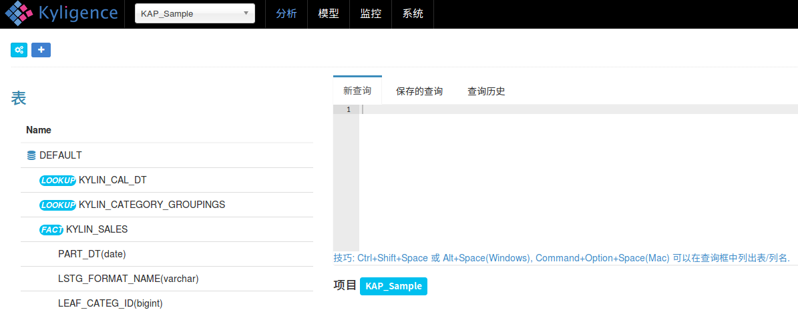
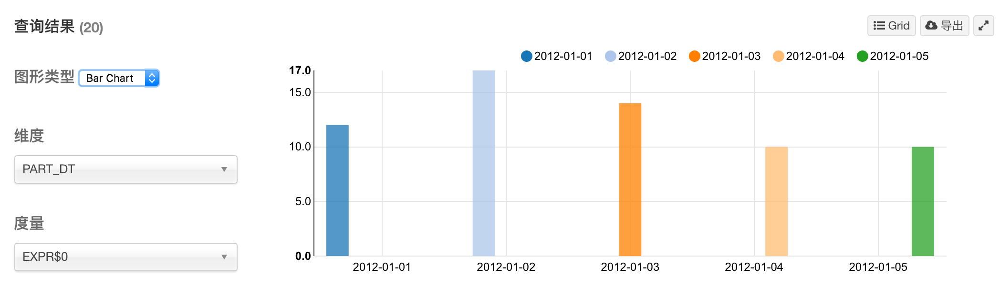
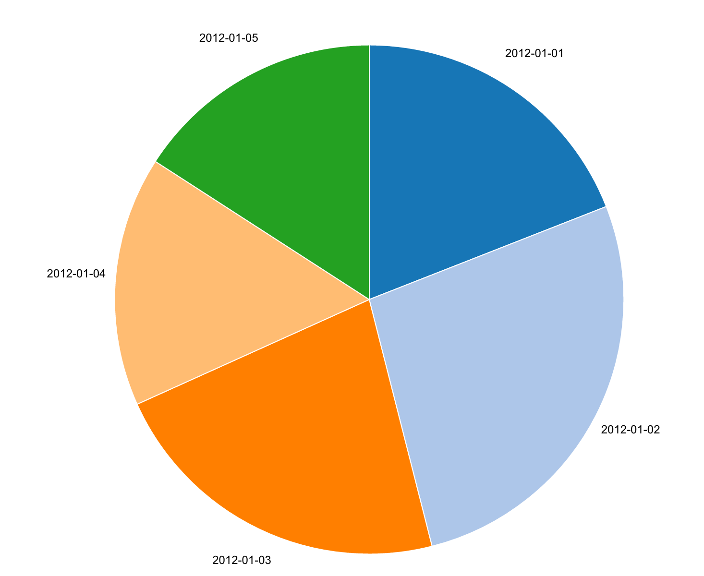

## Insight查询界面

> **支持的浏览器**
>
> Windows: Google Chrome, FireFox
>
> Mac: Google Chrome, FireFox, Safari

### Web查询页概览
KAP的分析页面即为查询页面，点击后左边列出来所有可以查询的表，这些表是Cube 构建好以后才会显示出来，右边给出了输入框，在这输入SQL, 下方显示结果。下面是不同标识对应的解释。
* FACT - 事实表
* LOOKUP - 维度表

### SQL查询
> **查询限制**
>
> 1. 仅支持SELECT查询
>
> 2. SQL在cube中无法找到的数据将不会重定向到Hive

* 提供一个输入框输入SQL, 点击提交即可查询结果。在右下角有一个limit字段，如果SQL中没有limit字段，这里默认会拼接上limit 50000，如果SQL中有limit 那么以SQL中为准。假如用户想去掉limit限制，那么SQL中不要加limit，右下角的limit输入框也改为0。

### 保存查询
与用户账号关联，你将能够从不同的浏览器甚至机器上获取已保存的查询。在结果区域点击保存图标，将会弹出名称和描述来保存当前查询。

### 查询历史
   仅保存当前用户在当前浏览器中的查询历史，这将需要启用cookie，并且如果你清理浏览器缓存将会丢失数据。点击“Query History”标签，你可以直接重新提交其中的任何一条并再次运行。

### 数据展现的方式

##### 表格

默认情况下，KAP会以表格形式展示数据，可以对数据进行升序和降序排列，也可以对字段进行隐藏。也可以点击‘导出’按钮到处csv文件。

点击'可视化'按钮，可以对数据进行可视化展示，KAP默认支持三种图形展示。分别是线形图，柱状图，饼图。

#### 图表展示

- 线形图展示

- 柱状图展示 

- 饼图展示

