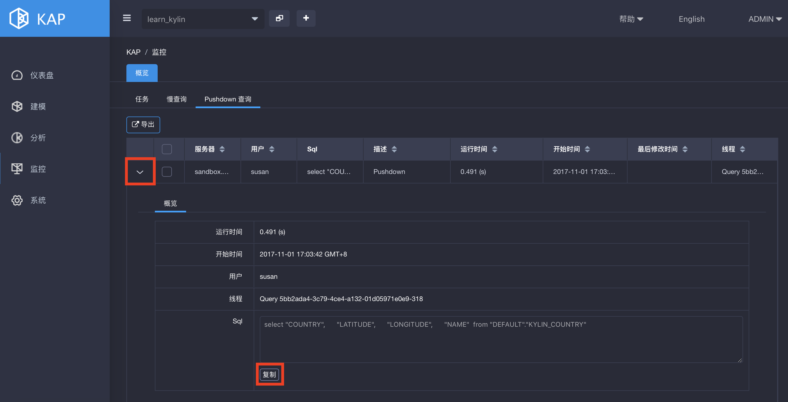
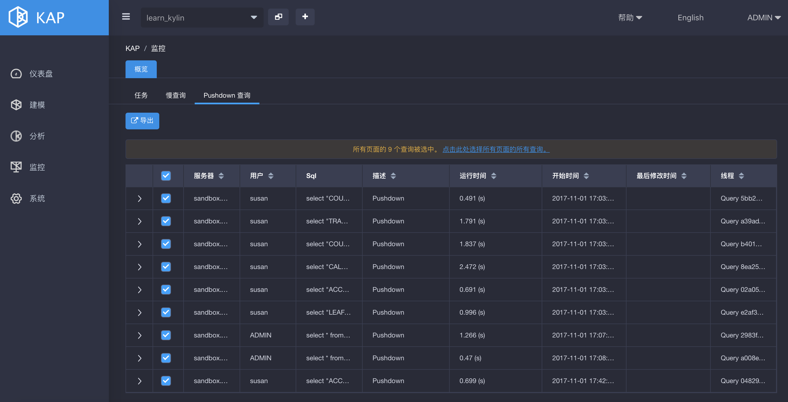
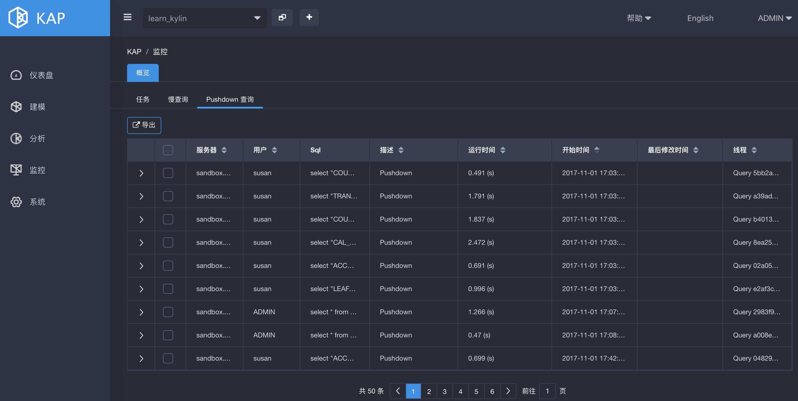

## 查询下压
从 2.4 版本开始，KAP 支持查询下压功能。当用户无法通过定制的 Cube 执行查询时，可以使用查询下压，将该查询重定向至 Spark SQL、Hive 和 Impala，从而在查询的执行时间与灵活程度之间做一个权衡折中，获取更理想的使用体验。

### 启用查询下压

默认情况下，查询下压功能未开启。如果要开启查询下压，需要在 `kylin.properties` 文件中删除 `kylin.query.pushdown.runner-class-name=io.kyligence.kap.storage.parquet.adhoc.PushDownRunnerSparkImpl` 这一配置项前的注释符号，使其生效。

查询下压开启后，当 Cube 无法返回所需的查询结果时，默认情况下，将被重定向至 Spark SQL。用户也可以手动配置，选择 Hive 或者 Impala 作为查询下压的引擎。有关配置方法，参见[查询下压配置](../config/basic_settings.cn.md)章节。

开启查询下压后，所有同步的数据表将对用户可见，而无需构建相应的 Cube。用户在提交查询时，若查询下压功能正常启用，则状态下方的查询引擎条目里，会显示 Pushdown。

### 基本操作

查询下压功能的常见操作如下：

#### 一键复制单个查询

如果要选择单个查询，用户只需轻松一击，即可复制整个查询信息。具体操作如下：点击查询条目前面的箭头，将弹出如下界面。点击**复制**，可复制整条查询信息。

#### 多选批量导出结果

如果要批量导出多个结果，可以勾选第一行中的复选框，选中所有查询执行导出；也可以依次勾选所需查询前面对应的复选框，根据需要选中多个查询执行导出。

#### 点击箭头轻松排序

点击每列标题后方的向上或向下箭头，可对相应的列进行排序。

