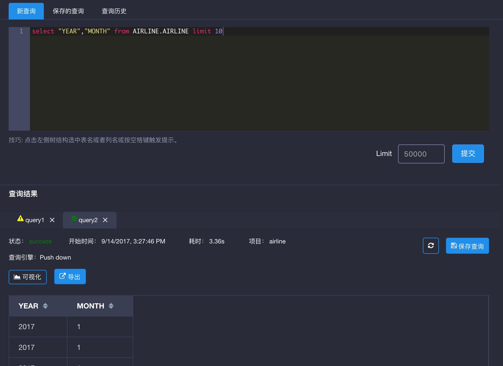
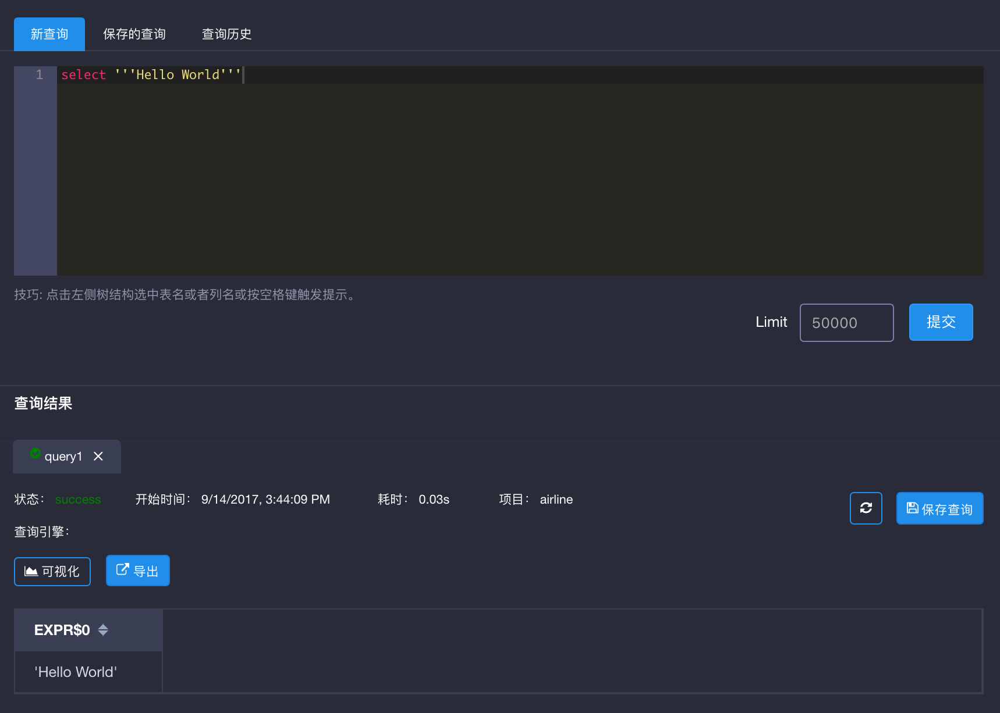

## SQL语法规范
KAP支持ANSI SQL 2003*，以下列举了支持的基本SQL语句。

### 支持语法

```sql
statement:
|  query 

query:
      values
  |  WITH withItem [ , withItem ]* query
  |   {
          select
      |  selectWithoutFrom
      |  query UNION [ ALL | DISTINCT ] query
      |  query INTERSECT [ ALL | DISTINCT ] query
      }
      [ ORDER BY orderItem [, orderItem ]* ]
      [ LIMIT { count | ALL } ]
      [ OFFSET start { ROW | ROWS } ]
      [ FETCH { FIRST | NEXT } [ count ] { ROW| ROWS } ]

withItem:
      name
      ['(' column [, column ]* ')' ]
      AS '(' query ')'

orderItem:
      expression [ ASC | DESC ]［ NULLS FIRST |NULLS LAST ］

select:
      SELECT [ ALL | DISTINCT]
          { * | projectItem [, projectItem ]* }
      FROM tableExpression
      [ WHERE booleanExpression ]
      [ GROUP BY { groupItem [, groupItem ]* }]
      [ HAVING booleanExpression ]
      [ WINDOW windowName AS windowSpec [,windowName AS windowSpec ]* ]

selectWithoutFrom:
      SELECT [ ALL | DISTINCT ]
          { * | projectItem [, projectItem ]* }

projectItem:
      expression [ [ AS ] columnAlias ]
  |  tableAlias . *

tableExpression:
      tableReference [, tableReference ]*
  |  tableExpression [ NATURAL ]［( LEFT | RIGHT | FULL ) [ OUTER ] ］ JOINtableExpression [ joinCondition ]

joinCondition:
      ON booleanExpression
  |  USING '(' column [, column ]* ')'

tableReference:
      tablePrimary
      [ matchRecognize ]
      [ [ AS ] alias [ '(' columnAlias [,columnAlias ]* ')' ] ]

tablePrimary:
      [ [ catalogName . ] schemaName . ]tableName
      '(' TABLE [ [ catalogName . ] schemaName. ] tableName ')'
  |   [LATERAL ] '(' query ')'
  |  UNNEST '(' expression ')' [ WITH ORDINALITY ]
  |   [LATERAL ] TABLE '(' [ SPECIFIC ] functionName '(' expression [, expression ]*')' ')'

values:
      VALUES expression [, expression ]*
 
groupItem:
      expression
  |   '('')'
  |   '('expression [, expression ]* ')'
  |  GROUPING SETS '(' groupItem [, groupItem ]* ')'

windowRef:
      windowName
  |  windowSpec

windowSpec:
      [windowName ]
      '(' 
      [ ORDER BYorderItem [, orderItem ]* ]
      [ PARTITION BY expression [, expression]* ]
      [
          RANGE numericOrIntervalExpression {PRECEDING | FOLLOWING }
      |  ROWS numericExpression { PRECEDING | FOLLOWING }
      ]
    ')'
```

*不同版本实现反馈可能会有不同，如有问题请咨询技术服务团队。

### 查询关键字

以下为KAP查询的关键字。

```sql
A, ABS, ABSOLUTE, ACTION, ADA, ADD, ADMIN, AFTER, ALL,ALLOCATE, ALLOW, ALTER, ALWAYS, AND, ANY, APPLY, ARE, ARRAY,ARRAY_MAX_CARDINALITY, AS, ASC, ASENSITIVE, ASSERTION, ASSIGNMENT, ASYMMETRIC, AT, ATOMIC, ATTRIBUTE, ATTRIBUTES,AUTHORIZATION, AVG, BEFORE, BEGIN, BEGIN_FRAME,BEGIN_PARTITION, BERNOULLI, BETWEEN, BIGINT, BINARY, BIT,BLOB, BOOLEAN, BOTH, BREADTH, BY, C, CALL, CALLED,CARDINALITY, CASCADE, CASCADED, CASE, CAST, CATALOG, CATALOG_NAME, CEIL, CEILING, CENTURY, CHAIN, CHAR,CHARACTER, CHARACTERISTICS, CHARACTERS,CHARACTER_LENGTH, CHARACTER_SET_CATALOG, CHARACTER_SET_NAME, CHARACTER_SET_SCHEMA,CHAR_LENGTH, CHECK, CLASSIFIER, CLASS_ORIGIN, CLOB, CLOSE,COALESCE, COBOL, COLLATE, COLLATION, COLLATION_CATALOG, COLLATION_NAME, COLLATION_SCHEMA, COLLECT, COLUMN, COLUMN_NAME, COMMAND_FUNCTION, COMMAND_FUNCTION_CODE, COMMIT, COMMITTED,CONDITION, CONDITION_NUMBER, CONNECT, CONNECTION, CONNECTION_NAME, CONSTRAINT, CONSTRAINTS, CONSTRAINT_CATALOG, CONSTRAINT_NAME, CONSTRAINT_SCHEMA, CONSTRUCTOR, CONTAINS, CONTINUE,CONVERT, CORR, CORRESPONDING, COUNT, COVAR_POP,COVAR_SAMP, CREATE, CROSS, CUBE, CUME_DIST, CURRENT,CURRENT_CATALOG, CURRENT_DATE,CURRENT_DEFAULT_TRANSFORM_GROUP, CURRENT_PATH,CURRENT_ROLE, CURRENT_ROW, CURRENT_SCHEMA,CURRENT_TIME, CURRENT_TIMESTAMP,CURRENT_TRANSFORM_GROUP_FOR_TYPE, CURRENT_USER,CURSOR, CURSOR_NAME, CYCLE, DATA, DATABASE, DATE, DATETIME_INTERVAL_CODE, DATETIME_INTERVAL_PRECISION,DAY, DEALLOCATE, DEC, DECADE, DECIMAL, DECLARE, DEFAULT, DEFAULTS, DEFERRABLE, DEFERRED, DEFINE, DEFINED, DEFINER, DEGREE, DELETE, DENSE_RANK, DEPTH, DEREF, DERIVED, DESC,DESCRIBE, DESCRIPTION, DESCRIPTOR, DETERMINISTIC, DIAGNOSTICS, DISALLOW, DISCONNECT, DISPATCH, DISTINCT, DOMAIN, DOUBLE, DOW, DOY, DROP, DYNAMIC, DYNAMIC_FUNCTION, DYNAMIC_FUNCTION_CODE, EACH,ELEMENT, ELSE, EMPTY, END, END-EXEC, END_FRAME,END_PARTITION, EPOCH, EQUALS, ESCAPE, EVERY, EXCEPT, EXCEPTION, EXCLUDE, EXCLUDING, EXEC, EXECUTE, EXISTS, EXP,EXPLAIN, EXTEND, EXTERNAL, EXTRACT, FALSE, FETCH, FILTER, FINAL, FIRST, FIRST_VALUE, FLOAT, FLOOR, FOLLOWING, FOR,FOREIGN, FORTRAN, FOUND, FRAC_SECOND, FRAME_ROW, FREE,FROM, FULL, FUNCTION, FUSION, G, GENERAL, GENERATED, GET,GLOBAL, GO, GOTO, GRANT, GRANTED, GROUP, GROUPING,GROUPS, HAVING, HIERARCHY, HOLD, HOUR, IDENTITY, IMMEDIATE, IMMEDIATELY, IMPLEMENTATION, IMPORT, IN, INCLUDING, INCREMENT, INDICATOR, INITIAL, INITIALLY, INNER,INOUT, INPUT, INSENSITIVE, INSERT, INSTANCE, INSTANTIABLE, INT,INTEGER, INTERSECT, INTERSECTION, INTERVAL, INTO, INVOKER, IS, ISOLATION, JAVA, JOIN, JSON, K, KEY, KEY_MEMBER, KEY_TYPE, LABEL, LAG, LANGUAGE, LARGE, LAST, LAST_VALUE, LATERAL, LEAD,LEADING, LEFT, LENGTH, LEVEL, LIBRARY, LIKE, LIKE_REGEX, LIMIT,LN, LOCAL, LOCALTIME, LOCALTIMESTAMP, LOCATOR, LOWER, M, MAP, MATCH, MATCHED, MATCHES, MATCH_NUMBER,MATCH_RECOGNIZE, MAX, MAXVALUE, MEASURES, MEMBER,MERGE, MESSAGE_LENGTH, MESSAGE_OCTET_LENGTH, MESSAGE_TEXT, METHOD, MICROSECOND, MILLENNIUM, MIN,MINUS, MINUTE, MINVALUE, MOD, MODIFIES, MODULE, MONTH, MORE, MULTISET, MUMPS, NAME, NAMES, NATIONAL, NATURAL,NCHAR, NCLOB, NESTING, NEW, NEXT, NO, NONE, NORMALIZE, NORMALIZED, NOT, NTH_VALUE, NTILE, NULL, NULLABLE, NULLIF, NULLS, NUMBER, NUMERIC, OBJECT, OCCURRENCES_REGEX, OCTETS, OCTET_LENGTH, OF, OFFSET, OLD, OMIT, ON, ONE, ONLY,OPEN, OPTION, OPTIONS, OR, ORDER, ORDERING, ORDINALITY, OTHERS, OUT, OUTER, OUTPUT, OVER, OVERLAPS, OVERLAY, OVERRIDING, PAD, PARAMETER, PARAMETER_MODE, PARAMETER_NAME, PARAMETER_ORDINAL_POSITION, PARAMETER_SPECIFIC_CATALOG, PARAMETER_SPECIFIC_NAME, PARAMETER_SPECIFIC_SCHEMA, PARTIAL, PARTITION, PASCAL, PASSTHROUGH, PAST, PATH, PATTERN, PER, PERCENT,PERCENTILE_CONT, PERCENTILE_DISC, PERCENT_RANK, PERIOD,PERMUTE, PLACING, PLAN, PLI, PORTION, POSITION,POSITION_REGEX, POWER, PRECEDES, PRECEDING, PRECISION,PREPARE, PRESERVE, PREV, PRIMARY, PRIOR, PRIVILEGES,PROCEDURE, PUBLIC, QUARTER, RANGE, RANK, READ, READS, REAL,RECURSIVE, REF, REFERENCES, REFERENCING, REGR_AVGX,REGR_AVGY, REGR_COUNT, REGR_INTERCEPT, REGR_R2,REGR_SLOPE, REGR_SXX, REGR_SXY, REGR_SYY, RELATIVE, RELEASE, REPEATABLE, REPLACE, RESET, RESTART, RESTRICT, RESULT,RETURN, RETURNED_CARDINALITY, RETURNED_LENGTH, RETURNED_OCTET_LENGTH, RETURNED_SQLSTATE, RETURNS,REVOKE, RIGHT, ROLE, ROLLBACK, ROLLUP, ROUTINE, ROUTINE_CATALOG, ROUTINE_NAME, ROUTINE_SCHEMA, ROW,ROWS, ROW_COUNT, ROW_NUMBER, RUNNING, SAVEPOINT, SCALE, SCHEMA, SCHEMA_NAME, SCOPE, SCOPE_CATALOGS, SCOPE_NAME, SCOPE_SCHEMA, SCROLL, SEARCH, SECOND, SECTION, SECURITY, SEEK, SELECT, SELF, SENSITIVE, SEQUENCE, SERIALIZABLE, SERVER, SERVER_NAME, SESSION, SESSION_USER,SET, SETS, SHOW, SIMILAR, SIMPLE, SIZE, SKIP, SMALLINT, SOME, SOURCE, SPACE, SPECIFIC, SPECIFICTYPE, SPECIFIC_NAME, SQL,SQLEXCEPTION, SQLSTATE, SQLWARNING, SQL_BIGINT, SQL_BINARY, SQL_BIT, SQL_BLOB, SQL_BOOLEAN, SQL_CHAR, SQL_CLOB, SQL_DATE, SQL_DECIMAL, SQL_DOUBLE, SQL_FLOAT, SQL_INTEGER, SQL_INTERVAL_DAY, SQL_INTERVAL_DAY_TO_HOUR, SQL_INTERVAL_DAY_TO_MINUTE, SQL_INTERVAL_DAY_TO_SECOND, SQL_INTERVAL_HOUR, SQL_INTERVAL_HOUR_TO_MINUTE, SQL_INTERVAL_HOUR_TO_SECOND, SQL_INTERVAL_MINUTE, SQL_INTERVAL_MINUTE_TO_SECOND, SQL_INTERVAL_MONTH, SQL_INTERVAL_SECOND, SQL_INTERVAL_YEAR, SQL_INTERVAL_YEAR_TO_MONTH, SQL_LONGVARBINARY, SQL_LONGVARCHAR, SQL_LONGVARNCHAR, SQL_NCHAR, SQL_NCLOB, SQL_NUMERIC, SQL_NVARCHAR, SQL_REAL, SQL_SMALLINT, SQL_TIME, SQL_TIMESTAMP, SQL_TINYINT, SQL_TSI_DAY, SQL_TSI_FRAC_SECOND, SQL_TSI_HOUR, SQL_TSI_MICROSECOND, SQL_TSI_MINUTE, SQL_TSI_MONTH, SQL_TSI_QUARTER, SQL_TSI_SECOND, SQL_TSI_WEEK, SQL_TSI_YEAR, SQL_VARBINARY, SQL_VARCHAR, SQRT, START, STATE, STATEMENT,STATIC, STDDEV_POP, STDDEV_SAMP, STREAM, STRUCTURE, STYLE, SUBCLASS_ORIGIN, SUBMULTISET, SUBSET, SUBSTITUTE,SUBSTRING, SUBSTRING_REGEX, SUCCEEDS, SUM, SYMMETRIC,SYSTEM, SYSTEM_TIME, SYSTEM_USER, TABLE, TABLESAMPLE, TABLE_NAME, TEMPORARY, THEN, TIES, TIME, TIMESTAMP, TIMESTAMPADD, TIMESTAMPDIFF, TIMEZONE_HOUR,TIMEZONE_MINUTE, TINYINT, TO, TOP_LEVEL_COUNT, TRAILING, TRANSACTION, TRANSACTIONS_ACTIVE, TRANSACTIONS_COMMITTED, TRANSACTIONS_ROLLED_BACK, TRANSFORM, TRANSFORMS, TRANSLATE, TRANSLATE_REGEX,TRANSLATION, TREAT, TRIGGER, TRIGGER_CATALOG, TRIGGER_NAME, TRIGGER_SCHEMA, TRIM, TRIM_ARRAY, TRUE,TRUNCATE, TYPE, UESCAPE, UNBOUNDED, UNCOMMITTED, UNDER, UNION, UNIQUE, UNKNOWN, UNNAMED, UNNEST,UPDATE, UPPER, UPSERT, USAGE, USER, USER_DEFINED_TYPE_CATALOG, USER_DEFINED_TYPE_CODE, USER_DEFINED_TYPE_NAME, USER_DEFINED_TYPE_SCHEMA,USING, VALUE, VALUES, VALUE_OF, VARBINARY, VARCHAR,VARYING, VAR_POP, VAR_SAMP, VERSION, VERSIONING, VIEW, WEEK, WHEN, WHENEVER, WHERE, WIDTH_BUCKET, WINDOW,WITH, WITHIN, WITHOUT, WORK, WRAPPER, WRITE, XML, YEAR, ZONE.
```


### 标识符

标识符为SQL查询中使用的表名、列名以及其他元数据。没有使用引号的标识符，如 `emp`需要以字母开头并且只能包含字母、数字及下划线。没有使用引号的标识符在查询时会隐式地被转换成**全大写**。

带引号的标识符，如 `"Employee Name"`，以双引号开头及结尾。这种标识符基本可以包含任何字符，包括空格或其他标点符号。如果你希望在标识符中包含双引号，使用另一个双引号来讲其转义，例如：

```"An employee called ""Fred""."```

标识符和引用的对象进行匹配是大小写敏感的。没有使用引号的标识符会隐式地被转换成全大写，如果查询对象在创建时也没有使用引号，它的名字也会被转成全大写，因此标识符和查询对象可以进行匹配。

###转义关键字

如果你的列名或表名是关键字，你需要使用双引号对其进行转义。

例如表 `AIRLINE` 包含列`YEAR` 及 `QUARTER`。这两列的列名和KAP的关键字**YEAR** 和**QUARTER**重复。如下图所示，如果用户直接对`YEAR` 及 `QUARTER`两列进行查询，查询会返回报错，因为KAP查询引擎无法分辨两列是否为关键字。


如上文所述，当你使用双引号对列名进行转义时，匹配标识符和引用的对象是大小写敏感的，KAP查询引擎无法查询到使用双引号包裹的小写的列名，因为这些列是用大写存储的。


这时候我们只要将双引号包裹的列名改为全大写的就可正常查询了。



### 转义引号

如果你的查询的值中包含单引号，你可以用另一个单引号对查询进行转义。



如果查询的值中有双引号是不需要转义的。

