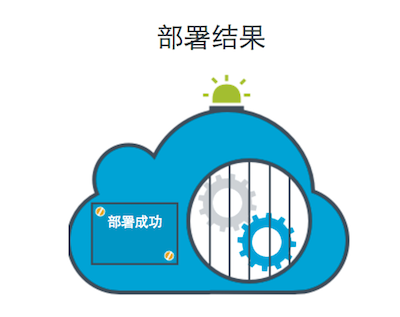
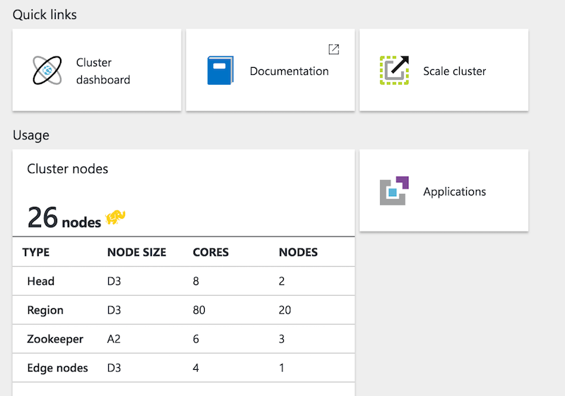

## KAP Azure镜像使用方法
> Azure镜像使用方法仅针对Azure中国镜像市场上发行的KAP有效。

很高兴地告诉您，KAP Enterprise已在[Azure中国镜像市场](https://market.azure.cn/)上线，用户可以方便地使用该镜像，快速创建一个基于Azure HDInsight的Hadoop集群，并运行在此集群上的KAP实例。其中所有的部署、安装和配置工作都已为您自动完成。

通过此镜像创建的KAP，提供不少于一个月的试用许可证，试用期内可以免费使用KAP，您只需为使用的Azure资源(包括HDInsight)付费；试用期结束后，请联系Kyligence公司购买正式的产品许可证。

### 登录Azure镜像市场

使用浏览器打开Azure中国镜像市场：[https://market.azure.cn/](https://market.azure.cn/)， 搜索KAP或Apache Kylin，会检索到KAP的镜像，如下图所示：


### 输入部署信息

点击“立即部署”，如果您还未登录过Azure，会要求您使用Azure账号登录。登录完成后，返回到镜像市场的安装页面：


请谨慎填写这些输入项，下面是关于这些输入项的含义和注意事项：

| 输入项目  | 描述  | 建议／默认值 |
|:------------- |:---------------| -------------|
| Azure订阅     | 用于创建KAP的Azure订阅，如果没有可用订阅，请联系Azure支持 |         |
| 选择资源组     | 选择用于管理KAP和所有依赖资源的资源组        |     建议新建一个资源组|
| 资源组名称 | 新建资源组的名称        |            建议和clusterName一致|
| 区域 | Azure中国数据中心：可选东部和北部        |            中国东部|
| clusterName |   新建HDInsight集群的名称      |  使用字母和数字的组合，不要有特殊符号，需唯一          |
| storageAccount |  新建HDInsight集群所使用的storage account       |   可以是一个已有的storage account，也可以是新建，建议跟clusterName同名         |
| containerName |  新建HDInsight集群所使用的blob store的名称       |    建议跟clusterName同名        |
| clusterLoginUserName |  HDInsight集群的web管理员账号，也将是KAP的管理员账号       |     admin       |
| clusterLoginPassword |  HDInsight集群的web管理员密码，也将是KAP的管理员密码       |   长度不小于8，至少包含一个大写字母，一个数字以及一个特殊符号，且不能包含用户名在其中         |
| sshUserName |   使用ssh登录HDInsight集群的用户      |    sshuser        |
| sshPassword |  使用ssh登录HDInsight集群的密码       |    长度不小于8，至少包含一个大写字母，一个数字以及一个特殊符号，且不能包含用户名在其中          |
| location |   区域      |      跟上面的“区域”保持一致，中国东部选chinaeast，北部选chinanorth      |
| clusterType |  HDInsight类型       |     hbase       |
| clusterWorkerNodeCount |  HDInsight集群的工作节点数       |    根据需要设置，最小为2， 确保当前订阅下有足够可用的core        |
| edgeNodeSize |   运行KAP的节点的大小      |   Standard\_D3 或 Standard\_D4      |
| appType |  选择要安装的KAP组件       |   KAP+KyAnalyzer         |

在输入完上述信息后，请检查并确认Azure以及服务商的服务条款，确认无误后，点击“立即部署”开始创建集群。


### 开始部署

整个集群的创建大约需要30分钟左右，耗时取决于集群的规模等多种因素。在此过程中，会先创建HDInsight集群，随后创建Edge Node并自动安装和配置KAP。创建结束后，会显示“部署成功”的画面，如下图所示：




在创建过程中，您也可以通过Azure的门户预览查看此资源组内的资源创建情况；如果创建失败，也会在门户中显示相关信息。如果要删除，请在Azure门户预览中删除对应的资源组即可；如要重试，在删除完资源组后，重复前面的操作即可。


### 查看集群信息

集群创建成功后，通过Azure门户预览，用户即可获得新创建的HDInsight集群以及KAP的详细信息；HDInsight信息通过在门户的“More services” -> "INTELLIGENCE + ANALYTICS" -> "HDInsight clsuters"中可以查看，点击集群名称可以获得进一步详细内容：




点击上图中的“Cluster dashboard”，然后用创建时候的指定的“clusterLoginUserName”账号及密码，即可登录集群仪表盘（Ambari）对Hadoop集群进行统一的监控和配置管理。

点击上图中的"Applications"，获取运行于集群内的应用程序（KAP）情况。在这里您会获取到KAP组件的访问地址，如下图所示：


这里分别有两个Web页和一个SSH的地址；两个Web页分别是KAP和KyAnalyzer的web界面，SSH地址供管理员以远程SSH的方法直接登录到KAP运行节点内进行管理操作。

通过点击这两个Web页，并输入在创建集群时候指定的“clusterLoginUserName”账号及密码，即可访问KAP以及KyAnalyzer。


### 快速使用示例Cube

KAP在初次启动时，自动创建一个示例Cube以及它所使用的Hive表，并自动触发构建；当您登录进入KAP时，此Cube正在构建或已经构建完成。


构建完成的Cube是处于“READY”状态，代表可以进行查询。在“分析”页面，可以手动输入一条SQL语言如“SELECT COUINT(*) FROM KYLIN_SALES”进行验证。随后您可以使用KyAnalyzer对此Cube进行更全面的分析。

在KyAnalyzer中，点击“管理控制台”， “同步Cube信息”， 选择"learn\_kylin"项目的“kylin\_sales\_cube”。随后点击“新建查询”， 点击刷新图标后，可在“多维数据”下拉框中选择“kylin\_sales\_cube”加载模型，选择指标和维度即时生成汇总报告，如下图所示：


至此，您已拥有了一个在云上的、可动态伸缩、支持超大数据集快速分析的计算平台。关于更多KAP和KyAnalyzer的使用方法，您可以参照KAP使用手册进行操作。

### 创建基于Bob Store的Hive表

在使用KAP之前，您需要将数据文件上传到Hadoop，并使用Hive描述成数据表格（table）。HDInsight作为Azure云上的Hadoop平台，默认使用Azure Blob Store作为分布式文件系统，从而提供一种高可用、可伸缩的低成本存储方案。您只需要将数据文件使用Azure工具上传到Blob Store，即可使用HiveQL语句将其描述成表格，HDInsight以及KAP会直接从Blob Store读取文件。关于Azure Blob Store的使用，请参考Azure帮助文档。

这里是一个使用Azure命令行上传文件到Blob Store的范例：

```
export AZURE_STORAGE_ACCOUNT=<your storage account>
export AZURE_STORAGE_ACCESS_KEY=<your storage account access key>
 
# list all files in container
azure storage blob list <container>
# upload a file to container
azure storage blob upload <path of a local file> <container> <name in container>


```

请注意，不同Hive表的文件，应使用不同目录存放。Blob Store虽不是普通的文件系统，但是可以在文件名中使用“／”模拟目录格式， 如下面的命令，会将本地文件airline\_2015\_01.csv上传到容器 mycontainer上，使用目标airline/2015/airline\_2015\_01.csv作为路径：

```
azure storage blob upload airline_2015_01.csv mycontainer airline/2015/airline_2015_01.csv

```

接下来便可以使用HQL来创建表格；您可以在集群仪表盘上使用图形化界面操作，或SSH到集群某个节点上使用Hive CLI进行表格操作，如下所示：

```
CREATE EXTERNAL TABLE airline_data (
Year int,  Quarter int, Month int, 
DayofMonth int, DayOfWeek int, FlightDate date, 
...
) 
PARTITIONED BY (Part_year STRING)
ROW FORMAT SERDE 'org.apache.hadoop.hive.serde2.OpenCSVSerde'
WITH SERDEPROPERTIES ("separatorChar" = ",") 
LOCATION 'wasb://<container>@<storage-account>.blob.core.windows.net/airline' 
TBLPROPERTIES('serialization.null.format'='','skip.header.line.count'='1');


ALTER TABLE airline_data ADD PARTITION (Part_year = '2015') location 'wasb://<container>@<storage-account>.blob.core.windows.net/airline/2015';

```

表格创建后，可以通过SQL进行简单验证：

```
hive> select * from airline_data limit 100;

```

至此，使用Azure Blob Store的Hive表格创建成功；您可以使用KAP同步表格的定义，创建模型和Cube，构建以及快速分析。

### Hadoop任务追踪

在Cube构建时，用户可以通过KAP界面跟踪每个任务的进度和状态；当任务出错时，需要查询Hadoop MapReduce日志进行排查。KAP界面的任务追踪URL，因为使用的是内网DNS地址，导致用户可能无法直接打开。此种情况下，您可以在集群仪表盘中通过YARN - Quick Links - Resource Manager UI寻找YARN资源管理器的地址，然后按运行状态“RUNNING”或“FINISHED”找到最近的任务。通常地址为 "https://\<clustername>.azurehdinsight.cn/yarnui/hn/cluster"


### 集群伸缩

当需要处理较大数据量时，增加集群节点可以增加并发性，减少处理时间；当计算结束后，减少集群节点可以节省资源，降低成本。HDInsight集群提供了动态伸缩的功能，为用户提供最大化的便利。您可以通过Azure门户，在HDInsight页面选择“Scale cluster”对集群大小进行调整：


### 管理员SSH操作

您可以使用SSH工具，登录到KAP的运行节点上进行操作。KAP服务器的DNS地址在Azure中国门户预览 -> HDInsight -> "应用程序" -> "KAP" -> "SSH ENDPOINT"可以查询到，通常为“KAP.\<clustername\>\-ssh.azurehdinsight.cn”；端口默认为 22。

使用部署集群的时候输入的SSH用户名登录(默认sshuser)，此用户名具有 sudo 权限，进入 Linux 后可以执行 sudo su kylin 切换到kylin账户。请使用kylin账户操作对KAP／KyAnalyzer的管理。

```
ssh sshuser@KAP.<clustername>-ssh.azurehdinsight.cn
sudo su kylin

```

程序安装和配置路径：

|组件  | 安装路径   | 日志路径 |
|:------------- |:---------------|:-------------|
| KAP  | /usr/local/kap/kap-2.3.0-GA-hbase1.x   |  /usr/local/kap/kap-2.3.0-GA-hbase1.x/logs/kylin.log| 
| KyAnalyzer  | /usr/local/kap/kyanalyzer-server   | /usr/local/kap/kyanalyzer-server/tomcat/logs/kyanalyzer.log | 

KAP的启动停止：  

```
sudo su kylin
/usr/local/kap/kap-2.3.0-GA-hbase1.x/bin/kylin.sh (start|stop)
```

KyAnalyzer的启动停止：

```
sudo su kylin
/usr/local/kap/kyanalyzer-server/start-analyzer.sh
/usr/local/kap/kyanalyzer-server/stop-analyzer.sh
```

### 卸载KAP

如果您需要停止使用KAP及HDInsight集群，请在Azure门户中删除相关的资源组即可。卸载前请备份必要的数据。


更多意见与建议，欢迎与我们联系：support@kyligence.io

