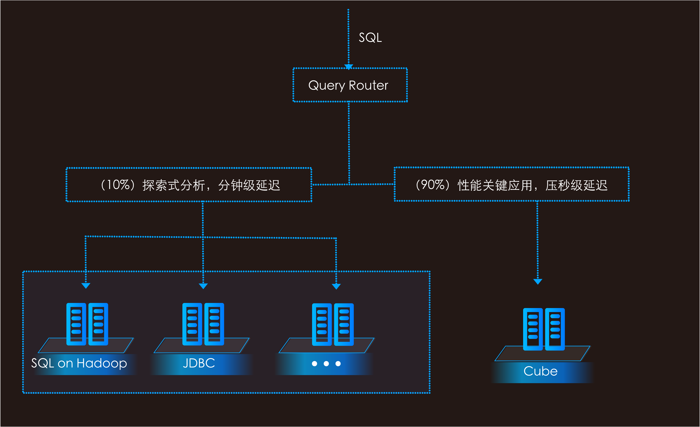
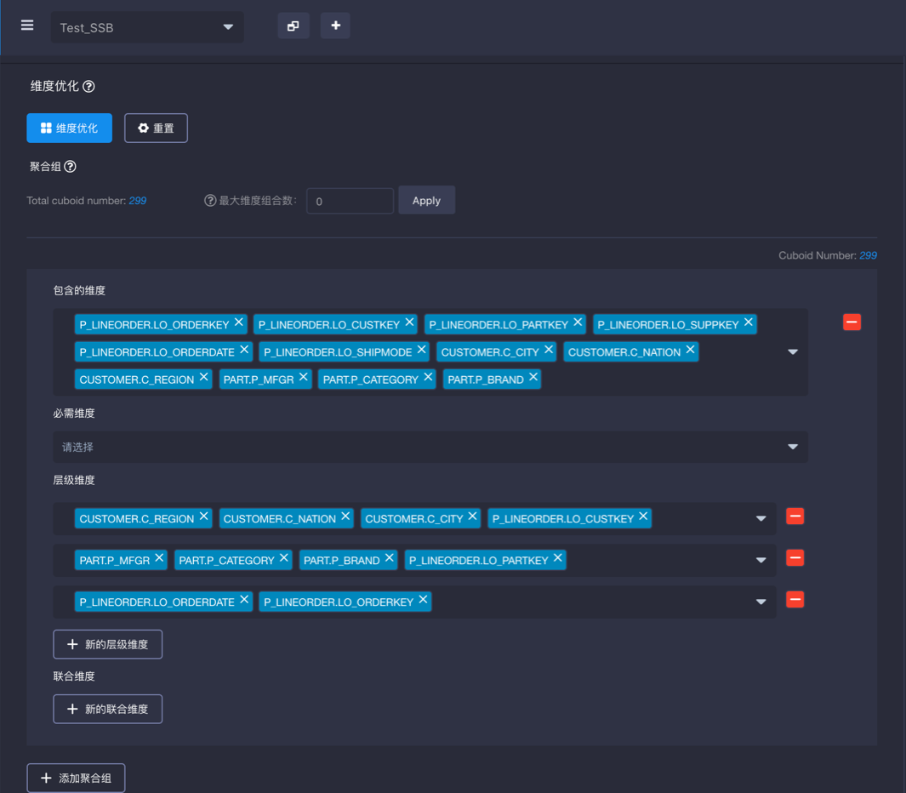

## KAP 2.4 Release Notes

近期我们发布了KAP v2.4，在该版本中，KAP全面升级为**HOLAP（Hybrid OLAP）**架构，进一步支持主流SQL on Hadoop技术，满足更多分析场景。同时KAP v2.4丰富了语义层的表达能力，支持了**雪花模型（Snowflake）**， 引入了**可计算列（Computed Column）**，以支持用户将复杂的商业逻辑转化为合适的数据模型 。

#### **引入HOLAP(Hybrid OLAP)**

**查询下压**

**查询下压**特性使得KAP能够将Kylin Cube不支持的查询下压到其他SQL引擎，内置支持Spark SQL及Hive，未来将进一步支持其他SQL on Hadoop技术。在KAP可以支持高性能的亚秒级聚合查询的同时，进一步满足了灵活的探索式分析（Ad-Hoc）需求。

**无缝对接SQL on Hadoop技术**

KAP支持与用户原有SQL on Hadoop技术的无缝对接，重用原有技术的分析能力，带来数据访问层的透明加速能力，结合KAP的预计算加速能力，为用户提供海量数据的交互式分析，为BI集成提供统一的查询接口和接入方式。

#### **增强的数据建模**

**KyStudio 建模中心**

全新视觉体验，更直观的、可拖拽式的数据建模流程，支持分析师自助地完成元数据导入、模型设计、Cube构建等工作，使建模过程更流畅。

**模型健康检测**

模型健康度检测在构建之前发现主外键不匹配、数据分布不均衡等建模隐患，清晰的检测结果帮助用户有效定位模型设计问题。

**Cube 优化器**

Cube优化器根据源数据特征和用户常用SQL模式，推荐出优化的Cube维度组合，度量配置，聚合组规则，字典编码算法和Rowkey排序。Cube优化器降低了建模的学习曲线，帮助用户迅速上手掌握建模核心。

**高效的Cube剪枝**

基于用户定义的最大维度组合数（指用户查询时用到的维度列个数）进行剪枝，大量减少低效的Cube维度组合开销，缩短Cube构建时间，解决了Cube维度组合爆炸难题。部分案例中，可以节省90%的Cube存储资源。

#### 语义层丰富

**可计算列**

支持用户自定义可计算列（Computed Column），将数据的抽取／转换／重定义等操作预先定义在模型中，增强数据模型语义层。将自定义计算列预置在模型中提前计算，以充分利用KAP的预计算能力，进一步提升查询效率。可计算列支持Hive UDF，可以重用已有的业务逻辑和代码。

**Snowflake 雪花模型**

在星型模型基础上，进一步支持了雪花模型，增强了模型对于复杂商业场景的支持。

#### 

#### 简化系统运维  

**安装环境检测** 

提供全面的安装检测脚本，检查环境依赖有效性、权限、版本等多个问题，直观地提示潜在问题并辅以解决方法。

**新的元数据存储方式**

支持MySQL等关系型数据库作为元数据存储介质，将metadata迁移到关系型数据库，遵从集群管理原有的数据库备份与恢复的运维规范，由于不再依赖HBase作为元数据存储，降低了管理员运维数据库的成本和风险。

**Cube构建调度器**

支持在Cube中设置按计划自动增量构建。减少手工运维，使分析师可以自助的调度Cube构建，简化了Cube增量构建运维工作，实现全自动化运维。全新调度器还可以与Kafka流式构建一起使用，改进流式Cube的运维体验和可靠性。

#### **Kylin核心引擎与兼容性**

**Apache Kylin 升级到2.0**

KAP基于Apache Kylin内核，与Apache Kylin完全兼容，本次升级基于Apache Kylin 2.0，完整公告参见Kylin官方网站。主要功能如下：

KYLIN-2467: Support TPCH queries

KYLIN-2331: Spark cubing engine

KYLIN-2006: Job Engine HA

KYLIN-2351: Support cloud-based storage

**其他更新与改进还包括**

KYLIN-2521: 升级Apache Calcite到1.12版本，支持更多日期函数

KYLIN-490: 支持多列的Distinct Count

表索引支持多列有序索引，提速明细查询

更新构建引擎，减少构建过程小文件IO次数，加速构建

优化诊断日志时间范围的选择，减少诊断包大小

支持模型和Cube临时保存为草稿，改善建模体验

集群环境支持基于ZooKeeper的服务发现，减少手工配置失误

支持自定义指标精度

简易配置升级，所有配置向后兼容，升级过程仅需用老版本conf目录覆盖新的安装包即可

KyAnalyzer集成KAP权限管理机制

#### Hadoop发行版支持

  产品认证：

  	Cloudera CDH 5.7+

  兼容性测试：

  	Apache Hadoop 2.2+，HBase 0.98+，Hive 0.14+

  	Hortonworks HDP 2.2+

  	Microsoft HDInsight

  	Amazon EMR

  	华为 FusionInsight C50/C60

#### **产品下载**

KAP已经开放下载试用，更多产品信息请见[KAP产品页面](http://kyligence.io/zh/)。