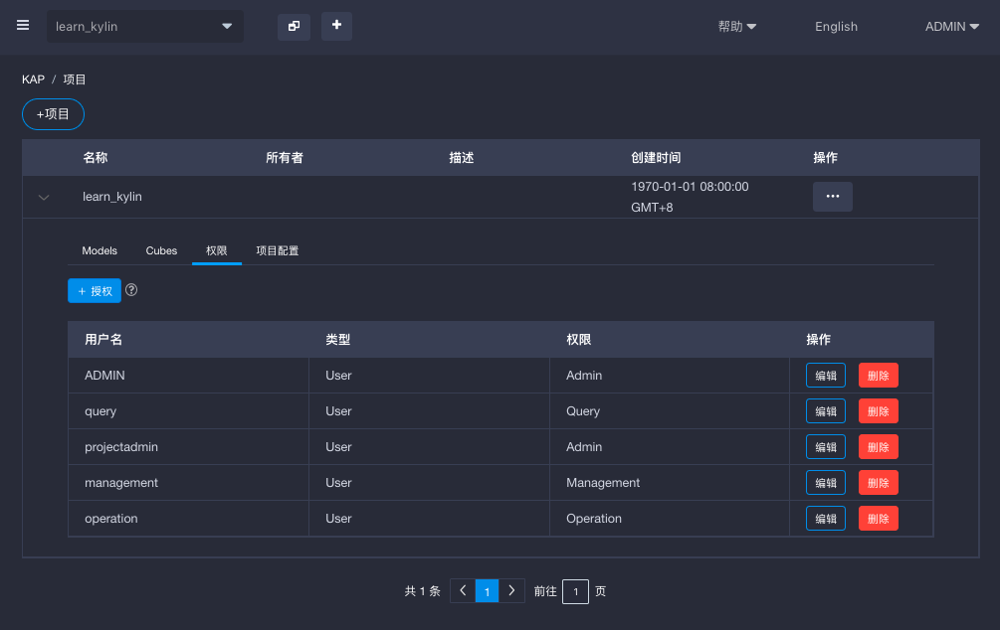
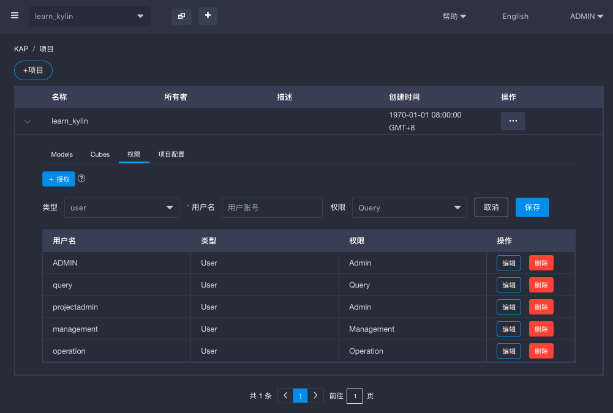

## 管理访问权限

用户在KAP中能否访问一个项目并使用项目中的一些功能是由项目级别访问权限决定的。KAP内置四种项目访问权限角色，他们是ADMIN、MANAGEMENT、OPERATION和QUERY。每个角色定义了一系列在KAP中有权限访问的功能。

KAP提供什么样的权限？

- *QUERY*: 定位为一般分析师，只需要项目中的表或者cube的查询权限。
- *OPERATION*: 定位为公司／组织内的IT运维人员，负责运维Cube。OPERATION权限包含QUERY权限。
- *MANAGEMENT*: 定位为业务部门的建模人员，对数据的业务情况很清楚，负责对数据进行导入、设计模型，Cube等。MANAGEMENT权限包含了OPERATION权限和QUERY权限
- *ADMIN*: 定义为项目的管理员，拥有项目内的所有权限。ADMIN权限包含了MANAGEMENT权限，OPERATION权UERY权限

### 如何判断用户的访问权限

管理员在项目上为用户分配了管理权限后，用户会相应地继承数据源、模型及Cube上的访问权限。每个访问权限角色可以访问的功能详情，请见下表：

| Functionality        | SYSTEM ADMIN | PROJECT ADMIN | MANAGEMENT | OPERATION | QUERY |
| -------------------- | ------------ | ------------- | ---------- | --------- | ----- |
| 增加／删除项目              | Yes          | No            | No         | No        | No    |
| 编辑／备份项目              | Yes          | Yes           | No         | No        | No    |
| 查看项目详情               | Yes          | Yes           | Yes        | Yes       | Yes   |
| 增加／编辑／删除项目访问权限       | Yes          | Yes           | No         | No        | No    |
| 查看系统仪表盘              | Yes          | Yes           | Yes        | Yes       | Yes   |
| 查看建模页面               | Yes          | Yes           | Yes        | Yes       | Yes   |
| 查看建模->数据源页面          | Yes          | Yes           | Yes        | No        | No    |
| 载入／卸载／重载数据源          | Yes          | Yes           | No         | No        | No    |
| 配置Kafka数据源           | Yes          | Yes           | No         | No        | No    |
| 查看表级、行级、列级访问权限       | Yes          | Yes           | Yes        | No        | No    |
| 添加、修改、删除表级、行级、列级访问权限 | Yes          | Yes           | No         | No        | No    |
| 查看建模->模型页面           | Yes          | Yes           | Yes        | Yes       | Yes   |
| 查看模型                 | Yes          | Yes           | Yes        | Yes       | Yes   |
| 添加、编辑、克隆、删除模型。模型健康检查 | Yes          | Yes           | Yes        | No        | No    |
| 查看Cube页面             | Yes          | Yes           | Yes        | Yes       | Yes   |
| 查看Cube详情             | Yes          | Yes           | Yes        | Yes       | Yes   |
| 编辑Cube详情             | Yes          | Yes           | Yes        | No        | No    |
| 添加、禁用／启用，清理Cube      | Yes          | Yes           | Yes        | No        | No    |
| 构建、管理Cube            | Yes          | Yes           | Yes        | Yes       | No    |
| 添加、编辑、删除Cube访问权限     | Yes          | Yes           | Yes        | No        | No    |
| 查看、编辑及删除Cube草稿       | Yes          | Yes           | Yes        | No        | No    |
| 查看分析页面               | Yes          | Yes           | Yes        | Yes       | Yes   |
| 在分析页面查询              | Yes          | Yes           | Yes        | Yes       | Yes   |
| 查看监控页面               | Yes          | Yes           | Yes        | Yes       | Yes   |
| 查看系统页面               | Yes          | No            | No         | No        | No    |
| 管理系统                 | Yes          | No            | No         | No        | No    |
| 管理用户                 | Yes          | No            | No         | No        | No    |

另外，在查询下压开启的情况下，项目上的QUERY权限允许用户在项目上没有Cube构建好的情况下，使用查询下压查询已同步到项目的表。但是如果用户没有QUERY访问权限则不可以这样做。

### 在项目级别管理权限

#### 授权权限

按照以下步骤为用户赋予项目权限

1. 点击项目列表右侧的项目图标。
2. 在项目列表中展开某个项目。
3. 点击`权限`然后点击`+授权`来为用户授予权限。
4. 填写用户姓名，权限，点击保存。

#### 修改权限

按照以下步骤修改用户的项目权限

1. 点击项目列表右侧的项目图标。
2. 在项目列表中展开某个项目。
3. 点击`权限`，选择一个用户点击`编辑`。
4. 修改用户的访问权限后`保存`。

#### 删除权限

按照以下步骤删除用户的项目权限

1. 点击项目列表右侧的项目图标。
2. 在项目列表中展开某个项目。
3. 点击`权限`，选择一个用户点击`删除`。

当用户的项目级权限被删除时，用户在项目上的所有权限也会被删除，这包括用户在项目上的表级、行级及列级权限。

