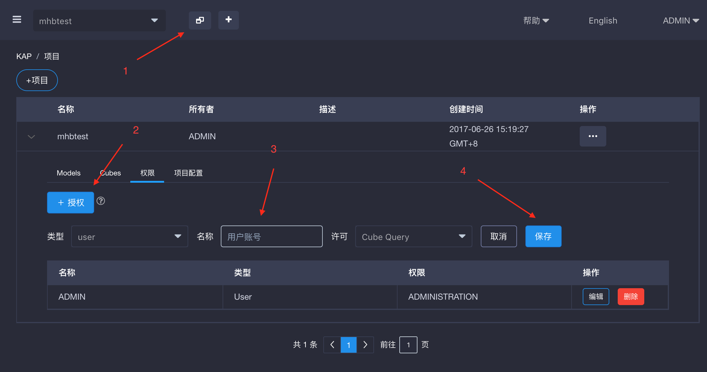
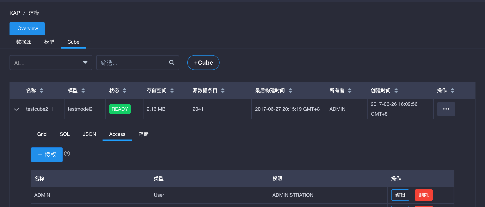

## 管理权限

KAP提供什么样的权限？

- *QUERY*: 查询项目中的表或者cube的权限
- *OPERATION*: 构建Cube的权限, 包括恢复和取消任务；OPERATION权限包含QUERY权限
- *MANAGEMENT*: 编辑和删除Cube的权限，MANAGEMENT权限包含了OPERATION权限和QUERY权限
- *ADMIN*: 对Cube拥有所有权限，ADMIN权限包含了MANAGEMENT权限，OPERATION权限和QUERY权限

### 在项目级别管理权限

我们建议用户尽量在项目级别而非cube级别对权限进行管理

#### 授权/收回权限

按照上图中的步骤对用户/角色进行授权，角色可以被看做是一个用户组。

使用旁边的编辑/删除按钮来更新或者收回权限

### 在cube级别管理权限

管理员可以在cube级别，为不同的用户/角色定制不同的权限：

### 影响

授予在项目级别上的权限会被该项目下的cube继承。也就是说，如果一个用户在项目级别上被授予了MANAGEMENT权限，那么他就自然获得了这个项目下所有cube的MANAGEMENT权限。

除非用户有查询选中的cube的QUERY权限，否则KAP会在查询的时候报出权限不足的异常。这里的权限既可以是项目级别继承而来的，也可以是cube级别上直接授予的。

另外，当查询下推被启用时，项目级别上的QUERY权限允许用户对项目里面的表进行即席查询，即使这些查询不能被任何cube满足。不过如果用户没有项目级别上的QUERY权限，则查询下推也不能正常工作。

