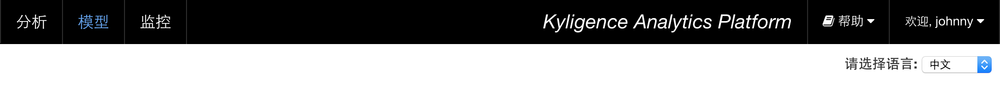

## LDAP验证

KAP支持与LDAP服务器集成完成用户验证。这种验证是通过Spring Security框架实现的，所以具有良好的通用性。在启用LDAP验证之前，建议您联系LDAP管理员，以获取必要的信息。

### LDAP服务器的安装
启用LDAP验证之前，需要一个运行的LDAP服务。如果已经有，联系LDAP管理员，以获取必要的信息，如服务器连接信息、人员和组织结构等。

如果没有可用的LDAP服务器，需要额外安装。推荐使用OpenLDAP Server 2.4，它是一个开源的实现（基于OpenLDAP Public License）并且也是最流行的LDAP服务器之一。很多企业Linux发行版已经内置了OpenLDAP服务，如果没有可以从官网下载： http://www.openldap.org/

OpenLDAP服务器的安装，依系统不同而略有区别。这里以CentOS 6.4为例介绍:  

* 安装之前检查

```shell
find / -name openldap*
```
如果没有安装，使用yum安装：
```shell
sudo yum install -y openldap openldap-servers openldap-clients
```

* 安装以后进行配置

```shell
cp /usr/share/openldap-servers/slapd.conf.obsolete /etc/openldap/slapd.conf
cp /usr/share/openldap-servers/DB_CONFIG.example /var/lib/ldap/DB_CONFIG
mv /etc/openldap/slapd.d{,.bak}
```

* 修改slapd.conf，以给example.com公司配置为例，步骤如下：

1．设置目录树的后缀

找到语句：
```
suffix "dc=my-domain,dc=com"
```
将其改为：
```
suffix "dc=example,dc=com"
```
2．该语句设置LDAP管理员的DN

找到语句：
```
rootdn "cn=Manager,dc=my-domain,dc=com"
```
将其改为：
```
rootdn "cn=Manager,dc=example,dc=com"
```
3．设置LDAP管理员的口令

找到语句：
```
rootpw secret
```

要创建一个新的加密密码，使用下面的命令：
```
slappasswd
```
输入要设置的密码，加密值会被输出在shell界面。然后将此值拷贝在rootpw这一行，如：
```
rootpw {SSHA}vv2y+i6V6esazrIv70xSSnNAJE18bb2u
```

4．为配置文件修改权限
```shell
chown ldap.ldap /etc/openldap/*
chown ldap.ldap /var/lib/ldap/*
```

5．新建目录/etc/openldap/cacerts
```shell
mkdir /etc/openldap/cacerts
```

6．重启系统，然后开启服务  
```shell
sudo service slapd start
```

7．新建文件 example.ldif （包括三个用户，两个组）
```properties
# example.com
dn: dc=example,dc=com
objectClass: dcObject
objectClass: organization
o: Example, Inc.
dc: example

# Manager, example.com
dn: cn=Manager,dc=example,dc=com
cn: Manager
objectClass: organizationalRole

# People, example.com
dn: ou=People,dc=example,dc=com
ou: People
cn: People
objectClass: organizationalRole
objectClass: top

# johnny, People, example.com
dn: cn=johnny,ou=People,dc=example,dc=com
mail: johnny@example.io
ou: Manager
cn: johnny
sn: johnny wang
objectClass: inetOrgPerson
objectClass: organizationalPerson
objectClass: person
objectClass: top
userPassword:: ZXhhbXBsZTEyMw==

# jenny, People, example.com
dn: cn=jenny,ou=People,dc=example,dc=com
mail: jenny@example.io
ou: Analyst
cn: jenny
sn: jenny liu
objectClass: inetOrgPerson
objectClass: organizationalPerson
objectClass: person
objectClass: top
userPassword:: ZXhhbXBsZTEyMw==

# oliver, People, example.com
dn: cn=oliver,ou=People,dc=example,dc=com
objectClass: inetOrgPerson
objectClass: organizationalPerson
objectClass: person
objectClass: top
cn: oliver
sn: oliver wang
mail: oliver@example.io
ou: Modeler
userPassword:: ZXhhbXBsZTEyMw==

# Groups, example.com
dn: ou=Groups,dc=example,dc=com
ou: Groups
objectClass: organizationalUnit
objectClass: top

# itpeople, Groups, example.com
dn: cn=itpeople,ou=Groups,dc=example,dc=com
cn: itpeople
objectClass: groupOfNames
objectClass: top
member: cn=johnny,ou=People,dc=example,dc=com
member: cn=oliver,ou=People,dc=example,dc=com

# admin, Groups, example.com
dn: cn=admin,ou=Groups,dc=example,dc=com
cn: admin
member: cn=jenny,ou=People,dc=example,dc=com
objectClass: groupOfNames
objectClass: top
```

8．通过命令导入
```shell
/usr/bin/ldapadd -x -W -D "cn=Manager,dc=example,dc=com" -f example.ldif
```

提示输入密码，输入管理员的密码，导入成功。

9．修改密码

```shell
管理员可以强制修改用户密码，命令
ldappasswd -xWD cn=Manager,dc=example,dc=com -S cn=jenny,ou=People,dc=example,dc=com
提示输入新密码
确认新密码
输入管理员密码
```


### 在KAP中配置LDAP服务器信息

首先，在conf/kylin.properties中，配置LDAP服务器的URL, 必要的用户名和密码（如果LDAP Server不是匿名访问）。为安全起见，这里的密码是需要加密（加密算法AES），您可以运行下面的命令来获得加密后的密码：
```shell
${KYLIN_HOME}/bin/kylin.sh io.kyligence.kap.tool.general.CryptTool AES *your_password*
# ${crypted_password}
```
> 然后填写在kylin.properties中(*请注意此处“=”后所指的用户名、服务器、密码都不需要用双引号*)，如下：
>

```properties
# ldap.server=ldap://<your_ldap_host>:<port>
# ldap.username=<your_user_name>
# ldap.password=<your_password_hash>

ldap.server=ldap://127.0.0.1:389
ldap.username=cn=Manager,dc=example,dc=com
ldap.password=${crypted_password}
```

其次，提供检索用户信息的模式, 例如从某个节点开始查询，需要满足哪些条件等。下面是一个例子，供参考:

```properties
# LDAP user account directory
ldap.user.searchBase=ou=People,dc=example,dc=com
ldap.user.searchPattern=(&(cn={0}))
ldap.user.groupSearchBase=ou=Groups,dc=example,dc=com
```

如果您需要服务账户（供系统集成）可以访问KAP，那么依照上面的例子配置`ldap.service.*`，否则请将它们留空。
```properties
# LDAP service account directory
ldap.service.searchBase=ou=People,dc=example,dc=com
ldap.service.searchPattern=(&(cn={0}))
ldap.service.groupSearchBase=ou=Groups,dc=example,dc=com
```

### 配置管理员群组和默认角色

KAP允许您将一个LDAP群组映射成管理员角色：在kylin.properties中，将"acl.adminRole"设置为"ROLE_" + GROUP_NAME形式. 在当前例子中，在LDAP中使用群组"ADMIN"来管理所有KAP管理员，那么这里应该设置为:

```properties
acl.adminRole=ROLE_ADMIN
acl.defaultRole=ROLE_ANALYST,ROLE_MODELER
```

属性"acl.defaultRole"定义了赋予登录用户的权限，默认是分析师（ANALYST）和建模人员（MODELER）.

### 启用LDAP

在conf/kylin.properties中，设置"kylin.security.profile=ldap"，然后重启KAP。

当使用 `admin` 组的 jenny 用户登录时，会显示 `系统` 菜单项。


当使用 `itpeople` 组的 johnny 登录时，因为该组并不是`管理员`组，则不会显示 `系统` 菜单项。



### LDAP用户信息缓存

用户通过LDAP验证登录KAP后，其信息会被KAP缓存以减轻访问LDAP服务器的开销。用户可以在kylin.properties中对用户信息缓存时间（秒）和最大缓存用户数目进行配置，默认值如下：

```properties
kylin.server.auth-user-cache.expire-seconds=300
kylin.server.auth-user-cache.max-entries=100
```

