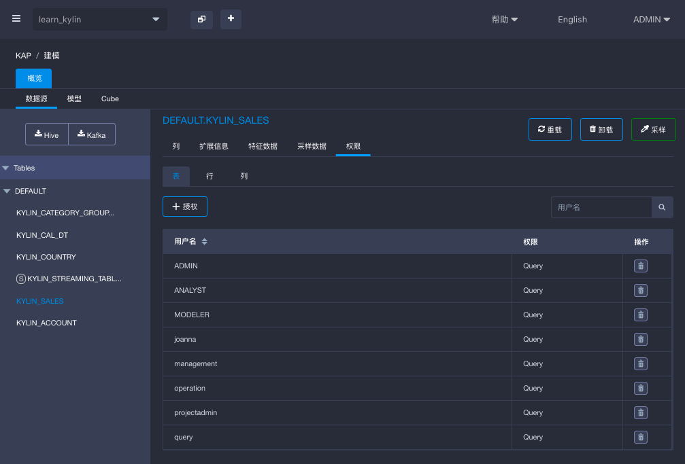
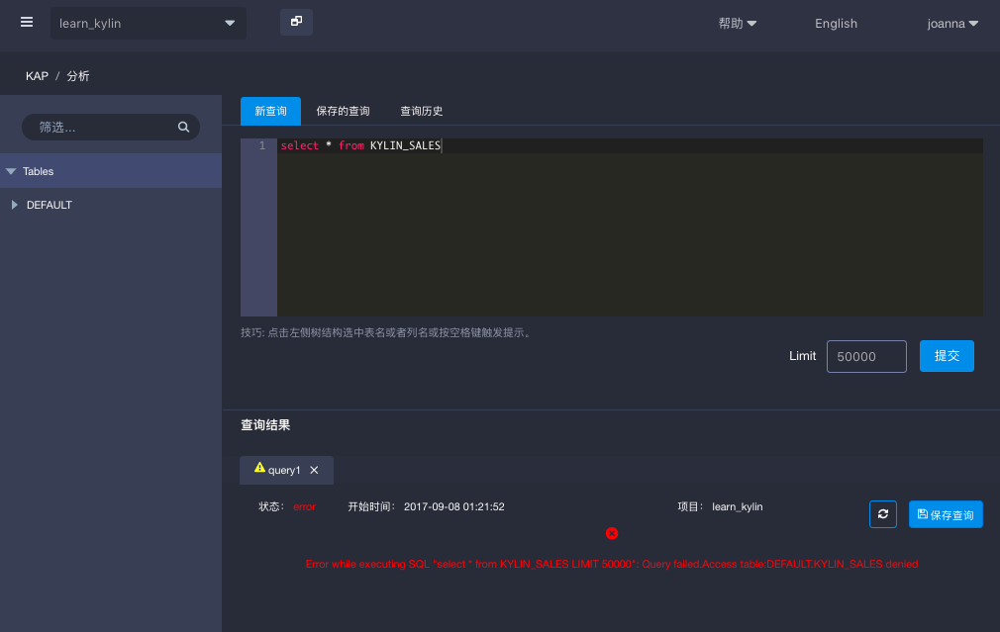

##表级访问权限

**表级访问权限**控制了用户在KAP中能查询的表。当用户被限制了对某表的权限时，用户则不能**查询**该表，不论是通过Cube、明细表索引还是查询下压。用户的查询还可以使用引用了限制表的Cube，前提条件是用户的查询没有使用限制的表。

当表初次被导入KAP中，或者项目从低版本升级到有表级权限功能的版本时，默认初始情况下所有用户可以访问项目中导入的所有表。

表级访问权限需要以项目为单位进行设置。也就是说如果同一个表在不同的项目中都导入了，两个项目下的表级权限需要分别设置。

###管理表级权限

#### 添加权限

按照以下步骤为用户添加表级权限：

1. 点击左侧导航栏中的`建模`。
2. 点击`数据源`，选择一个已导入的表。
3. 在这个表上，点击`权限`，然后选择`表`。
4. 点击`+授权`。
5. 在弹窗中，选择用户并保存。

#### 删除权限

按照以下步骤为删除用户的表级权限：

1. 点击左侧导航栏中的`建模`。
2. 点击`数据源`，选择一个已导入的表。
3. 在这个表上，点击`权限`，然后选择`表`。
4. 选择一个用户并点击`操作`下的`删除`按钮。

###验证表级访问权限

在本例中用户`joanna` 是一个有项目 `learn_kylin `访问权限的用户，并且被限制了对表`Kylin_sales`的访问。

登录用户`joanna`，来到查询页面，对表`Kylin_sales`进行查询以验证表级访问权限是否被限制了。

如截图所示用户`joanna`试图查询表`Kylin_sales`访问请求被被拒绝了。

