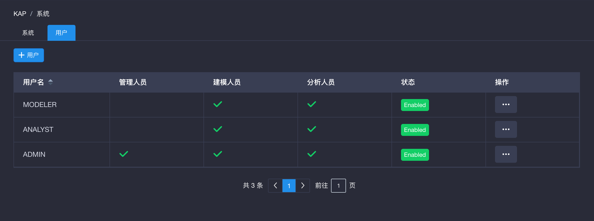
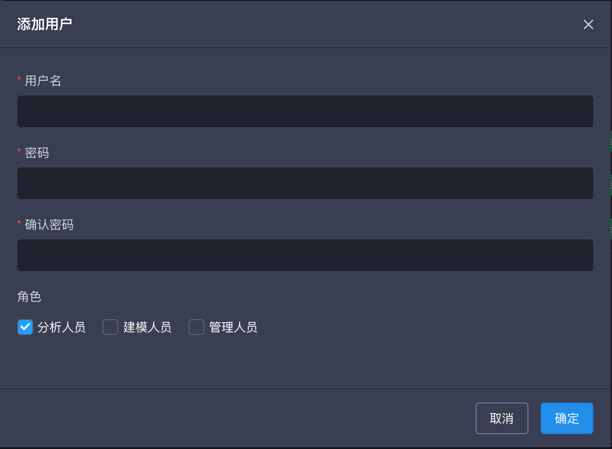
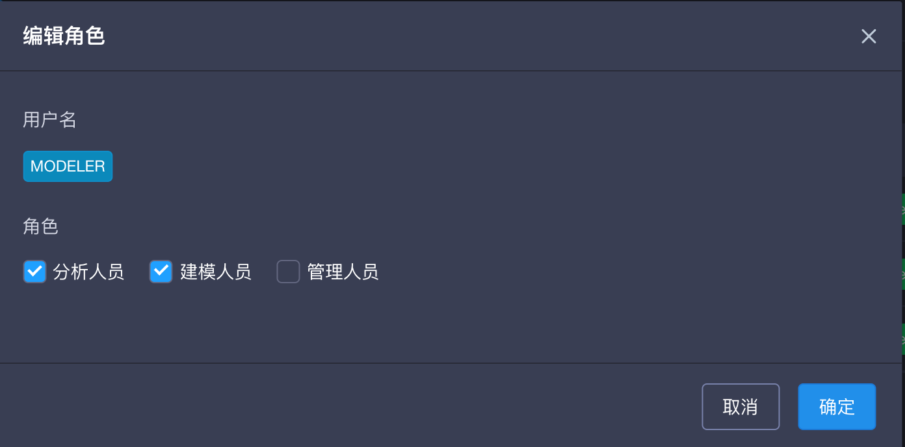
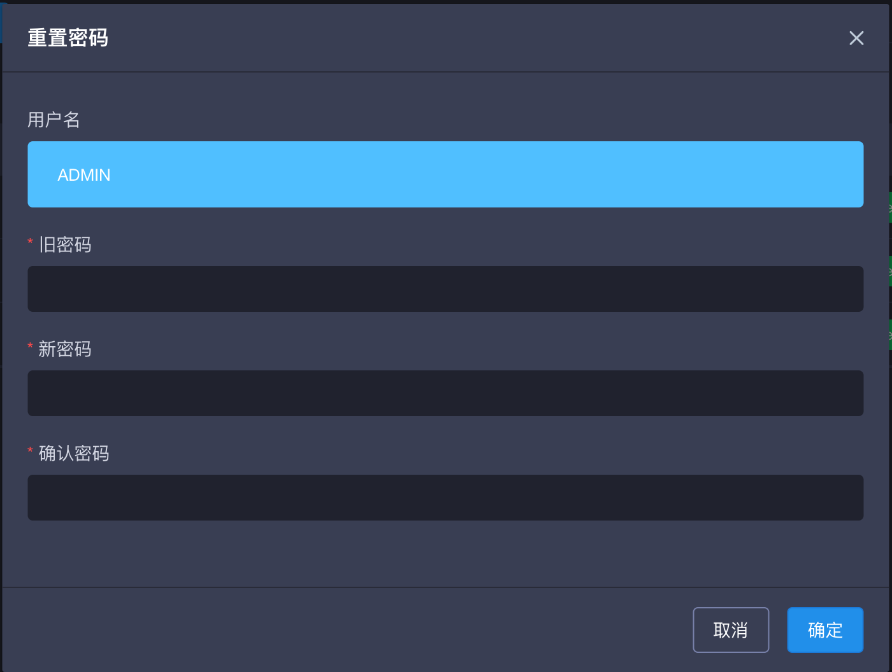
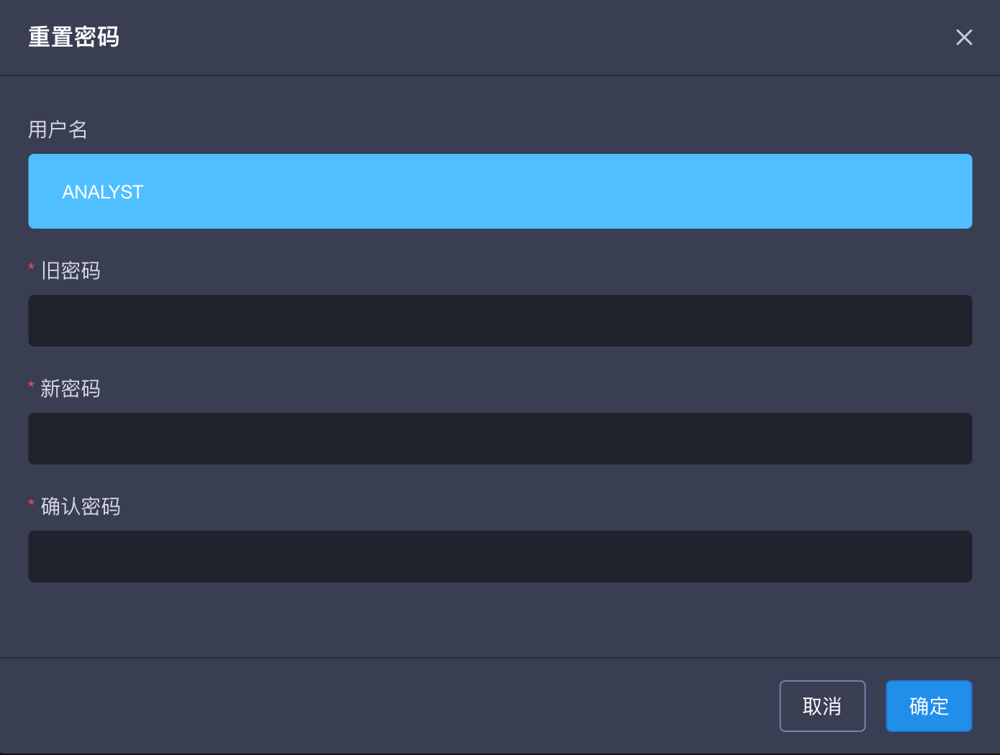

## 用户管理

本章节将介绍什么是用户以及用户如何管理。

### 关于用户

任何用户使用KAP都需要使用账号和密码登录。创建之后用户的信息会存储在KAP的元数据中，每个KAP实例上每个用户是唯一的，即用户不需要在同意实例的不同项目上反复创建。

一个新的KAP实力创建时，KAP会创建缺省的三个用户，其中用户**ADMIN**是KAP内置的系统管理员。**系统管理员**拥有整个系统的所有权限。

###权限控制列表

权限控制列表(ACL)是用户和其访问权限的列表。除了系统管理员权限以外，ACL需要以项目为单位进行授予。

在项目上，KAP提供四种访问权限。这四种权限分别为admin、management、operation和query。每个权限定义了用户在项目上可以操作的功能。

关于项目级权限控制的更多内容，请参见[管理权限](acl.cn.md) 。

###管理用户

登录KAP后，点击导航栏的`系统`按钮，进入系统管理页面，点击左侧的用户栏进入用户管理页面。只有系统管理员能看到该页面。
KAP默认会初始化三个用户，对应帐号信息为 ADMIN(系统管理员), MODELER, ANALYST。

用户创建后，系统管理员可以在系统->用户页面对用户进行管理，可以增加、管理、删除用户。

除系统管理员以外，其他用户需要在项目级别被赋予访问权限才能使用项目上的功能。出系统管理员以外，单单创建用户并不能让用户获得任何项目上的访问权限。

### 添加用户
在系统->用户管理页面，系统管理员可以点击`+用户`按钮来增加新用户。在添加新用户弹窗中，输入用户名，密码，确认密码，再选择用是系统管理员还是普通用户。

### 编辑用户
在系统->用户管理页面，点击`操作`下的`...`，并选择编辑用户。

在弹窗中系统管理员可以选择修改用户是否为系统管理员的设定。

### 更改密码
在`系统`->`用户`管理页面，点击`操作`下的`...`并选择`重置密码`。

系统管理员可以更改密码信息，需重复输入两次新密码。

初始的ADMIN账户密码在首次登陆后，需要被修改。如需恢复初始密码，在"KYLIN_HOME/"使用重置密码命令（kylin.sh admin-password-reset），将ADMIN账户密码恢复为初始密码，其他账户密码将保持不变。

### 删除用户

在`系统`->`用户`管理页面，点击`操作`下的`...`并选择`删除`。

系统管理员可以在此页面删除用户。用户被删除后将不能恢复。

将用户从一个KAP实例上彻底删除后，用户在所有项目上的访问权限也会被删除。这包括项目级别、表级、行级、列级等权限。

### 启用/禁用用户

在`系统`->`用户`管理页面，点击`操作`下的`...`并选择`启用`或`禁用`。

系统管理员可以启用或禁用用户，用户被禁用后将不可再登录系统。

### 普通用户修改密码
点击界面右上方的用户名，选择`设置`并在弹出的窗口中重置密码。用户需要提供旧密码并输入新密码两次来重制密码。

点击导航栏最右侧的欢迎标签，可以看到'设置'选项，点击进入个人更改密码页面。

