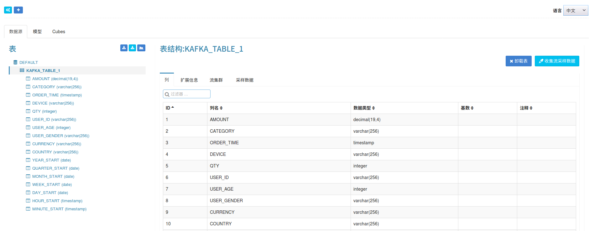
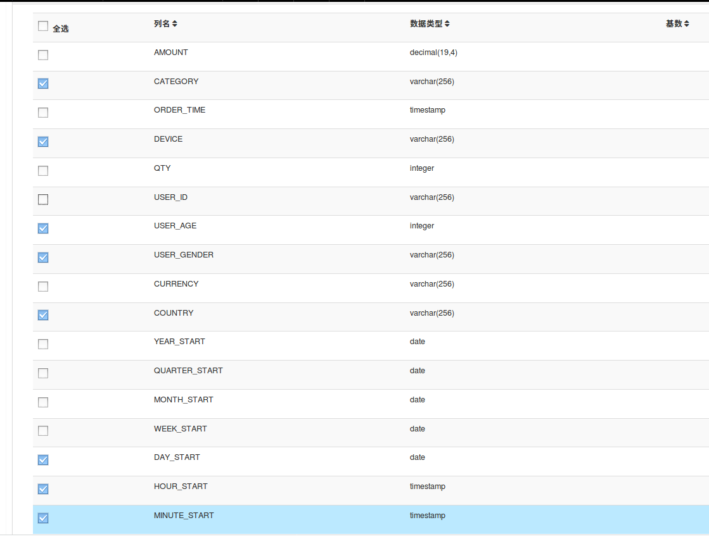
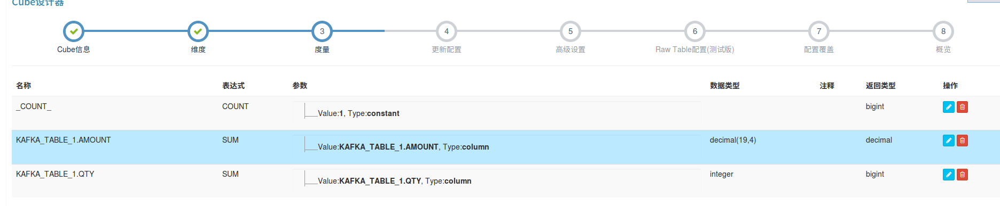

## 以Kafka为数据源流式构建cube

KAP 2.3 提供了流式构建的功能，用户能够以Kafka为数据源，根据时间间隔进行流式构建cube．本文档提供了一个简单的教程，向用户展示如何一步步流式构建cube

## 环境准备
在开始本教程前，请确保您已准备好Hadoop环境并且已经安装了KAP 2.3及Kafka。在本教程中，我们使用Hortonworks HDP 2.4 Sandbox虚拟机作为Hadoop环境。

## 创建Kafka topic并导入数据

首先，我们需要启动Kafka服务器，并且创建一个名为"kylin_demo"的topic

	curl -s http://mirrors.tuna.tsinghua.edu.cn/apache/kafka/0.10.0.0/kafka_2.10-0.10.0.0.tgz | tar -xz -C /usr/local/
	cd /usr/local/kafka_2.10-0.10.0.0/
	./bin/kafka-server-start.sh config/server.properties &

接着，我们需要启动一个生产者，持续往topic中导入数据。KAP提供了一个简单的Producer用于产生数据．这里假设KAP安装在${KYLIN_HOME}目录

	bin/kafka-topics.sh --create --zookeeper localhost:2181 --replication-factor 1 --partitions 3 --topic kylindemo
	Created topic "kylindemo"
	export KAFKA_HOME=/usr/local/kafka_2.10-0.10.0.0
	cd $KYLIN_HOME
	./bin/kylin.sh org.apache.kylin.source.kafka.util.KafkaSampleProducer --topic kylindemo --broker localhost:9092

以下这个工具类每秒会向Kafka中发送100条消息。在学习本教程的过程中，请保持本程序持续运行。同时，你可以使用Kafka自带的消费者控制台来检查消息是否成功导入

	cd $KAFKA_HOME
	bin/kafka-console-consumer.sh --zookeeper localhost:2181 --bootstrap-server localhost:9092 --topic kylindemo --from-beginning

## 从流式数据中定义事实表
   
1. 启动KAP, 登录KAP web GUI, 新建一个project或者选择一个已有的project。点击 "Model" -> "Data Source"，点击"Add Streaming Table"按钮。
   

2. 输入Broker集群信息
   

3. 点击 sandbox->kylindemo,Kafka的采样消息会出现在右边
   

4. 接着，您需要为流式数据源定义一个表名．定义的表名会用于后续的 SQL 查询． 假设我们将表命名为 "KAFKA_TABLE_1" 
   

5. 检查表结构是否正确，如果正确，请点击"提交"

   

## 创建model
定义好事实表以后，我们就可以开始定义数据模型了。这一步和定义一个普通的数据模型没有太大不同，不过，您可能需要留意如下两点：

* 对于流式Cube，KAP暂时还不支持查找表，因此，在定义model的时候请不要引入查找表。
* 请选择 "MINUTE_START" 属性作为partition column, 这样KAP可以以分钟为间隔构建Cube。不要直接选择ORDER_TIME属性（因为其粒度太小）。

这里，我们选择８个属性作为dimension，２个属性作为measure。
 

 	

 	
	
保存数据模型。

## 创建cube

流式Cube与常规Cube在大部分情况下都十分相似，不过，您需要特别留意如下几点：

* 不要使用"order\_time"作为dimension，因为这个属性是一个十分细粒度的属性。这里，我们建议您使用"mintue\_start", "hour\_start" 等时间属性。
* 在"refersh setting" 步骤，您可以定义更多的构建间隔时间，例如0.5小时，4小时，１天，７天等。这有助于Segment的自动合并。
* 在选择"rowkeys" 的环节, 请将"minute\_start" 拖拽到所有属性的最顶部. 对于基于流式Cube的查询，时间维度会是一个经常被用到的维度，因此，将其放在rowkeys前面有助于快速过滤。

	
	
	
		
	

	

保存Cube。

## 触发Cube构建

你可以直接在WebUI中，点击“Actions” -> “Build”来触发Cube构建，当然，你也可以通过curl指令结合KAP的RESTfulAPI触发cube构建

	curl -X PUT --user ADMIN:KYLIN -H "Content-Type: application/json;charset=utf-8" -d '{ "sourceOffsetStart": 0, "sourceOffsetEnd": 9223372036854775807, "buildType": "BUILD"}' http://localhost:7070/kylin/api/cubes/{your_cube_name}/build2

请特别注意，API是以"build2"结尾的，这跟常规构建中以"build"结尾不同。
同时，语句中的数字０指的是Cube开始构建的偏移量，而9223372036854775807指的是Long.MAX_VALUE的值，指的是KAP的构建会用到Topic中目前为止拥有的所有消息。

在触发了Cube构建以后，在“Monitor” 页面，我们可以观察到一个新的构建任务，接下来，我们只需耐心等待Cube构建完成。

在Cube构建完成后，点击 “Insight” 按钮, 并执行sql语句，确认流式Cube可用

	select minute_start, count(*), sum(amount), sum(qty) from streaming_sales_table group by minute_start order by minute_start

## 自动触发Cube定期构建

在第一次构建完成以后，你可以以一定周期定时触发构建任务。KAP会自动记录每次构建的偏移量，每次触发构建的时候，KAP都会自动从上次结束的位置开始构建。您可以使用Linux上的crontab指令定期触发构建任务:

	crontab -e　*/5 * * * * curl -X PUT --user ADMIN:KYLIN -H "Content-Type: application/json;charset=utf-8" -d '{ "sourceOffsetStart": 0, "sourceOffsetEnd": 9223372036854775807, "buildType": "BUILD"}' http://localhost:7070/kylin/api/cubes/{your_cube_name}/build2

现在，您可以看到Cube已经可以自动定期构建了。同时，当累积的segments超过一定阀值时，KAP会自动触发segments合并。

##一些常见问题

1. 在运行“kylin.sh”的时候，您可能会遇到如下错误:

       Exception in thread "main" java.lang.NoClassDefFoundError: org/apache/kafka/clients/producer/Producer
       at java.lang.Class.getDeclaredMethods0(Native Method)
       at java.lang.Class.privateGetDeclaredMethods(Class.java:2615)
       at java.lang.Class.getMethod0(Class.java:2856)
       at java.lang.Class.getMethod(Class.java:1668)
       at sun.launcher.LauncherHelper.getMainMethod(LauncherHelper.java:494)
       at sun.launcher.LauncherHelper.checkAndLoadMain(LauncherHelper.java:486)
       Caused by: java.lang.ClassNotFoundException: org.apache.kafka.clients.producer.Producer
       at java.net.URLClassLoader$1.run(URLClassLoader.java:366)
       at java.net.URLClassLoader$1.run(URLClassLoader.java:355)
       at java.security.AccessController.doPrivileged(Native Method)
       at java.net.URLClassLoader.findClass(URLClassLoader.java:354)
       at java.lang.ClassLoader.loadClass(ClassLoader.java:425)
       at sun.misc.Launcher$AppClassLoader.loadClass(Launcher.java:308)
       at java.lang.ClassLoader.loadClass(ClassLoader.java:358)
       ... 6 more

这是由于KAP无法找到 Kafka客户端的jar包导致的。请确认您是否已经正确设置了 “KAFKA_HOME”。 

2. 在构建Cube时，遇到 “killed by admin” 错误

这个问题主要是由于在使用Sandbo时，MR任务请求的内存过多，从而被YARN拒绝导致的。您可以通过修改“conf/kylin_job_conf_inmem.xml”配置，调低请求的内存大小来解决这个问题
	
	<property>
		<name>mapreduce.map.memory.mb</name>
		<value>1072</value>
		<description></description>
	</property>
	
        <property>
                <name>mapreduce.map.java.opts</name>
                <value>-Xmx800m</value>
                <description></description>
        </property>

如果topic中已经有大量的消息，您最好不要从头开始构建，建议您选择队列的尾部作为构建的起始点。如下所示：

	curl -X PUT --user ADMIN:KYLIN -H "Content-Type: application/json;charset=utf-8" -d '{ "sourceOffsetStart": 0, "sourceOffsetEnd": 9223372036854775807, "buildType": "BUILD"}' http://localhost:7070/kylin/api/cubes/{your_cube_name}/init_start_offsets

3. 如果某次构建发生了错误，并且您丢弃了这次构建，则Cube中会由于缺失了这次构建的segment而产生一个"空洞"。由于KAP的自动构建总是从最后的位置开始，正常的构建将无法填补这些空洞。您需要使用KAP提供的工具找出这些"空洞"并且重新触发构建将其填补。

	   curl -X GET --user ADMINN:KYLIN -H "Content-Type: application/json;charset=utf-8" http://localhost:7070/kylin/api/cubes/{your_cube_name}/holes

如果curl结果为空数组，则表示没有任何空洞，否则，我们则需要手动触发KAP的构建来填补这些空洞：

	curl -X PUT --user ADMINN:KYLIN -H "Content-Type: application/json;charset=utf-8" http://localhost:7070/kylin/api/cubes/{your_cube_name}/holes

