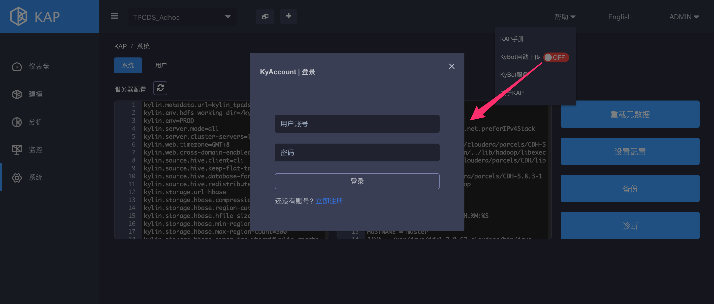
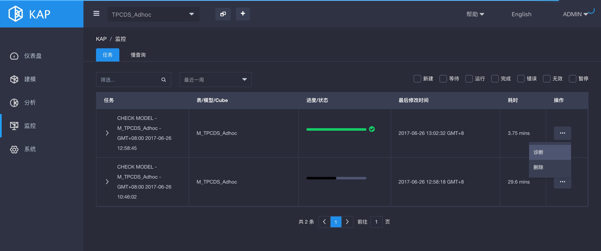

KAP用户在使用过程中经常会遇到一些棘手的问题，例如Cube创建失败、SQL查询失败、SQL查询时间过长等；运维人员需要抓取相关信息并分析问题原因。此外，也可通过Kyligence提供的在线服务平台——KyBot对KAP实例进行诊断、优化、寻求技术支持。

# 诊断
KAP的Web UI上提供了一个“诊断”功能，可将相关的信息打包成zip格式压缩包，供运维人员进行问题排查。该功能的入口总共有两处：系统诊断和任务诊断

## 系统诊断
单击System页面下的Diagnosis按钮，所生成的诊断包包含整个KAP实例的诊断信息。

同时KAP也支持了自动上传系统诊断包的功能，打开“帮助”下的KyBot自动上传开关，登陆KyAccount账号即可。

## 任务诊断

单击Monitor页面中某个Job下的Diagnosis按钮，所生成的诊断包仅包含该任务的诊断信息。

# 求助KyBot
KyBot是Kyligence提供的一个为Apache Kylin或KAP进行诊断、优化的在线服务平台。用户可以使用KyBot Agent产生KyBot诊断包，并上传到KyBot网站。

#### 登录注册
KyBot登录地址：https://kybot.io

首次使用请先注册账号，请您使用公司邮箱进行注册。

关于KyBot的使用，请您参考：[KyBot介绍及快速入门](../kybot/kybot.cn.html)